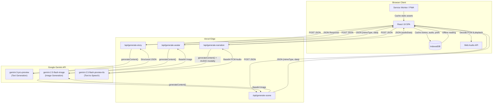
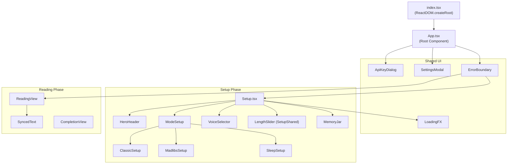
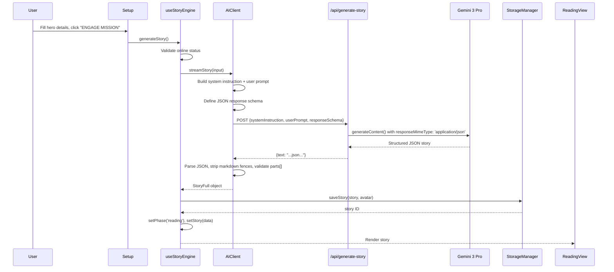
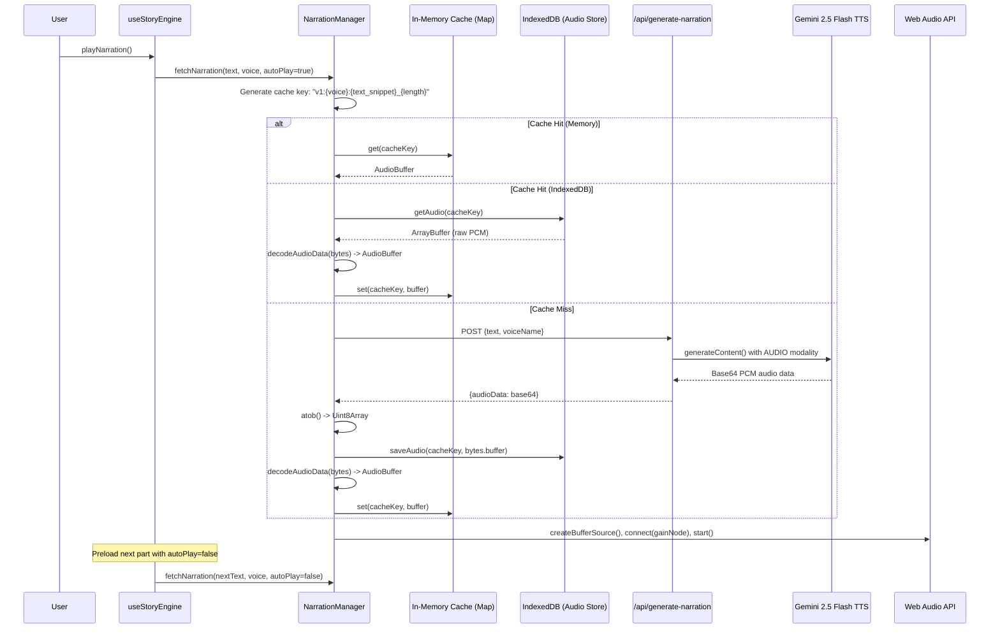

# Infinity Heroes: Bedtime Chronicles -- Architecture Documentation

## 1. System Overview

Infinity Heroes: Bedtime Chronicles is a **React 19 single-page application** that generates personalized AI-powered bedtime stories for children. Users configure a hero, select a story mode (Classic Adventure, Mad Libs, or Sleep), and the application generates a fully illustrated, narrated, interactive storybook experience using Google Gemini's multimodal AI capabilities.

The system is deployed on **Vercel** as a static frontend with serverless API functions acting as a secure proxy layer to the Google Gemini API. All AI operations (text generation, image generation, text-to-speech) flow through these serverless functions so the API key never reaches the client. Generated content is cached in **IndexedDB** for offline reading, and the app is installable as a **Progressive Web App (PWA)**.

---

## 2. Architecture Diagram



---

## 3. Frontend Architecture

### 3.1 Component Hierarchy



### 3.2 State Management Approach

The application uses **React hooks and lifted state** exclusively -- there is no external state management library (no Redux, Zustand, or Context API).

| Layer | Mechanism | Responsibility |
|-------|-----------|----------------|
| `useStoryEngine` | Custom hook (central state) | All story lifecycle state: phase, input, story data, scenes, narration flags, history, errors, user preferences |
| `useNarrationSync` | Custom hook (polling) | Bridges imperative `NarrationManager` singleton with React state via `requestAnimationFrame` loop |
| `useApiKey` | Custom hook | API key dialog visibility (now a no-op since keys are server-side) |
| `useState` in components | Local component state | UI-only concerns (drawer open/closed, local form state) |

The `useStoryEngine` hook is the **single source of truth** for the entire application. It returns ~30 state values and action callbacks that are threaded down to child components via props. This avoids prop drilling complexity by keeping the component tree shallow (only 2-3 levels deep).

### 3.3 Navigation / Phase Model

There is **no client-side router**. Navigation is handled via an `AppPhase` state enum with two values:

```
type AppPhase = 'setup' | 'reading';
```

- **`setup`** -- Renders the `Setup` component (hero configuration, mode selection, story history).
- **`reading`** -- Renders the `ReadingView` component (story text, narration controls, scene illustrations).

Phase transitions are driven by actions in `useStoryEngine`:
- `generateStory()` or `loadStoryFromHistory()` transitions `setup` to `reading`.
- `reset()` transitions `reading` back to `setup`.

Components are **lazy-loaded** using `React.lazy()` + `Suspense` for code splitting, with `LoadingFX` as the fallback.

### 3.4 Story Modes

The application supports three distinct modes, each producing a different story structure:

| Mode | Input Fields | Interactivity | AI System Prompt Style |
|------|-------------|---------------|----------------------|
| `classic` | Hero name, power, setting, sidekick, problem | 3 choices per story part | Fantasy/Adventure author |
| `madlibs` | Adjective, place, food, silly word, animal | 3 choices per story part | Mad Libs comedian |
| `sleep` | Hero name, sensory anchors (texture, sound, scent), theme | No choices (auto-advance) | Sleep hypnotist |

---

## 4. Backend Architecture

### 4.1 Serverless Function Design

All backend logic lives in the `api/` directory as **Vercel Serverless Functions** (Node.js runtime). Each function is a single-purpose proxy to the Google Gemini API:

| Endpoint | File | Gemini Model | Purpose |
|----------|------|-------------|---------|
| `POST /api/generate-story` | `api/generate-story.ts` | `gemini-3-pro-preview` | Structured JSON story generation with schema enforcement |
| `POST /api/generate-avatar` | `api/generate-avatar.ts` | `gemini-2.5-flash-image` | Hero portrait image generation |
| `POST /api/generate-scene` | `api/generate-scene.ts` | `gemini-2.5-flash-image` | Scene illustration generation |
| `POST /api/generate-narration` | `api/generate-narration.ts` | `gemini-2.5-flash-preview-tts` | Text-to-speech audio generation |

All functions follow the same pattern:
1. Validate HTTP method (POST only).
2. Read `GEMINI_API_KEY` from `process.env`.
3. Instantiate `GoogleGenAI` client.
4. Call `ai.models.generateContent()` with model-specific configuration.
5. Extract and return the relevant response data.
6. Propagate errors with status codes.

### 4.2 API Key Security Model

```
Client (Browser)  ---->  Vercel Serverless Function  ---->  Google Gemini API
   No API key                GEMINI_API_KEY env var           Authenticated
```

- The API key is stored exclusively as a **Vercel Environment Variable** (`process.env.GEMINI_API_KEY`).
- The client never sees or transmits the key.
- The `useApiKey` hook is a vestigial no-op that always returns `true` -- it exists from an earlier architecture where users provided their own keys.
- The `ApiKeyDialog` component is retained for fallback error messaging if the server-side key becomes invalid.
- **Content Security Policy** headers in `vercel.json` restrict `connect-src` to `'self'` and `https://generativelanguage.googleapis.com`, preventing exfiltration.
- Additional security headers: `X-Frame-Options: DENY`, `X-Content-Type-Options: nosniff`, `Referrer-Policy: strict-origin-when-cross-origin`.

---

## 5. Data Flow Diagrams

### 5.1 Story Generation Flow



### 5.2 Image Generation Flow

```mermaid
sequenceDiagram
    participant User
    participant useStoryEngine
    participant AIClient
    participant ServerlessFn as /api/generate-avatar or /api/generate-scene
    participant Gemini as Gemini 2.5 Flash Image
    participant StorageManager

    User->>useStoryEngine: generateAvatar() or generateScene(index)
    useStoryEngine->>AIClient: generateAvatar(name, power) or generateSceneIllustration(context, heroDesc)
    AIClient->>AIClient: Construct image prompt (truncated to 400 chars for scenes)
    AIClient->>ServerlessFn: POST {prompt}
    ServerlessFn->>Gemini: generateContent() with text prompt
    Gemini-->>ServerlessFn: Response with inlineData {mimeType, data}
    ServerlessFn-->>AIClient: {mimeType, data}
    AIClient->>AIClient: Convert to data: URI (data:mime;base64,...)
    AIClient-->>useStoryEngine: Base64 data URI string
    useStoryEngine->>StorageManager: saveStoryScene(storyId, partIndex, imageUrl)
    useStoryEngine->>useStoryEngine: Update scenes state
```

### 5.3 TTS Narration Flow



---

## 6. Storage Layer

### 6.1 IndexedDB via StorageManager

The `StorageManager` class (`lib/StorageManager.ts`) provides a singleton abstraction over IndexedDB with three object stores:

| Store | Key | Data | Purpose |
|-------|-----|------|---------|
| `stories` | `id` (UUID) | `CachedStory` (story JSON, avatar base64, scenes map, feedback, timestamp) | Persist generated stories for offline reading and history ("Memory Jar") |
| `audio` | Composite string `v1:{voice}:{text_snippet}_{length}` | `ArrayBuffer` (raw PCM bytes) | Cache TTS audio to avoid re-fetching narration |
| `preferences` | `'user_settings'` (singleton key) | `UserPreferences` object | Persist narrator voice, story length, font size, mute state, reduced motion |

Database version is **4**, with automatic schema migration via `onupgradeneeded`.

### 6.2 In-Memory Caching in NarrationManager

The `NarrationManager` maintains a `Map<string, AudioBuffer>` for session-level audio caching. This avoids the overhead of IndexedDB reads and PCM decoding for audio segments already played in the current session. The lookup chain is:

1. **Memory cache** (instant, already decoded AudioBuffer)
2. **IndexedDB** (requires read + PCM decode)
3. **Network fetch** (requires API call + base64 decode + PCM decode + IndexedDB write)

### 6.3 PWA Service Worker Caching

Configured via `vite-plugin-pwa` in `vite.config.ts`:

- **Registration**: `autoUpdate` mode (new service worker activates immediately).
- **Precaching**: All static assets matching `**/*.{js,css,html,ico,png,svg,woff2}`.
- **Navigation Fallback**: `/index.html` (enables SPA routing).
- **Runtime Caching**: Google Fonts cached with `CacheFirst` strategy, 365-day expiration, max 10 entries.
- **Manifest**: Uses existing `metadata.json` instead of auto-generating (`manifest: false`).

---

## 7. Audio System

### 7.1 Dual Audio Subsystems

The application has two independent audio subsystems, each with its own `AudioContext`:

| System | Class | Sample Rate | Purpose |
|--------|-------|-------------|---------|
| **Narration** | `NarrationManager` | 24,000 Hz | AI-generated TTS playback |
| **Sound Effects + Ambient** | `SoundManager` | 44,100 Hz | UI feedback sounds and procedural ambient soundscapes |

### 7.2 NarrationManager -- PCM Decoding Pipeline

Gemini TTS returns **raw 16-bit signed PCM** at 24 kHz mono. The decoding pipeline is:

```
Base64 string
    |  atob()
    v
Uint8Array (raw bytes)
    |  new Int16Array(buffer)
    v
Int16Array (16-bit signed samples)
    |  sample / 32768.0
    v
Float32Array (normalized -1.0 to 1.0)
    |  ctx.createBuffer(1, frameCount, 24000)
    v
AudioBuffer (Web Audio API)
```

This manual decoding is necessary because the Gemini API returns raw PCM rather than a standard audio container format (WAV/MP3), so `AudioContext.decodeAudioData()` cannot be used.

### 7.3 NarrationManager -- Playback Controls

- **Play/Pause/Resume**: Tracks `pausedAt` offset to resume from correct position via `source.start(0, offset)`.
- **Playback Rate**: Adjustable speed (e.g., 0.5x to 2x). When rate changes mid-playback, the `startTime` is recalculated to maintain accurate time tracking.
- **Time Tracking**: Current time computed as `(audioCtx.currentTime - startTime) * playbackRate`.
- **React Sync**: The `useNarrationSync` hook polls the singleton via `requestAnimationFrame` to update React state for progress bars.

### 7.4 SoundManager -- Procedural Audio

The `SoundManager` generates all audio procedurally using the Web Audio API -- no audio files are loaded. This keeps the bundle size zero for audio assets.

**UI Sound Effects** (one-shot oscillator patterns):
- `playChoice()` -- Sine wave 440 Hz to 880 Hz sweep (selection confirmation)
- `playPageTurn()` -- Triangle wave 150 Hz to 300 Hz sweep (page navigation)
- `playSparkle()` -- Cascading sine arpeggio C5-E5-G5-C6 (avatar generation success)
- `playDelete()` -- Sawtooth wave 150 Hz to 50 Hz descending (deletion confirmation)

**Ambient Soundscapes** (looping noise generators with filters and LFOs):

| Theme | Base Noise | Technique |
|-------|-----------|-----------|
| `space` | Brown noise (80 Hz lowpass) | Detuned sine drones (55 Hz / 55.5 Hz) for binaural beating, LFO filter modulation, stereo panning |
| `rain` | Pink noise (1200 Hz lowpass) | White noise patter layer (2500 Hz bandpass), amplitude LFO, stereo spread |
| `forest` | Pink noise (400 Hz lowpass for wind) | High-passed pink noise for leaves (2500 Hz), dual LFOs for wind swelling and leaf rustling |
| `ocean` | Brown noise (350 Hz lowpass for waves) | Pink noise spray/foam layer, synchronized volume LFOs for wave cycling, stereo panning |
| `crickets` | Pink noise (600 Hz lowpass) | 4500 Hz sine oscillator with square wave AM (25 Hz chirp rate), rhythm LFO |
| `magic` | White noise (2000 Hz bandpass, Q=20) | Narrow bandpass filter swept by LFO for ethereal resonance |

All ambient sounds fade in over 4 seconds and fade out over 2 seconds with exponential ramps.

---

## 8. Key Design Decisions

| Decision | Rationale |
|----------|-----------|
| **Server-side API key only** | Eliminates API key exposure in client bundles. Simplifies user onboarding (no key entry required). The vestigial `useApiKey` hook remains for graceful error handling. |
| **No client-side router** | With only two phases (`setup` and `reading`), a router adds unnecessary complexity. Phase state is simpler to reason about and avoids URL management overhead. |
| **Singleton audio managers** | `NarrationManager` and `SoundManager` are singletons because the Web Audio API requires careful lifecycle management. Multiple `AudioContext` instances would conflict and waste resources. |
| **Manual PCM decoding** | Gemini TTS outputs raw PCM, not a container format. Manual `Int16Array` to `Float32Array` conversion is the only reliable cross-browser approach. |
| **Three-tier audio caching** | Memory cache eliminates re-decode latency for same-session replays. IndexedDB cache enables offline narration. Network fetch is the last resort. This pattern minimizes API calls and latency. |
| **Procedural ambient sound** | Generating soundscapes via Web Audio oscillators and noise buffers avoids loading large audio files. The entire audio system adds zero bytes to the asset bundle. |
| **Lazy loading views** | `Setup` and `ReadingView` are loaded via `React.lazy()` so the initial bundle only includes the active phase. Reduces time-to-interactive. |
| **Structured JSON schema for stories** | Passing a `responseSchema` to Gemini with `responseMimeType: 'application/json'` ensures the AI output is always parseable. Eliminates fragile regex-based extraction. |
| **IndexedDB over localStorage** | Stories contain large base64 images and audio buffers that would exceed localStorage's ~5 MB limit. IndexedDB handles binary data natively and has much higher storage limits. |
| **Preloading next narration** | After starting playback of the current story part, the next part's narration is fetched with `autoPlay=false`. This eliminates wait time when advancing through story parts. |
| **Sleep mode auto-advance** | In sleep mode, narration auto-advances to the next part after a 500ms delay when the current part finishes. Choices are disabled. This creates an uninterrupted listening experience designed to lull children to sleep. |
| **Framer Motion for animations** | Provides declarative animation with `AnimatePresence` for enter/exit transitions, layout animations, and gesture support. Integrates naturally with React's component model. |

---

## 9. Technology Choices

| Technology | Version | Role | Justification |
|------------|---------|------|---------------|
| **React** | 19.2.x | UI framework | Latest stable with concurrent features, large ecosystem, component model matches the application's phase-based architecture |
| **Vite** | 6.2.x | Build tool / dev server | Fast HMR, native ESM, excellent plugin ecosystem for PWA and Tailwind integration |
| **TypeScript** | 5.8.x | Type safety | Strong typing for complex state shapes (`StoryState`, `StoryFull`, `UserPreferences`), catch errors at build time |
| **Tailwind CSS** | 4.1.x (via `@tailwindcss/vite`) | Styling | Utility-first CSS eliminates stylesheet management, comic-book aesthetic achieved through border/shadow utilities |
| **Framer Motion** | 11.18.x | Animation | Declarative enter/exit animations, layout transitions, gesture handlers for the interactive storybook feel |
| **Google Gemini API** | via `@google/genai` 1.36.x | AI backbone | Multimodal capabilities (text, image, TTS) from a single provider, structured JSON output, multiple specialized models |
| **Vercel** | Serverless Functions (`@vercel/node` 5.6.x) | Hosting + API proxy | Zero-config deployment for Vite SPAs, serverless functions co-located with frontend, environment variable management |
| **vite-plugin-pwa** | 1.2.x | PWA / Service Worker | Automatic service worker generation with Workbox, precaching, runtime caching strategies, offline support |
| **IndexedDB** | Browser API | Persistent storage | Handles large binary data (images, audio), no size limitations of localStorage, async API avoids blocking UI thread |
| **Web Audio API** | Browser API | Audio playback + generation | Low-level control for PCM decoding, procedural sound synthesis, gain control, playback rate adjustment, stereo panning |
