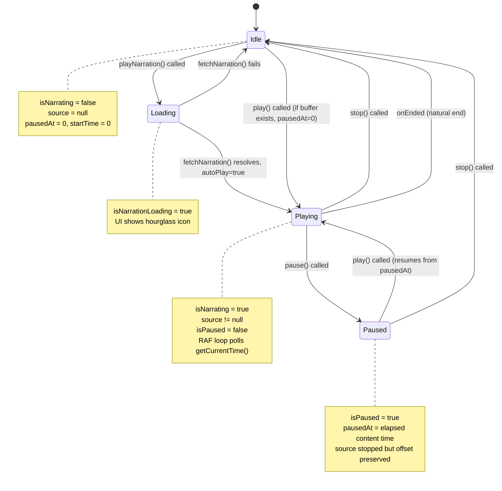
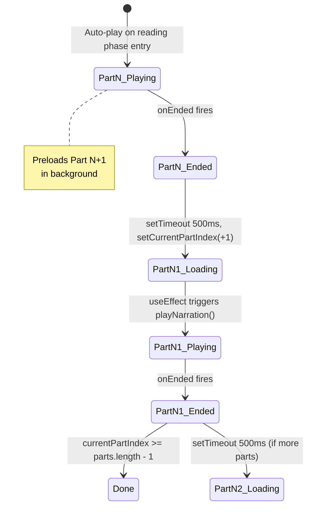
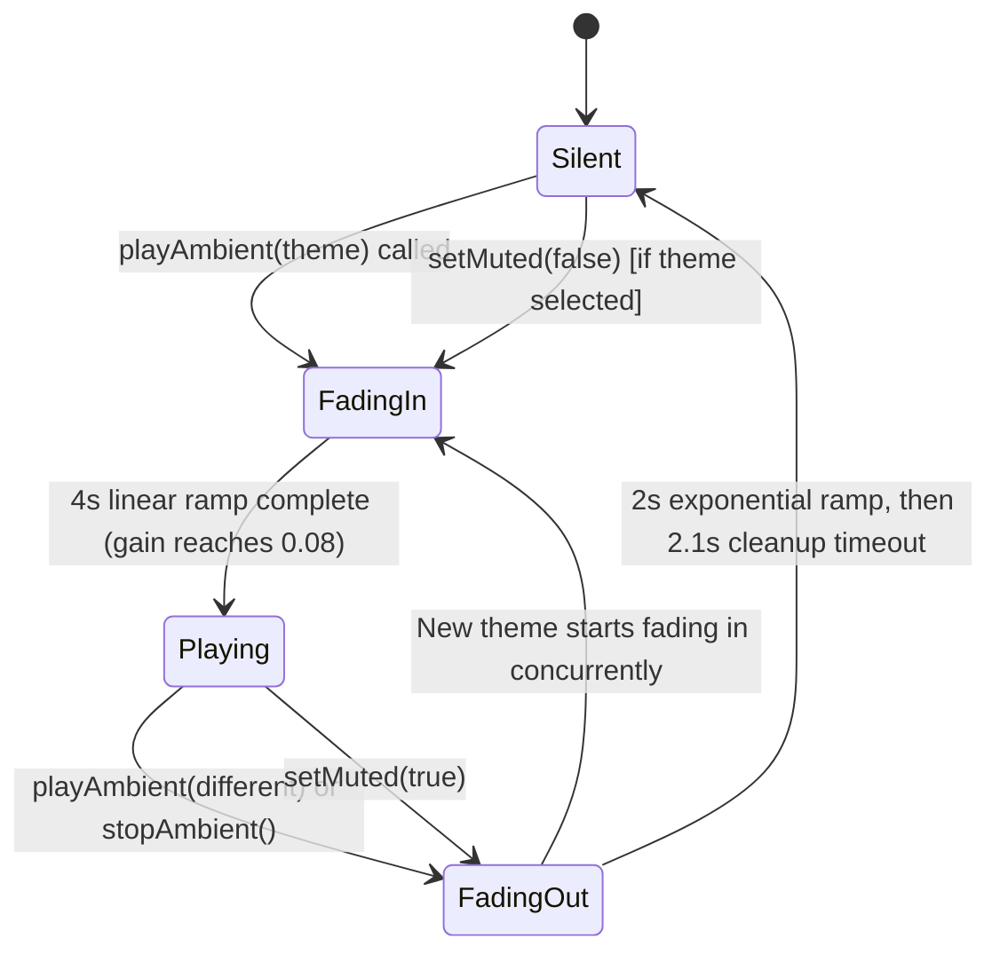

# Infinity Heroes: Bedtime Chronicles -- Audio System Documentation

Complete engineering reference for the audio UX layer spanning narration, procedural sound effects, ambient soundscapes, caching, and playback controls.

---

## Table of Contents

1. [Architecture Overview](#1-architecture-overview)
2. [Narration System](#2-narration-system)
3. [Caching System](#3-caching-system)
4. [Voice System](#4-voice-system)
5. [Procedural Sound Effects](#5-procedural-sound-effects)
6. [Ambient Soundscapes](#6-ambient-soundscapes)
7. [Audio Controls UI](#7-audio-controls-ui)
8. [Browser Compatibility](#8-browser-compatibility)
9. [Audio State Machine](#9-audio-state-machine)
10. [Performance](#10-performance)

---

## 1. Architecture Overview

The application employs a **dual-AudioContext** design with two completely independent audio pipelines, each operating at a different sample rate optimized for its content type.

### Dual AudioContext Design

| Context | Owner | Sample Rate | Purpose |
|---------|-------|-------------|---------|
| **Narration Context** | `NarrationManager` (singleton) | **24,000 Hz** | TTS playback -- matches Gemini TTS native output rate |
| **SFX / Ambient Context** | `SoundManager` (singleton) | **44,100 Hz** | UI sound effects and procedural ambient soundscapes |

Both singletons are instantiated once and exported as module-level constants:

```
// NarrationManager.ts
export const narrationManager = new NarrationManager();

// SoundManager.ts
export const soundManager = new SoundManager();
```

### Why Two Contexts

Gemini TTS (`gemini-2.5-flash-preview-tts`) outputs raw 16-bit PCM at 24 kHz mono. Creating the narration AudioContext at 24 kHz avoids resampling and preserves fidelity. Sound effects and ambient textures use standard 44.1 kHz for full-bandwidth synthesis with oscillators and noise generators.

### Web Audio API Node Graphs

**Narration pipeline (NarrationManager):**

```
AudioBufferSourceNode (.playbackRate)
        |
        v
     GainNode (volume)
        |
        v
  AudioContext.destination
```

**SFX pipeline (SoundManager -- one-shot effects):**

```
OscillatorNode (freq envelope)
        |
        v
     GainNode (amplitude envelope)
        |
        v
  AudioContext.destination
```

**Ambient pipeline (SoundManager -- persistent loops):**

```
BufferSourceNode(s) [noise buffers, looping]
        |
        v
  BiquadFilterNode(s) [lowpass / highpass / bandpass]
        |
        v
     GainNode(s) [per-layer volume, LFO-modulated]
        |
        v
  StereoPannerNode (optional, LFO-modulated pan)
        |
        v
  ambientGain (master gain for fade-in / fade-out)
        |
        v
  AudioContext.destination

OscillatorNode(s) [drones, chirps, LFOs]
        |
        v
  GainNode(s) [modulation depth]
        |
        v
  (connected to filter.frequency, gain.gain, or panner.pan)
```

### Source Files

| File | Role |
|------|------|
| `NarrationManager.ts` | TTS fetch, decode, playback, pause/resume, rate control, caching |
| `SoundManager.ts` | Procedural SFX, ambient soundscape synthesis, mute control |
| `hooks/useNarrationSync.ts` | React bridge -- polls `NarrationManager` state via `requestAnimationFrame` |
| `hooks/useStoryEngine.ts` | Orchestrator -- coordinates narration, SFX, story progression |
| `components/ReadingView.tsx` | Playback UI -- play/pause, stop, speed, progress ring, mute toggle |
| `components/SyncedText.tsx` | Karaoke-style word highlighting synchronized to narration time |
| `components/SettingsModal.tsx` | Persistent voice/mute preferences UI |
| `components/setup/VoiceSelector.tsx` | Voice picker with 7 voice options |
| `components/setup/SleepSetup.tsx` | Ambient soundscape selector, triggers `SoundManager.playAmbient()` |
| `api/generate-narration.ts` | Vercel serverless function -- proxies Gemini TTS API |
| `lib/StorageManager.ts` | IndexedDB persistence for audio buffers and user preferences |
| `types.ts` | Type definitions for voices, ambient themes, preferences |

---

## 2. Narration System

### 2.1 TTS Generation Flow

The full pipeline from user action to audible speech:

```
User taps Play
      |
      v
useStoryEngine.playNarration()
      |
      v
narrationManager.fetchNarration(text, voiceName, autoPlay=true)
      |
      v
[1] Check memory cache (Map<string, AudioBuffer>)
      |--- HIT --> play()
      |
      v
[2] Check IndexedDB cache (storageManager.getAudio)
      |--- HIT --> decodeAudioData() --> memoryCache.set() --> play()
      |
      v
[3] POST /api/generate-narration  {text, voiceName}
      |
      v
Vercel serverless handler:
  GoogleGenAI.generateContent({
    model: 'gemini-2.5-flash-preview-tts',
    responseModalities: [Modality.AUDIO],
    speechConfig.voiceConfig.prebuiltVoiceConfig.voiceName
  })
      |
      v
Response: { audioData: "<base64-encoded raw PCM>" }
      |
      v
Client receives JSON, extracts base64Audio
      |
      v
decode(base64Audio)  -->  Uint8Array (raw bytes)
      |
      v
storageManager.saveAudio(cacheKey, bytes.buffer)  [fire-and-forget to IndexedDB]
      |
      v
decodeAudioData(bytes, audioCtx)  -->  AudioBuffer
      |
      v
memoryCache.set(cacheKey, buffer)
      |
      v
play()  [if autoPlay=true]
```

### 2.2 Base64 Decoding Implementation

The `decode()` method manually converts a base64 string to a `Uint8Array`. This is a deliberate implementation choice (rather than using `fetch()` + `Blob` or `TextDecoder`) to maintain direct control over the byte pipeline:

```typescript
private decode(base64: string): Uint8Array {
    const binaryString = atob(base64);       // Browser-native base64 decode to binary string
    const len = binaryString.length;
    const bytes = new Uint8Array(len);
    for (let i = 0; i < len; i++) {
        bytes[i] = binaryString.charCodeAt(i); // Extract each byte as char code
    }
    return bytes;
}
```

**Why not `decodeAudioData()` on the AudioContext?** Gemini returns *raw PCM*, not a container format (WAV, MP3, OGG). The native `AudioContext.decodeAudioData()` expects a container with headers. The manual PCM decoder below handles the headerless format directly.

### 2.3 Raw PCM 16-bit to Float32 Conversion

The `decodeAudioData()` method converts raw 16-bit signed integer PCM samples into the `Float32Array` format required by Web Audio API `AudioBuffer` channels:

```typescript
private async decodeAudioData(
    data: Uint8Array,
    ctx: AudioContext,
    sampleRate: number = 24000,  // Gemini TTS native rate
    numChannels: number = 1       // Mono output
): Promise<AudioBuffer> {
    const dataInt16 = new Int16Array(data.buffer);            // Reinterpret bytes as signed 16-bit
    const frameCount = dataInt16.length / numChannels;        // Total sample frames
    const buffer = ctx.createBuffer(numChannels, frameCount, sampleRate);

    for (let channel = 0; channel < numChannels; channel++) {
        const channelData = buffer.getChannelData(channel);   // Float32Array view
        for (let i = 0; i < frameCount; i++) {
            channelData[i] = dataInt16[i * numChannels + channel] / 32768.0;
            // Normalize: Int16 range [-32768, 32767] --> Float32 range [-1.0, 1.0)
        }
    }
    return buffer;
}
```

**Key details:**
- The division by `32768.0` (2^15) normalizes the integer range to floating-point audio range.
- The interleaved channel layout `dataInt16[i * numChannels + channel]` supports hypothetical multi-channel, though Gemini currently outputs mono.
- The `AudioBuffer` is created at the context's sample rate (24 kHz), matching the TTS output natively.

### 2.4 Audio Node Chain

```
AudioBufferSourceNode
    .buffer = currentBuffer          // Decoded AudioBuffer
    .playbackRate.value = this.playbackRate  // Speed control
        |
        v  .connect()
    GainNode (this.gainNode)
        |
        v  .connect() [set up during init()]
    AudioContext.destination
```

The `GainNode` is created once during `init()` and persists for the lifetime of the context. Each `play()` call creates a fresh `AudioBufferSourceNode` (as required by Web Audio API -- source nodes are single-use).

### 2.5 Play / Pause / Resume with Offset Tracking

The narration system implements pause/resume using offset tracking rather than `AudioContext.suspend()`, enabling more precise control:

**Play:**
```typescript
play() {
    if (!this.currentBuffer || !this.audioCtx) return;
    this.stop();                                    // Tear down any active source

    this.source = this.audioCtx.createBufferSource();
    this.source.buffer = this.currentBuffer;
    this.source.playbackRate.value = this.playbackRate;
    this.source.connect(this.gainNode!);

    const offset = this.isPaused ? this.pausedAt : 0;  // Resume from pause point or start
    this.source.start(0, offset);                       // Start immediately, at offset

    this.startTime = this.audioCtx.currentTime - (offset / this.playbackRate);
    this.isPaused = false;

    this.source.onended = () => {
        if (!this.isPaused) {                          // Only fire if natural end (not pause)
            if (this.onEnded) this.onEnded();
            this.stop();
        }
    };
}
```

**Pause:**
```typescript
pause() {
    if (!this.source || !this.audioCtx || this.isPaused) return;
    this.pausedAt = (this.audioCtx.currentTime - this.startTime) * this.playbackRate;
    // ^ Calculate how many seconds of audio content have been consumed
    this.source.stop();        // This triggers onended, but isPaused flag prevents callback
    this.isPaused = true;
}
```

**Stop (full reset):**
```typescript
stop() {
    if (this.source) {
        this.source.onended = null;    // Detach callback to prevent spurious firing
        try { this.source.stop(); } catch (e) {}  // May already be stopped
        this.source = null;
    }
    if (!this.isPaused) {
        this.pausedAt = 0;             // Only reset position if not pausing
        this.startTime = 0;
    }
}
```

**Time tracking formula:**
- `currentTime = (audioCtx.currentTime - startTime) * playbackRate`
- `startTime` is set so that the formula yields the correct audio position accounting for speed changes
- When paused: `pausedAt` stores the audio-content-time at the moment of pause

### 2.6 Playback Rate Adjustment with Time Recalculation

When the user changes speed during active playback, the `startTime` reference must be recalculated to keep the reported `getCurrentTime()` continuous:

```typescript
setRate(rate: number) {
    if (this.playbackRate === rate) return;

    if (this.source && !this.isPaused && this.audioCtx) {
        const now = this.audioCtx.currentTime;
        const currentAudioTime = (now - this.startTime) * this.playbackRate;
        // ^ Content time elapsed at the OLD rate
        this.startTime = now - (currentAudioTime / rate);
        // ^ New startTime such that getCurrentTime() returns the same value at the NEW rate
        this.source.playbackRate.value = rate;
    }

    this.playbackRate = rate;
}
```

**Example:** If 10 seconds of content have played at 1.0x, and the user switches to 1.5x, `startTime` is adjusted so the progress bar doesn't jump. The remaining buffer plays faster, but the position remains continuous.

### 2.7 onEnded Callback Behavior

The `onEnded` callback is a public property on `NarrationManager`:

```typescript
public onEnded: (() => void) | null = null;
```

It is set by `useStoryEngine` to handle post-narration logic:

```typescript
narrationManager.onEnded = () => {
    setIsNarrating(false);
    if (input.mode === 'sleep' && story) {
        if (currentPartIndex < story.parts.length - 1) {
            setTimeout(() => {
                setCurrentPartIndex(prev => prev + 1);
            }, 500);   // 500ms gap between sleep story parts
        }
    }
};
```

**Critical guard:** The `onended` handler on the `AudioBufferSourceNode` checks `if (!this.isPaused)` before invoking `this.onEnded`. This prevents the callback from firing when `source.stop()` is called during a pause operation (since stopping a source always triggers its `onended` event).

### 2.8 Preloading (Next Part Pre-fetch)

After the current part begins playing, the next part is immediately pre-fetched with `autoPlay = false`:

```typescript
// In useStoryEngine.playNarration():

// 1. Play current part
await narrationManager.fetchNarration(textToRead, input.narratorVoice, true);

// 2. Preload next part (fire and forget)
if (!isLastPart) {
    const nextText = /* ... construct next part text ... */;
    narrationManager.fetchNarration(nextText, input.narratorVoice, false)
        .catch(err => console.warn("Preload failed", err));
}
```

When `autoPlay = false`, `fetchNarration()` goes through the full cache lookup and API fetch pipeline but only stores the resulting `AudioBuffer` in the memory cache and IndexedDB without calling `play()`. The next time that part is requested with `autoPlay = true`, it hits the memory cache instantly.

For the **last part**, the narrated text is augmented with the story's lesson, joke, and tomorrow hook:

```typescript
const textToRead = isLastPart
    ? `${currentPart.text}. Today's lesson is: ${story.lesson}. Here is a joke: ${story.joke}. ${story.tomorrowHook}`
    : currentPart.text;
```

---

## 3. Caching System

### 3.1 Cache Key Format

```
v1:{voiceName}:{first30CharsOfText}_{textLength}
```

**Examples:**
```
v1:Kore:Once upon a time in a land far_847
v1:Puck:The brave hero leaped across th_1203
```

The `v1:` prefix enables future cache invalidation if the TTS model or encoding changes. The combination of text prefix + full text length provides a pragmatic uniqueness guarantee without hashing overhead.

### 3.2 Memory Cache

```typescript
private memoryCache = new Map<string, AudioBuffer>();
```

- **Type:** `Map<string, AudioBuffer>` -- maps cache keys to decoded Web Audio `AudioBuffer` objects
- **Lifetime:** Persists for the duration of the browser session (page lifecycle)
- **Lookup cost:** O(1) hash map access
- **No eviction policy:** The memory cache grows unboundedly. See [Performance](#10-performance) for implications.

### 3.3 IndexedDB Persistent Cache

Backed by the `StorageManager` class using an IndexedDB object store named `audio`:

```typescript
// Database: 'BedtimeChroniclesDB', version 4
// Object store: 'audio' (simple key-value, no keyPath)

// Write:
async saveAudio(key: string, data: ArrayBuffer): Promise<void>

// Read:
async getAudio(key: string): Promise<ArrayBuffer | undefined>
```

- **Stored format:** Raw `ArrayBuffer` (the PCM bytes before Float32 conversion)
- **Persists across sessions:** Audio survives page reloads and browser restarts
- **Enables offline playback:** Previously narrated story parts can be replayed without network

### 3.4 Three-Tier Lookup Strategy

```
[1] Memory Cache (Map<string, AudioBuffer>)
    |
    |-- HIT: Use AudioBuffer directly. Fastest path (~0ms).
    |-- MISS: Fall through.
    |
    v
[2] IndexedDB (storageManager.getAudio)
    |
    |-- HIT: Uint8Array -> decodeAudioData() -> AudioBuffer.
    |         Write back to memory cache. (~5-20ms)
    |-- MISS: Fall through.
    |
    v
[3] Network (POST /api/generate-narration)
    |
    |-- Response: base64 -> decode() -> Uint8Array
    |         Save to IndexedDB (fire-and-forget).
    |         decodeAudioData() -> AudioBuffer.
    |         Write to memory cache. (~500-3000ms depending on text length)
    |-- ERROR: console.error, no playback.
```

---

## 4. Voice System

### 4.1 All 7 Voices

Defined in `components/setup/VoiceSelector.tsx` as the `VOICES` constant and typed in `types.ts`:

```typescript
// types.ts
narratorVoice: 'Puck' | 'Charon' | 'Kore' | 'Fenrir' | 'Aoede' | 'Zephyr' | 'Leda';
```

| Voice ID | Icon | Label | Character |
|----------|------|-------|-----------|
| `Kore` | `$1` | Soothing | Default voice. Calm and warm. |
| `Aoede` | `$1` | Melodic | Musical, songlike quality. |
| `Zephyr` | `$1` | Gentle (Soft) | Breathy, whisper-adjacent. |
| `Leda` | `$1` | Ethereal (Soft) | Dreamy, otherworldly. |
| `Puck` | `$1` | Playful | Mischievous, energetic. |
| `Charon` | `$1` | Deep | Low, gravelly, storyteller. |
| `Fenrir` | `$1` | Bold | Strong, commanding. |

These voice names are passed directly to the Gemini TTS API as `prebuiltVoiceConfig.voiceName`.

### 4.2 Voice Selection UI

The `VoiceSelector` component renders a radio-group style picker:

- Each voice is a button with icon, label, and voice ID
- Selection triggers `onVoiceChange(voiceId)` which updates `input.narratorVoice`
- Plays `soundManager.playChoice()` on selection for tactile feedback
- Visual styling adapts to app mode (`sleep` mode uses indigo/glow theme; other modes use bold comic style)
- Uses proper ARIA: `role="radiogroup"`, `role="radio"`, `aria-checked`

### 4.3 Voice Selection Persistence

Voice preference is persisted through the `UserPreferences` system:

1. **Setup phase:** VoiceSelector updates `input.narratorVoice` in the story state
2. **Settings modal:** Voice picker in "Voice & Audio" tab updates `userPreferences.narratorVoice`
3. **Persistence:** `saveUserPreferences()` writes to IndexedDB via `storageManager.savePreferences()`
4. **Load:** On app init, `useStoryEngine` loads saved preferences and applies them as defaults:

```typescript
const prefs = await storageManager.getPreferences();
setInput(prev => ({
    ...prev,
    narratorVoice: prefs.narratorVoice,
    // ...
}));
```

Default voice is `Kore` (defined in `DEFAULT_PREFERENCES`).

### 4.4 Voice Preview Functionality

Voice selection provides *implicit* preview through the `soundManager.playChoice()` UI feedback sound. There is no dedicated TTS preview (the user would need to start a narration to hear the selected voice). The voice name is displayed below the icon as a monospace label for identification.

---

## 5. Procedural Sound Effects

### 5.1 SoundManager Singleton

```typescript
class SoundManager {
    private ctx: AudioContext | null = null;  // Lazy-initialized at 44100 Hz
    private muted: boolean = false;
    // ... ambient state ...
}

export const soundManager = new SoundManager();
```

All SFX methods check `if (this.muted) return;` before generating audio. The `setMuted()` method also fades ambient gain to 0 when muted.

### 5.2 Sound Effect Types

#### `playChoice()` -- Button Click / Selection

**Used for:** All interactive button presses (voice selection, settings changes, menu navigation, playback controls, choice selection, font size toggle, mute toggle, ambient theme selection, story mode switches).

**Synthesis:**
```
OscillatorNode (sine)
    freq: 440 Hz -> exponential ramp to 880 Hz over 100ms
        |
        v
    GainNode
        gain: 0.3 -> exponential ramp to 0.01 over 100ms
        |
        v
    destination

Duration: 100ms
Character: Quick upward chirp. Satisfying "click" feel.
```

#### `playPageTurn()` -- Story Progression

**Used for:** Story generation complete, loading story from history, advancing to next part after choice.

**Synthesis:**
```
OscillatorNode (triangle)
    freq: 150 Hz -> exponential ramp to 300 Hz over 300ms
        |
        v
    GainNode
        gain: 0.1 -> linear ramp to 0 over 300ms
        |
        v
    destination

Duration: 300ms
Character: Soft swoosh. Low-pitched triangle wave with gentle rise suggests page flip.
```

#### `playSparkle()` -- Celebration / Success

**Used for:** Avatar generation success, settings saved confirmation.

**Synthesis:**
```
4 sequential OscillatorNodes (sine), staggered 100ms apart:
    Frequencies: C5 (523.25), E5 (659.25), G5 (783.99), C6 (1046.50)

    Each note:
        OscillatorNode (sine, frequency = f)
            |
            v
        GainNode
            gain: 0 -> linear ramp to 0.1 over 50ms -> exponential ramp to 0.01 over 400ms
            |
            v
        destination

    Note starts: t+0ms, t+100ms, t+200ms, t+300ms
    Note duration: 400ms each

Total duration: ~700ms
Character: Ascending C major arpeggio. Magical, rewarding sparkle effect.
```

#### `playDelete()` -- Destructive / Reset Action

**Used for:** Settings reset to defaults.

**Synthesis:**
```
OscillatorNode (sawtooth)
    freq: 150 Hz -> linear ramp to 50 Hz over 200ms
        |
        v
    GainNode
        gain: 0.2 -> exponential ramp to 0.01 over 200ms
        |
        v
    destination

Duration: 200ms
Character: Descending buzz. Sawtooth gives a rough, slightly alarming quality
    suggesting something being removed or undone.
```

### 5.3 SFX Usage Map

| Sound | Trigger Points |
|-------|---------------|
| `playChoice()` | Voice selection, ambient theme pick, mode toggle, settings tab switch, settings value change, playback toggle, stop button, menu button, font size toggle, mute toggle, "Mission Complete" button, story choice button |
| `playPageTurn()` | Story generated and entering reading phase, loading story from history, after handling a story choice |
| `playSparkle()` | Avatar generated successfully, settings saved |
| `playDelete()` | Settings reset to defaults |

---

## 6. Ambient Soundscapes

### 6.1 Overview

Six procedural ambient soundscapes are available, primarily designed for the Sleep Mode experience. Each is generated entirely through Web Audio API synthesis with no audio file dependencies.

**Ambient themes** (defined in `types.ts` as `AmbientTheme`):

```typescript
type AmbientTheme = 'space' | 'rain' | 'forest' | 'magic' | 'ocean' | 'crickets' | 'auto';
```

The `'auto'` value means silence (no ambient playback).

### 6.2 Common Infrastructure

**Master gain control:**
Every soundscape connects through a shared `ambientGain` GainNode:

```
[All soundscape nodes] --> ambientGain --> ctx.destination
```

- **Fade-in:** `ambientGain.gain.linearRampToValueAtTime(0.08, currentTime + 4)` -- 4-second linear fade to target level of 0.08
- **Fade-out (on stop):** `ambientGain.gain.exponentialRampToValueAtTime(0.0001, currentTime + 2)` -- 2-second exponential fade to near-silence, then full teardown after 2.1s timeout

**Noise buffer factory:**
```typescript
createNoiseBuffer(type: 'white' | 'pink' | 'brown'): AudioBuffer
```
- Buffer size: 2 seconds at context sample rate (88,200 samples at 44.1 kHz)
- All noise buffers are looped via `source.loop = true`

**Noise generation algorithms:**

| Type | Algorithm | Character |
|------|-----------|-----------|
| **White** | Uniform random `[-1, 1]` | Equal energy across all frequencies. Harsh, hissy. |
| **Pink** | Voss-McCartney approximation (7 coefficient IIR filter on white noise, scaled by 0.11) | 1/f spectral density. Natural, balanced. Used for rain, wind, leaves. |
| **Brown** | Integrated white noise (`output[i] = (lastOut + 0.02 * white) / 1.02`, scaled by 3.5) | 1/f^2 spectral density. Deep rumble. Used for ocean waves, cosmic hum. |

**Stereo panning:** All soundscapes that use stereo create a `StereoPannerNode` (with fallback for browsers without `createStereoPanner` support), modulated by a slow LFO for spatial movement.

**Active LFO tracking:** All `OscillatorNode` instances used as LFOs, drones, or chirps are pushed to `this.activeLFOs[]` for cleanup during `stopAmbient()`.

### 6.3 Soundscape: Space (Cosmic Hum)

**Concept:** Deep, resonant cosmic drone with slow spatial movement.

**Node Graph:**

```
[Brown Noise Buffer] --loop--> BiquadFilter (lowpass, fc=80Hz)
                                    ^
                                    |
                          OscillatorNode (LFO, 0.05Hz)
                                    |
                               GainNode (depth=20)
                                    |
                          --> filter.frequency modulation
                                    |
                               BiquadFilter output
                                    |
                                    v
                              ambientGain --> destination

[Drone 1: Sine @ 55 Hz (A1)] --> GainNode (0.03)  -\
                                                      |--> StereoPannerNode --> ambientGain
[Drone 2: Sine @ 55.5 Hz]    --> GainNode (0.03)  -/         ^
                                                              |
                                                    OscillatorNode (pan LFO, 0.1Hz)
                                                              |
                                                         GainNode (depth=0.5)
```

**Characteristics:**
- The 0.5 Hz detuning between drones creates a slow **beating effect** (1 beat per 2 seconds)
- The lowpass filter LFO at 0.05 Hz (20-second period) creates slow timbral evolution of the rumble
- Stereo pan LFO at 0.1 Hz slowly rotates the drone field across the stereo image

### 6.4 Soundscape: Rain (Gentle Rain)

**Concept:** Layered rain with distinct "body" and "patter" textures.

**Node Graph:**

```
[Pink Noise Buffer] --loop--> BiquadFilter (lowpass, fc=1200Hz) --> ambientGain
                              "Rain body"

[White Noise Buffer] --loop--> BiquadFilter (bandpass, fc=2500Hz, Q=0.5)
                               "Rain patter"
                                    |
                                    v
                               GainNode (patter volume)
                                    ^
                                    |
                          OscillatorNode (LFO, 0.3Hz)
                                    |
                               GainNode (depth=0.02)
                                    |
                          --> patterGain.gain modulation
                                    |
                               patterGain output
                                    |
                                    v
                              StereoPannerNode --> ambientGain
                                    ^
                                    |
                          OscillatorNode (pan LFO, 0.2Hz)
```

**Characteristics:**
- **Rain body:** Pink noise (natural spectrum) through 1200 Hz lowpass gives warm, enveloping rain sound
- **Rain patter:** White noise through 2500 Hz bandpass isolates the higher "droplet" frequency band
- Patter volume modulated at 0.3 Hz creates natural intensity variation
- Patter panned at 0.2 Hz for spatial spread

### 6.5 Soundscape: Forest (Forest Night)

**Concept:** Wind through trees with rustling leaf overlay.

**Node Graph:**

```
[Pink Noise Buffer] --loop--> BiquadFilter (lowpass, fc=400Hz)
                              "Wind base"
                                    ^
                                    |
                          OscillatorNode (LFO, 0.15Hz)
                                    |
                               GainNode (depth=200)
                                    |
                          --> windFilter.frequency modulation (200-600Hz sweep)
                                    |
                               windFilter output --> ambientGain

[Pink Noise Buffer] --loop--> BiquadFilter (highpass, fc=2500Hz)
                              "Rustling leaves"
                                    |
                                    v
                               GainNode (0.04)
                                    ^
                                    |
                          OscillatorNode (leaf LFO, 0.08Hz)
                                    |
                               GainNode (depth=0.01)
                                    |
                          --> leafGain.gain modulation
                                    |
                               leafGain output
                                    |
                                    v
                              StereoPannerNode --> ambientGain
                                    ^
                                    |
                          OscillatorNode (pan LFO, 0.05Hz)
                                    |
                               GainNode (depth=0.6)
```

**Characteristics:**
- Wind filter cutoff sweeps between ~200-600 Hz at 0.15 Hz (6.7-second cycle) for natural gusting
- Leaves isolated above 2500 Hz with slow amplitude modulation
- Wide stereo pan (0.6 depth) at very slow 0.05 Hz (20-second cycle) for immersive canopy effect

### 6.6 Soundscape: Ocean (Midnight Ocean)

**Concept:** Deep wave surges with synchronized spray/foam.

**Node Graph:**

```
[Brown Noise Buffer] --loop--> BiquadFilter (lowpass, fc=350Hz)
                               "Deep waves"
                                    |
                                    v
                               GainNode (base=1.0)
                                    ^
                                    |
                          OscillatorNode (wave LFO, 0.1Hz) --+
                                    |                         |
                               GainNode (depth=0.3)           |
                                    |                         |
                          --> waveGain.gain modulation         |
                                    |                         |
                               waveGain output                |
                                    |                         |
                                    v                         |
                              StereoPannerNode --> ambientGain|
                                    ^                         |
                                    |                         |
                          OscillatorNode (pan LFO, 0.05Hz)    |
                                                              |
[Pink Noise Buffer] --loop--> BiquadFilter (highpass, fc=2000Hz)
                              "Spray/Foam"                    |
                                    |                         |
                                    v                         |
                               GainNode (base=0, modulated)   |
                                    ^                         |
                                    |                         |
                               GainNode (depth=0.03) <--------+
                                    |                    (shared wave LFO)
                          --> sprayGain.gain modulation
                                    |
                               sprayGain output
                                    |
                                    v
                              StereoPannerNode --> ambientGain (shared panner)
```

**Characteristics:**
- **Synchronized layers:** Both wave volume and spray volume are driven by the **same** LFO at 0.1 Hz (10-second wave cycle), creating correlated surge and splash
- Spray gain starts at 0 and is modulated by +/- 0.03, so it only becomes audible at wave peaks
- Wave volume oscillates around 1.0 +/- 0.3 for dramatic but smooth swells
- Brown noise (heaviest low-frequency content) through 350 Hz lowpass produces convincing deep wave sound

### 6.7 Soundscape: Crickets (Summer Night)

**Concept:** Warm nighttime base with procedural cricket chirps.

**Node Graph:**

```
[Pink Noise Buffer] --loop--> BiquadFilter (lowpass, fc=600Hz) --> ambientGain
                              "Warm night air"

OscillatorNode (sine, 4500Hz) --> GainNode (chirp envelope, base=0)
    "Cricket tone"                     ^                     ^
                                       |                     |
                              OscillatorNode (square, 25Hz)  OscillatorNode (sine, 0.4Hz)
                                  "Chirp rate"                "Chirp rhythm"
                                       |                     |
                                  GainNode (0.02)        GainNode (0.02)
                                       |                     |
                              --> chirpGain.gain mod    --> chirpGain.gain mod

chirpGain output --> ambientGain --> destination
```

**Characteristics:**
- Cricket chirp at 4500 Hz (realistic insect frequency range)
- **Square wave at 25 Hz** amplitude-modulates the chirp tone, creating the characteristic rapid on/off "trill" pattern
- **Sine wave at 0.4 Hz** provides slower rhythmic envelope, making chirps come in bursts rather than continuously
- Pink noise base through 600 Hz lowpass gives warm ambient night atmosphere
- No stereo panning on this soundscape

### 6.8 Soundscape: Magic (Ethereal Spark)

**Concept:** Swept, resonant shimmer.

**Node Graph:**

```
[White Noise Buffer] --loop--> BiquadFilter (bandpass, fc=2000Hz, Q=20)
                                    ^
                                    |
                          OscillatorNode (LFO, 0.15Hz)
                                    |
                               GainNode (depth=1000)
                                    |
                          --> filter.frequency modulation (1000-3000Hz sweep)
                                    |
                               filter output --> ambientGain --> destination
```

**Characteristics:**
- **Narrow bandpass** (Q=20) on white noise creates a pitched, resonant tone from broadband noise
- LFO sweeps the center frequency across a 2000 Hz range (+/- 1000 Hz around center)
- This produces a slowly undulating, otherworldly shimmer effect
- Simplest soundscape topology -- single noise source with swept filter
- No stereo panning, no secondary source

### 6.9 Crossfade Behavior When Switching

When switching between soundscapes (or from soundscape to silence):

1. `playAmbient(newMode)` is called
2. If `isAmbientPlaying`, `stopAmbient()` is called first:
   - Current `ambientGain` fades out exponentially over **2 seconds** to 0.0001
   - After **2.1 seconds** (via `setTimeout`), all source and LFO nodes are `.stop()`-ped
   - References are nulled
3. New `ambientGain` is created starting at gain 0
4. New soundscape nodes are wired up
5. `ambientGain` fades in linearly over **4 seconds** to 0.08

**Note:** This is a **hard cut with fade**, not a true crossfade. The old soundscape fades out, then the new one fades in. There is a brief overlap during the 2-second fade-out while the new soundscape begins its 4-second fade-in. The old soundscape's `ambientGain` node is a different object from the new one, so both can decay/grow simultaneously without interference.

### 6.10 Ambient Sound in Sleep Setup

The `SleepSetup` component manages ambient sound lifecycle:

```typescript
useEffect(() => {
    if (input.sleepConfig.ambientTheme !== 'auto' && input.mode === 'sleep') {
        soundManager.playAmbient(input.sleepConfig.ambientTheme);
    } else {
        soundManager.stopAmbient();
    }
    return () => soundManager.stopAmbient();  // Cleanup on unmount
}, [input.sleepConfig.ambientTheme, input.mode]);
```

This means ambient sounds play as a **live preview** during the setup phase when the user selects a soundscape, and are cleaned up when leaving sleep setup.

---

## 7. Audio Controls UI

The primary audio controls are rendered in `ReadingView.tsx` within a persistent bottom navigation bar (`<motion.nav>`).

### 7.1 Play / Pause Button

**Location:** Center of the control hub, wrapped in a circular SVG progress ring.

**States and icons:**

| State | Icon | `aria-label` |
|-------|------|-------------|
| Loading narration | `$1` (hourglass, pulsing + 50% opacity) | "Play" |
| Playing | `$1` (pause) | "Pause" |
| Stopped / Paused | `$1` (play triangle) | "Play" |

**Behavior on click:**
1. `onTogglePlayback()` calls `useStoryEngine.playNarration()`
2. Which checks `narrationManager.state`:
   - If **paused**: calls `narrationManager.play()` (resumes from offset)
   - If **playing**: calls `narrationManager.pause()`
   - If **stopped** (no buffer or not playing): fetches narration, then plays
3. Additionally plays `soundManager.playChoice()` for click feedback

**Progress ring:** An SVG `<circle>` element with `strokeDasharray="260"` and `strokeDashoffset` computed as:
```
260 - (260 * progressPercent) / 100
```
where `progressPercent = (narrationTime / narrationDuration) * 100`.

### 7.2 Stop Button

**Location:** To the right of the play/pause button.

**Icon:** `$1` (stop square), 30% opacity, full opacity on hover, red on hover.

**Behavior:** Calls `onStopNarration()` which invokes `narrationManager.stop()` and sets `isNarrating = false`. Resets playback position to 0. Also plays `soundManager.playChoice()`.

### 7.3 Speed Control

**Location:** Right side of the control bar, below the voice name display.

**Available rates:** `0.8x`, `1.0x`, `1.2x`

**Rendering:** Three pill buttons in a `role="group"` with `aria-label="Playback speed"`:

```typescript
{[0.8, 1.0, 1.2].map(r => (
    <button
        onClick={() => { setPlaybackRate(r); soundManager.playChoice(); }}
        className={`... ${playbackRate === r ? 'bg-current text-white scale-110' : 'opacity-30 hover:opacity-60'}`}
        aria-pressed={playbackRate === r}
    >
        {r}x
    </button>
))}
```

**Data flow:**
1. Button click calls `setPlaybackRate(rate)` from `useNarrationSync`
2. Which calls `narrationManager.setRate(rate)` (updates AudioBufferSourceNode.playbackRate and recalculates startTime)
3. And `setPlaybackRateState(rate)` (updates React state for UI)

### 7.4 Volume Controls

**Mute toggle:** Located in the top-right header of the ReadingView.

**Icon:** `$1` when unmuted, `$1` when muted.

**Behavior:**
1. Calls `toggleMute()` which invokes `saveUserPreferences({...userPreferences, isMuted: !userPreferences.isMuted})`
2. `saveUserPreferences` calls `soundManager.setMuted(newPrefs.isMuted)` immediately
3. `SoundManager.setMuted()` fades `ambientGain` to 0 (muted) or 0.06 (unmuted) using `setTargetAtTime` with a 500ms time constant
4. All SFX methods (`playChoice`, `playPageTurn`, etc.) check `if (this.muted) return;` at the top

**Note:** There is no granular volume slider. Volume control is binary (muted/unmuted) via the master mute toggle. The narration `GainNode` has no exposed volume control -- it defaults to gain 1.0.

### 7.5 Progress Indicators

**Per-part narration progress:**
- SVG circular progress ring around the play/pause button (see 7.1)
- Uses `narrationTime` and `narrationDuration` from `useNarrationSync`

**Overall story progress:**
- Horizontal progress bar in the left section of the control hub
- Shows "Journey Segment {current} / {total}"
- Width computed as `((currentPartIndex + 1) / story.parts.length) * 100`%
- Animated with `motion.div` spring transition

### 7.6 Soundscape Selector

Located in `SleepSetup.tsx`, rendered only during sleep mode setup:

- **Silence option:** "auto" theme = no ambient sound
- **6 soundscape buttons:** rain, forest, ocean, crickets, space, magic
- Selected soundscape gets indigo highlight with glow shadow
- Selection immediately triggers `soundManager.playAmbient(theme)` via useEffect

### 7.7 Text Synchronization (SyncedText)

The `SyncedText` component provides karaoke-style word highlighting during narration:

**Algorithm:**
1. Split text into sentences using regex: `/[^.!?]+[.!?]+[\])'"]*|[^.!?]+$/g`
2. For each sentence, calculate start/end time based on character position ratio:
   ```
   sentStartTime = (charOffset / totalChars) * duration
   ```
3. Split each sentence into words (preserving whitespace)
4. Calculate per-word timing using same proportional method
5. Apply styling:
   - **Active sentence:** Yellow background highlight
   - **Active word:** Blue color (#2563eb), bold, 1.05x scale, text shadow glow
   - **Active sentence inactive word:** Dark blue (#1e3a8a)
   - **Inactive sentence:** 70% opacity, gray (#1f2937)

**Note:** This is a heuristic-based sync (proportional to character count), not timestamp-aligned. It approximates real-time TTS pacing but may drift with variable speech rates for different words.

---

## 8. Browser Compatibility

### 8.1 AudioContext Resume After User Gesture

Both `NarrationManager.init()` and `SoundManager.init()` handle the autoplay policy restriction:

```typescript
private init() {
    if (!this.audioCtx) {
        this.audioCtx = new (window.AudioContext || (window as any).webkitAudioContext)({
            sampleRate: 24000  // or 44100 for SoundManager
        });
        // ... set up gain nodes ...
    }
    if (this.audioCtx.state === 'suspended') {
        this.audioCtx.resume();
    }
}
```

**Key points:**
- `init()` is called lazily on first user interaction (first `play()`, `playChoice()`, `playAmbient()`, etc.)
- This ensures the AudioContext is created within a user gesture event handler, satisfying Chrome, Firefox, and Safari autoplay policies
- The `state === 'suspended'` check handles cases where the context was previously created but suspended by the browser due to inactivity

### 8.2 Safari / WebKit Quirks

**`webkitAudioContext` fallback:**
```typescript
new (window.AudioContext || (window as any).webkitAudioContext)(...)
```
Older Safari versions (pre-14.1) expose the Audio API under the `webkit` prefix. The fallback handles this.

**`createStereoPanner` guard:**
```typescript
private createPanner(): StereoPannerNode | null {
    if (this.ctx && 'createStereoPanner' in this.ctx) {
        return this.ctx.createStereoPanner();
    }
    return null;
}
```
`StereoPannerNode` is not available in all browsers (notably older iOS Safari). When unavailable, soundscapes render in mono by connecting layers directly to `ambientGain` without panning. All ambient setup methods check `if (panner)` before wiring through the panner.

### 8.3 Fallback Behaviors

| Feature | Primary | Fallback |
|---------|---------|----------|
| `AudioContext` | `window.AudioContext` | `window.webkitAudioContext` |
| `StereoPannerNode` | `createStereoPanner()` | Mono output (direct to gain) |
| IndexedDB cache | Full persistence | Console warning, network-only fetch |
| TTS API failure | Error logged | No narration playback, silent failure |
| `source.stop()` in `stop()` | Clean stop | `try/catch` swallows "already stopped" errors |

---

## 9. Audio State Machine

### 9.1 Narration State Machine



### 9.2 Sleep Mode Auto-Advance



### 9.3 Ambient Sound State Machine



---

## 10. Performance

### 10.1 Memory Management

**Memory cache growth:**
The `memoryCache` (`Map<string, AudioBuffer>`) has no eviction policy. Each cached `AudioBuffer` for a narrated story part consumes:
- At 24 kHz, 16-bit mono: ~48 KB per second of audio
- A typical 30-second narration: ~1.4 MB as Float32 in the AudioBuffer
- A 15-part sleep story: ~21 MB in memory cache

**Mitigation:** The cache only grows within a single page session. A page reload clears the memory cache. IndexedDB stores the raw PCM (half the size of Float32 AudioBuffers) for cross-session persistence.

### 10.2 Buffer Cleanup

**Narration source nodes:**
- `stop()` nulls the source reference: `this.source = null`
- `onended` is set to `null` before stopping to prevent dangling callbacks
- Each `play()` call creates a fresh `AudioBufferSourceNode` (Web Audio requirement -- source nodes are not reusable)

**Ambient sound cleanup (`stopAmbient()`):**
- References to `ambientSource`, `secondarySource`, `ambientGain` are immediately nulled
- Actual `.stop()` calls happen in a `setTimeout` after the 2-second fade-out completes
- All LFO/oscillator references are cleared from `activeLFOs[]`

```typescript
stopAmbient() {
    // Fade out
    this.ambientGain.gain.exponentialRampToValueAtTime(0.0001, now + 2);

    // Capture refs for deferred cleanup
    const sources = [this.ambientSource, this.secondarySource];
    const lfos = [...this.activeLFOs];
    this.activeLFOs = [];

    // Deferred stop after fade
    setTimeout(() => {
        sources.forEach(s => { if (s) try { s.stop(); } catch(e) {} });
        lfos.forEach(l => { if (l) try { l.stop(); } catch(e) {} });
    }, 2100);

    // Null refs immediately
    this.ambientSource = null;
    this.secondarySource = null;
    this.ambientGain = null;
    this.isAmbientPlaying = false;
}
```

### 10.3 Concurrent Audio Streams

The application can have the following audio streams active simultaneously:

| Stream | Context | Max Concurrent |
|--------|---------|---------------|
| Narration playback | NarrationManager (24 kHz) | 1 (previous source is stopped before new play) |
| Ambient soundscape | SoundManager (44.1 kHz) | 1 active + 1 fading out during transition |
| UI SFX | SoundManager (44.1 kHz) | Multiple (fire-and-forget, each is ~100-700ms) |

**Maximum simultaneous audio nodes during an ambient transition:**
- Old soundscape: 2 sources + N oscillators + N gain nodes + 1 panner + 1 master gain (all fading out)
- New soundscape: 2 sources + N oscillators + N gain nodes + 1 panner + 1 master gain (fading in)
- Active narration: 1 source + 1 gain
- Any triggered SFX: 1-4 oscillators + 1-4 gains (short-lived)

Worst case is approximately 20-30 active audio nodes, well within Web Audio API performance budgets on modern browsers.

### 10.4 requestAnimationFrame Polling

The `useNarrationSync` hook uses a `requestAnimationFrame` loop to poll `narrationManager.getCurrentTime()`:

```typescript
const updateTime = () => {
    if (isNarrating) {
        setNarrationTime(narrationManager.getCurrentTime());
        setNarrationDuration(narrationManager.getDuration());
        rafId = requestAnimationFrame(updateTime);
    }
};
```

**Performance considerations:**
- Runs at display refresh rate (~60 Hz) but only while `isNarrating` is true
- Each frame triggers two React state updates (`setNarrationTime`, `setNarrationDuration`)
- `SyncedText` is wrapped in `React.memo` to prevent unnecessary re-renders when props haven't changed
- The RAF loop is cleanly cancelled on effect cleanup (`cancelAnimationFrame(rafId)`)
- When narration stops, `isNarrating` becomes false, and the RAF loop self-terminates

### 10.5 IndexedDB Write Performance

Audio data is written to IndexedDB using a fire-and-forget pattern:

```typescript
storageManager.saveAudio(cacheKey, bytes.buffer as ArrayBuffer)
    .catch(err => console.error("Save audio failed", err));
```

This ensures IndexedDB write latency does not block playback. The `catch` prevents unhandled promise rejections if the write fails (e.g., storage quota exceeded).

---

## Appendix: File Reference

| File Path | Audio Role |
|-----------|-----------|
| `NarrationManager.ts` | Core TTS playback engine, singleton |
| `SoundManager.ts` | Procedural SFX and ambient soundscape engine, singleton |
| `hooks/useNarrationSync.ts` | React state bridge for narration time/rate |
| `hooks/useStoryEngine.ts` | Orchestrates narration lifecycle, preloading, auto-advance |
| `components/ReadingView.tsx` | Playback controls UI (play/pause/stop/speed/mute/progress) |
| `components/SyncedText.tsx` | Karaoke-style word highlighting |
| `components/SettingsModal.tsx` | Persistent voice/mute preferences |
| `components/setup/VoiceSelector.tsx` | 7-voice radio picker |
| `components/setup/SleepSetup.tsx` | Ambient soundscape selector + preview |
| `api/generate-narration.ts` | Vercel serverless TTS proxy (Gemini API) |
| `lib/StorageManager.ts` | IndexedDB for audio cache + preferences |
| `types.ts` | `AmbientTheme`, `narratorVoice` union, `UserPreferences` |
