# Infinity Heroes: Bedtime Chronicles -- User Workflows & Journey Documentation

> Complete reference for every user journey, interaction, screen, and state transition in the application.

---

## Table of Contents

1. [Primary Workflows](#1-primary-workflows)
2. [Secondary Workflows](#2-secondary-workflows)
3. [Micro-Interactions](#3-micro-interactions)
4. [State Transitions](#4-state-transitions)
5. [User Personas & Scenarios](#5-user-personas--scenarios)
6. [Screen Inventory](#6-screen-inventory)
7. [Navigation Map](#7-navigation-map)
8. [Timing & Pacing](#8-timing--pacing)

---

## 1. Primary Workflows

### 1.1 Classic Adventure Mode

```mermaid
flowchart TD
    A[App Launch] --> B[Setup Phase]
    B --> C{Mode Selection Dock}
    C -->|Classic selected| D[Classic Setup - Wizard Step 0]
    D --> D1[Enter Hero Name]
    D1 -->|Click 'Next'| D2[Wizard Step 1: Enter Setting]
    D2 -->|Click 'Next'| D3[Wizard Step 2: Mission Parameters Review]
    D3 --> D3a{Generate Avatar?}
    D3a -->|Yes| D4[Click 'CREATE HERO' or 'REPAINT']
    D4 --> D5[Avatar Loading Spinner]
    D5 --> D6[Avatar Displayed]
    D6 --> D3b[Review Summary]
    D3a -->|No| D3b
    D3b --> E{Adjust Story Length?}
    E -->|Yes| E1[Select Length: Short / Medium / Long / Eternal]
    E -->|No| F{Select Narrator Voice?}
    E1 --> F
    F -->|Yes| F1[Pick from 7 Voices: Kore, Aoede, Zephyr, Leda, Puck, Charon, Fenrir]
    F -->|No| G{Ready to Launch?}
    F1 --> G
    G -->|heroName + setting filled| H[Click 'ENGAGE MISSION']
    H --> I[Loading FX Overlay]
    I --> I1[Progress Bar: 0-99%]
    I1 --> I2[Status Messages Cycle Every 2s]
    I2 --> J[Story Generated & Saved to IndexedDB]
    J --> K[Phase Transitions to 'reading']
    K --> L[Reading View]
    L --> L1[Display Story Title + Avatar]
    L1 --> L2[Display Current Part Text with SyncedText]
    L2 --> M{Part Has Choices?}
    M -->|Yes| N[Display Choice Buttons]
    N -->|Click a Choice| O[Advance to Next Part]
    O --> O1[Page Turn Sound]
    O1 --> L2
    M -->|No, Last Part| P[Display Completion Footer]
    P --> P1[Show 'The Wise Hero''s Lesson']
    P1 --> P2[Show 'A Chuckle for the Road' Joke]
    P2 --> P3[Click 'MISSION COMPLETE']
    P3 --> Q[Reset to Setup Phase]

    style A fill:#1e3a5f,color:#fff
    style H fill:#dc2626,color:#fff
    style J fill:#16a34a,color:#fff
    style P3 fill:#dc2626,color:#fff
```

**Readiness Validation (Classic):**
- `heroName` must be non-empty (trimmed)
- `setting` must be non-empty (trimmed)
- Must be online
- Not currently loading

---

### 1.2 Sleep Story Mode

```mermaid
flowchart TD
    A[App Launch] --> B[Setup Phase]
    B --> C{Mode Selection Dock}
    C -->|Sleep selected| D[Sleep Setup Screen]
    D --> D1[Enter Sleepy Hero Name]
    D1 --> D2{Select Sub-Mode}
    D2 -->|Dream Pick| D3[View Theme Preview Panel]
    D2 -->|Parent's Path| D4[Fill Sensory Inputs]
    D4 --> D4a[World Texture Input + Suggestions]
    D4a --> D4b[Gentle Echoes Input + Suggestions]
    D4b --> D4c[Dream Aromas Input + Suggestions]
    D3 --> E[Select Dreamscape Theme]
    D4c --> E
    E --> E1[Cloud Kingdom / Starry Space / Magic Forest / Deep Ocean / Moonlight Meadow]
    E1 --> F{Select Ambient Sound?}
    F -->|Yes| F1[Pick: Silence / Gentle Rain / Forest Night / Midnight Ocean / Night Crickets / Cosmic Hum / Ethereal Spark]
    F1 --> F2[Ambient Sound Starts Playing Immediately via Web Audio API]
    F -->|No, default Silence| G[Optional: Generate Avatar]
    F2 --> G
    G --> H[Select Story Length]
    H --> I[Select Narrator Voice]
    I --> J{heroName filled?}
    J -->|Yes| K[Click 'BEGIN DREAM-LOG']
    K --> L[Loading FX: Sleep Theme]
    L --> L1[Calming Stars + 'Weaving Dreams...' Messages]
    L1 --> M[Story Generated & Saved]
    M --> N[Reading View - Sleep Theme]
    N --> N1[Dark Indigo Background]
    N1 --> N2[Auto-Play Narration Starts]
    N2 --> N3[SyncedText Highlights Words]
    N3 --> N4{Narration Ends?}
    N4 -->|Yes, Not Last Part| N5[500ms Delay]
    N5 --> N6[Auto-Advance to Next Part]
    N6 --> N7[Auto-Play Next Part Narration]
    N7 --> N3
    N4 -->|Yes, Last Part| N8[Story Completes - Child Asleep]
    N4 -->|No, Still Playing| N3

    style C fill:#4338ca,color:#fff
    style K fill:#4338ca,color:#fff
    style N1 fill:#1e1b4b,color:#a5b4fc
```

**Sleep Mode Auto-Advance Behavior:**
1. When narration of current part finishes (`narrationManager.onEnded` fires)
2. If `mode === 'sleep'` and `currentPartIndex < parts.length - 1`: wait 500ms, then advance `currentPartIndex`
3. A `useEffect` watches `currentPartIndex` changes in sleep mode: triggers `playNarration()` after 100ms
4. Narration preloads the next part audio in parallel during current playback

**Readiness Validation (Sleep):**
- `heroName` must be non-empty (trimmed)
- Must be online

---

### 1.3 Mad Libs Mode

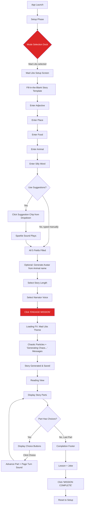

**Readiness Validation (Mad Libs):**
- All five fields must be non-empty (trimmed): `adjective`, `place`, `food`, `sillyWord`, `animal`
- Must be online

**Mad Lib Input Suggestions:**
| Field | Suggestions |
|-------|-------------|
| Adjective | brave, tiny, glowing, invisible |
| Place | Cave, Cloud City, Candy Lab |
| Food | Pizza, Marshmallow, Taco |
| Animal | Hamster, Dragon, Penguin |
| Silly Word | Bazinga!, Sploot!, Zoinks! |

---

## 2. Secondary Workflows

### 2.1 Returning User: Load from Memory Jar

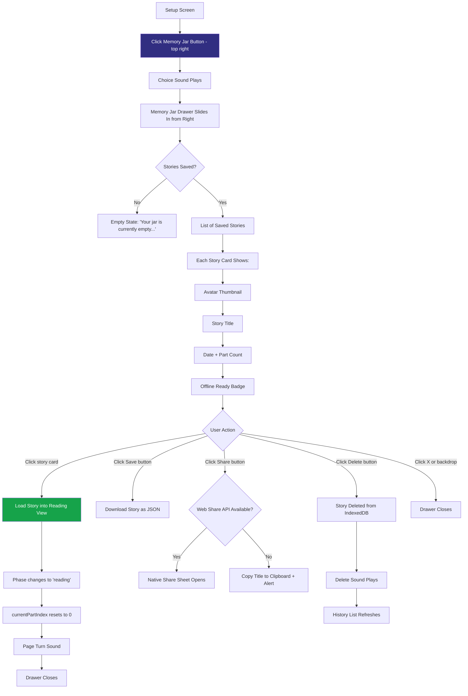

### 2.2 Voice Preview & Selection

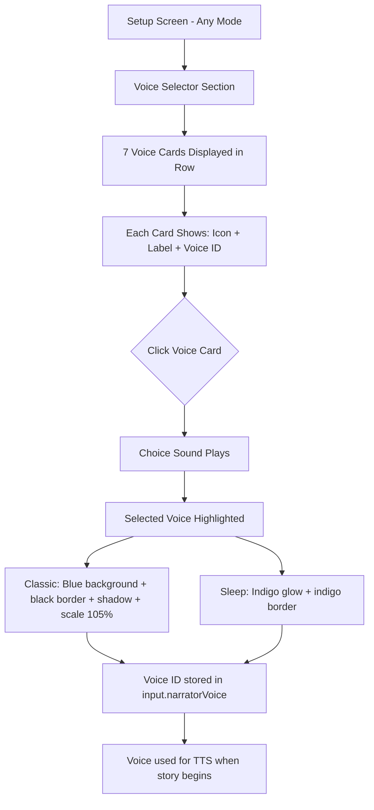

**Available Voices:**

| Voice ID | Icon | Label | Character |
|----------|------|-------|-----------|
| Kore | `*flower*` | Soothing | Default voice |
| Aoede | `*bird*` | Melodic | Singing quality |
| Zephyr | `*leaf*` | Gentle (Soft) | Whisper-like |
| Leda | `*sparkle*` | Ethereal (Soft) | Dreamy |
| Puck | `*fox*` | Playful | Energetic |
| Charon | `*bear*` | Deep | Low, warm |
| Fenrir | `*wolf*` | Bold | Strong, commanding |

### 2.3 Settings Adjustment

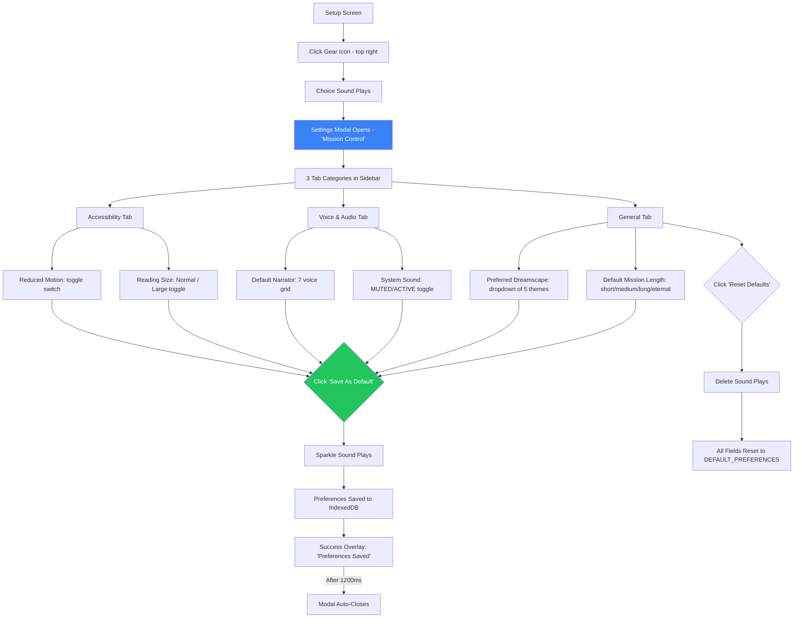

**Default Preferences:**
| Key | Default Value |
|-----|---------------|
| narratorVoice | Kore |
| storyLength | medium |
| sleepTheme | Cloud Kingdom |
| fontSize | normal |
| isMuted | false |
| reducedMotion | false |

### 2.4 Offline Reading

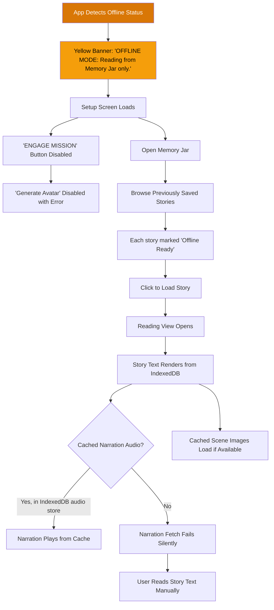

### 2.5 Story Download

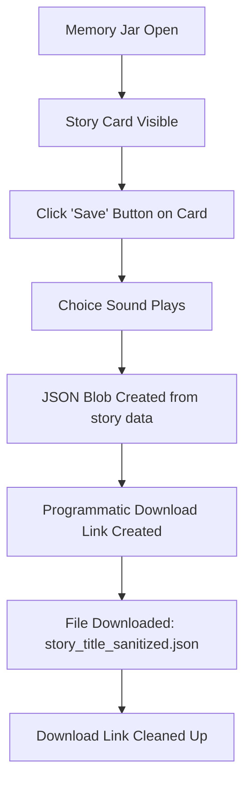

**Download Format:** JSON file containing the full `StoryFull` object (title, parts, vocabWord, joke, lesson, tomorrowHook, rewardBadge).

### 2.6 Story Share

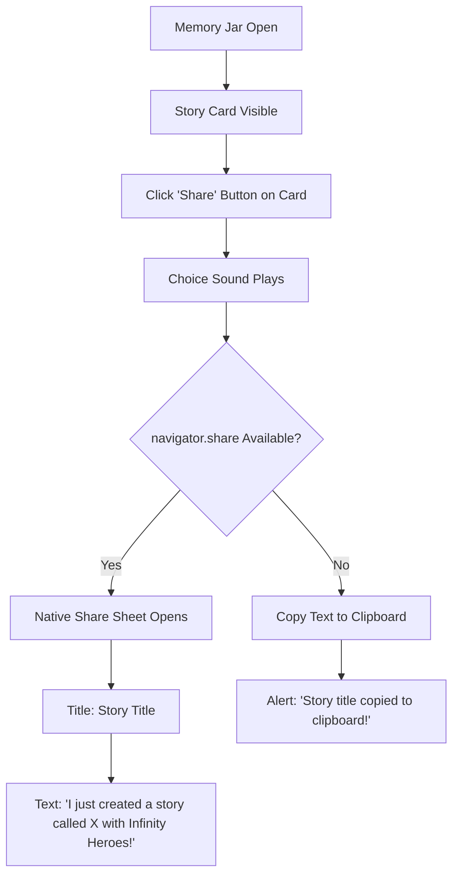

### 2.7 Image Upload for Avatar

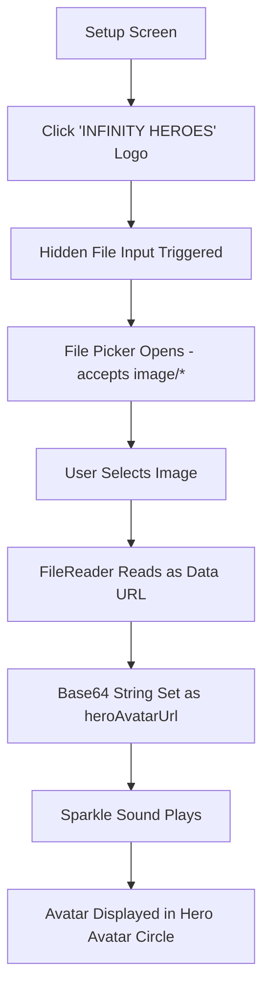

---

## 3. Micro-Interactions

### 3.1 Buttons

| Button | Location | Action | Sound | Visual Feedback |
|--------|----------|--------|-------|-----------------|
| **Classic mode tab** | Mode Dock (header) | Sets `mode = 'classic'` | `playChoice()` | Spring-animated blue pill slides to position |
| **Mad Libs mode tab** | Mode Dock (header) | Sets `mode = 'madlibs'` | `playChoice()` | Spring-animated red pill slides to position |
| **Sleep mode tab** | Mode Dock (header) | Sets `mode = 'sleep'` | `playChoice()` | Spring-animated indigo pill slides to position |
| **Memory Jar** | Top-right corner | Opens Memory Jar drawer | `playChoice()` | hover: scale 110%, active: scale 95% |
| **Settings gear** | Top-right corner | Opens Settings modal | `playChoice()` | hover: scale 110% + rotate 90deg, active: scale 95% |
| **CREATE HERO / REPAINT** | Avatar circle | Generates AI avatar | None | Pulse animation when empty; yellow badge on hover when filled |
| **Wizard Back arrow** | Classic setup wizard | Goes to previous step | None | Disabled + opacity 20% when on first step |
| **Wizard Next** | Classic setup wizard | Goes to next step | None | Blue background; green on last step |
| **Adjust Origin Story** | Classic step 2 | Returns to wizard step 0 | `playChoice()` | Underline decoration, hover changes to blue |
| **Length selector steps** | Setup panel | Sets `storyLength` | `playChoice()` | Active: colored + elevated + scale 110%; selected shows duration label |
| **Voice cards** | Setup panel | Sets `narratorVoice` | `playChoice()` | Active: bordered + scaled 105% + shadow; Inactive: opacity 40%, hover: opacity 100% |
| **ENGAGE MISSION / BEGIN DREAM-LOG** | Bottom of setup panel | Triggers `generateStory()` | Page turn on success | Disabled: gray bg, no shadow; Enabled: red/indigo bg + shadow |
| **Dismiss error** | Error banner | Clears error state | None | Hover: darker background |
| **Dream Pick toggle** | Sleep sub-mode | Sets `subMode = 'child-friendly'` | `playChoice()` | Spring-animated pill indicator |
| **Parent's Path toggle** | Sleep sub-mode | Sets `subMode = 'parent-madlib'` | `playChoice()` | Spring-animated pill indicator |
| **Theme cards (x5)** | Sleep dreamscape grid | Sets sleep theme | `playChoice()` | Selected: indigo border + glow + checkmark; hover: scale 105%; tap: scale 95% |
| **Ambient sound buttons** | Sleep setup footer | Sets ambient theme + starts audio | `playChoice()` | Selected: indigo-600 bg + scale 105% + glow shadow |
| **Silence button** | Sleep ambient row | Stops ambient audio | `playChoice()` | Selected: white bg + scale 105% |
| **Menu** | Reading view top-left | Calls `reset()`, returns to setup | `playChoice()` | Translucent glass button |
| **Font size toggle (A/A+)** | Reading view top-right | Toggles `fontSize` between normal/large | `playChoice()` | Glass circle button |
| **Mute toggle** | Reading view top-right | Toggles `isMuted` | `playChoice()` | Shows speaker/muted icon |
| **Play/Pause** | Reading view bottom center | Toggles narration playback | `playChoice()` | Circular progress ring; loading: hourglass + pulse; playing: pause icon |
| **Stop** | Reading view bottom center | Stops narration completely | `playChoice()` | Opacity 30% idle, hover: 100% + red color |
| **Playback speed (0.8x/1.0x/1.2x)** | Reading view bottom right | Sets `playbackRate` | `playChoice()` | Active: filled bg + scale 110%; inactive: opacity 30% |
| **Choice buttons (1-2)** | Inline in story part | Advances to next part | `playChoice()` + `playPageTurn()` | Comic-style blue buttons; hover: scale 103%; active: scale 97% |
| **MISSION COMPLETE** | Completion footer | Calls `reset()` | `playChoice()` | Full-width red button with comic shadow |
| **Load story** | Memory Jar card | Loads story into reading | `playPageTurn()` | Hover: blue border + background change |
| **Download** | Memory Jar card action bar | Downloads story JSON | `playChoice()` | Hover: white text + white bg tint |
| **Share** | Memory Jar card action bar | Shares or copies story | `playChoice()` | Hover: white text + white bg tint |
| **Delete** | Memory Jar card action bar | Deletes story from IndexedDB | `playDelete()` | Hover: red text + red bg tint |
| **Close drawer (X)** | Memory Jar header | Closes drawer | None | Hover: darker background |
| **Close drawer (backdrop)** | Memory Jar backdrop overlay | Closes drawer | None | Full-screen click target |
| **Settings tab buttons** | Settings sidebar | Switches settings category | `playChoice()` | Active: black bg + white text; inactive: hover gray bg |
| **Story length buttons (settings)** | General settings | Sets default length | `playChoice()` | Active: yellow + shadow |
| **Dreamscape select** | General settings | Sets default sleep theme | `playChoice()` | Standard select dropdown |
| **Sound mute/active toggle** | Voice settings | Toggles mute | `playChoice()` | Red badge when muted, green when active |
| **Narrator voice buttons (settings)** | Voice settings | Sets default narrator | `playChoice()` | Active: blue border + shadow + scale 105% |
| **Reading size buttons** | Accessibility settings | Sets font size | `playChoice()` | Active: black border + shadow |
| **Reduced Motion toggle** | Accessibility settings | Toggles reduced motion | `playChoice()` | Toggle pill slides left/right |
| **Reset Defaults** | Settings footer | Resets all preferences to defaults | `playDelete()` | Hover: red text |
| **Save As Default** | Settings footer | Saves preferences to IndexedDB | `playSparkle()` | Green bg; success overlay slides up |
| **Settings close (X)** | Settings header | Closes modal | None | Hover: scale 110% |
| **API Key dialog 'Unlock'** | API key modal | Dismisses dialog | None | Active: scale 95% |

### 3.2 Input Fields

| Input | Location | Validation | Placeholder | Behavior |
|-------|----------|------------|-------------|----------|
| **Hero Name** (Classic) | Wizard Step 0 | Required (non-empty) | "Hero's name..." | autoFocus; text-center; 3xl-5xl font |
| **Setting** (Classic) | Wizard Step 1 | Required (non-empty) | "Place name..." | autoFocus; text-center; purple border |
| **Hero Name** (Sleep) | Sleep setup | Required (non-empty) | "Hero's name..." | Serif font; 4xl-6xl; gradient underline on focus |
| **Adjective** (Mad Libs) | Inline fill-in-blank | Required (non-empty) | "Adjective" | Focus: blue border + bg; empty + unfocused: red pulsing border; shows suggestion dropdown on focus |
| **Place** (Mad Libs) | Inline fill-in-blank | Required (non-empty) | "Place" | Same as Adjective |
| **Food** (Mad Libs) | Inline fill-in-blank | Required (non-empty) | "Food" | Same as Adjective |
| **Animal** (Mad Libs) | Inline fill-in-blank | Required (non-empty) | "Animal" | Same as Adjective |
| **Silly Word** (Mad Libs) | Inline fill-in-blank | Required (non-empty) | "Silly Word" | Same as Adjective |
| **World Texture** (Sleep Parent) | Sensory input card | Optional | "Soft and pillowy..." | Has clear (X) button when filled; suggestion chips below |
| **Gentle Echoes** (Sleep Parent) | Sensory input card | Optional | "A distant hum..." | Same as Texture |
| **Dream Aromas** (Sleep Parent) | Sensory input card | Optional | "Warm honey..." | Same as Texture |
| **File input** (hidden) | Behind logo | accepts `image/*` | N/A | Hidden; triggered by logo click |

### 3.3 Suggestion Chips

**Mad Libs Suggestion Dropdowns:**
- Appear on input focus with a yellow header "Ideas for [Label]"
- Each suggestion is a clickable button
- Clicking a suggestion fills the field and plays `playSparkle()`
- Dropdown disappears 200ms after blur (delay allows click registration)

**Sleep Sensory Suggestion Chips:**
- Displayed as pill buttons below each sensory input
- Clicking a chip fills the input and plays `playChoice()`
- Active chip: indigo bg + white text + glow shadow + scale 105%
- Inactive chip: dark bg + faded text; hover brightens

### 3.4 Toggles/Selectors

| Element | Type | States | Behavior |
|---------|------|--------|----------|
| Mode Dock | 3-way tab bar | classic / madlibs / sleep | Animated pill follows selection (spring physics) |
| Sub-mode toggle (Sleep) | 2-way toggle | Dream Pick / Parent's Path | Pill animation with `layoutId` |
| Story Length | 4-step slider | short / medium / long / eternal | Track fills with color; active steps elevate |
| Voice Selector | 7-card radio group | 7 voices | `role="radiogroup"`, `aria-checked` on selected |
| Playback Speed | 3-button group | 0.8x / 1.0x / 1.2x | `aria-pressed` on selected |

### 3.5 Gestures & Keyboard

| Interaction | Element | Behavior |
|-------------|---------|----------|
| Click backdrop | Memory Jar, Settings Modal | Closes overlay |
| Scroll | Reading View content area | Standard vertical scroll; sleep mode auto-scrolls to current part |
| `Tab` navigation | All interactive elements | Standard focus ring (blue-500) on buttons |
| No explicit keyboard shortcuts | N/A | App relies on standard tab/enter/space patterns |

---

## 4. State Transitions

### 4.1 Complete App State Machine

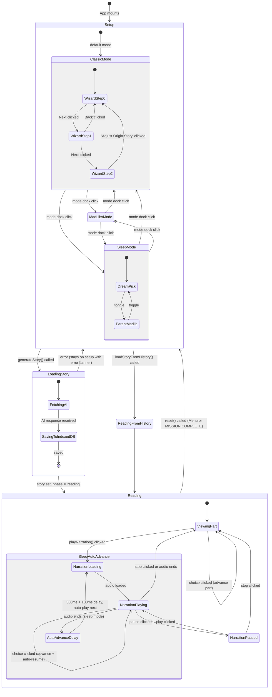

### 4.2 Phase Transitions Detail

| From | To | Trigger | Data Changes |
|------|-----|---------|-------------|
| `setup` | `reading` | `generateStory()` succeeds | `story` set, `currentPartIndex = 0`, `scenes = {}`, story saved to IndexedDB |
| `setup` | `reading` | `loadStoryFromHistory()` | `story` set from cache, `scenes` loaded, `currentPartIndex = 0`, avatar URL set |
| `reading` | `setup` | `reset()` | `story = null`, `currentPartIndex = 0`, `scenes = {}`, narration stopped, `heroAvatarUrl = ''` |
| `setup` | `setup` | `generateStory()` fails | `error` set with message, `isLoading = false` |
| `setup` | `setup` | Mode change | `input.mode` updated; UI re-renders mode-specific setup |

### 4.3 Narration State Machine

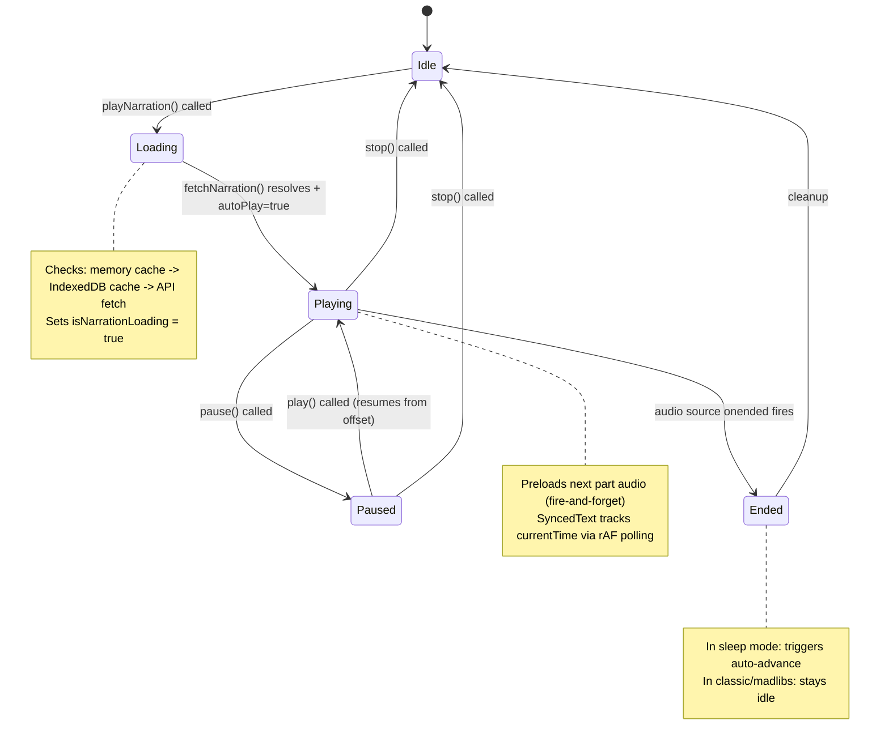

### 4.4 Online/Offline State

```mermaid
stateDiagram-v2
    [*] --> Online: navigator.onLine = true

    Online --> Offline: 'offline' event
    Offline --> Online: 'online' event

    state Online {
        note: All features available
    }

    state Offline {
        note: Banner shown at top
        note: Generate buttons disabled
        note: Memory Jar stories still loadable
        note: Cached audio still playable
    }
```

---

## 5. User Personas & Scenarios

### 5.1 Child (Age 7-9) Using Classic Mode with Parent

**Persona:** Mia, age 8, loves superheroes. Her dad helps her get started.

**Scenario:**
1. Dad opens the app on a tablet. The "INFINITY HEROES" logo fills the screen with a blue cosmic gradient.
2. The Classic mode is already selected (default). Dad reads the wizard prompt: "Who is our hero today?"
3. Mia types "STAR GIRL" into the hero name field with dad spelling help.
4. Dad clicks "Next." The wizard asks: "Where does the adventure begin?"
5. Mia says "A volcano!" and dad types "Volcano Island."
6. Dad clicks "Next." They see the Mission Parameters summary showing "The Hero: STAR GIRL" and "The World: Volcano Island."
7. Mia notices the bouncing paint badge on the avatar circle and excitedly clicks "CREATE HERO." A spinner appears with "Painting..." text. Seconds later, an AI-generated cartoon of Star Girl appears. Sparkle sound plays.
8. Dad selects "Medium" story length (~8 mins) and the "Puck" voice (playful fox icon).
9. Dad clicks "ENGAGE MISSION." The loading screen shows spinning rings, cosmic particles, and status messages like "Querying the Multiverse Archives..." with a progress bar.
10. The story loads. They see the story title, the avatar, and the first part's text.
11. Dad clicks the play button. An hourglass appears briefly, then narration begins. Words highlight in blue as the Puck voice reads aloud.
12. At the end of the first part, two choice buttons appear: "Climb the Volcano" and "Explore the Cave." Mia taps "Explore the Cave." A choice sound plays, the page advances.
13. They continue through all parts. At the end, they see the lesson ("True bravery is helping others"), a joke, and the "MISSION COMPLETE" button.
14. Mia taps "MISSION COMPLETE." They return to setup. The story is already saved in the Memory Jar.
15. The next evening, Mia wants to hear it again. Dad opens the Memory Jar, finds "Star Girl" with the date and avatar thumbnail, and taps it. The story loads instantly from IndexedDB.

### 5.2 Parent Setting Up Sleep Story for Child

**Persona:** Sarah, mother of Leo (age 5). Leo is already in bed.

**Scenario:**
1. Sarah opens the app on a phone and taps the Moon icon ("Sleepy") in the mode dock. The entire interface transitions to a deep indigo theme with twinkling stars.
2. She types "Leo" in the hero name field.
3. She selects "Parent's Path" sub-mode to customize the sensory details.
4. In "World Texture," she clicks the suggestion "Soft velvet cloud." In "Gentle Echoes," she types "Mommy humming." In "Dream Aromas," she picks "Warm apple pie."
5. On the right panel, she selects the "Cloud Kingdom" dreamscape theme. The large cloud icon gently bobs on the preview panel.
6. She scrolls down to Ambient Sounds and taps "Gentle Rain." Immediately, a synthesized pink-noise rain soundscape begins playing through the phone speakers. The sound has subtle stereo panning.
7. She selects "Short" story length (~3 mins) and the "Leda" voice (ethereal, soft).
8. She clicks "BEGIN DREAM-LOG." The loading screen shows calm stars drifting with messages like "Fluffing the Clouds..." and "Gathering Starlight..."
9. The story loads. The reading view has a dark indigo background. Narration auto-starts immediately. Sarah places the phone on Leo's nightstand.
10. The Leda voice softly reads the story. Words gently highlight on screen. After the first part finishes, there is a brief 500ms pause, then the next part auto-advances and auto-plays.
11. Leo falls asleep by the second part. The narration continues quietly through all parts, then stops naturally. The rain ambient sound continues playing.
12. Sarah picks up the phone and taps "Menu" to return to setup.

### 5.3 Child Using Mad Libs Independently

**Persona:** Jack, age 9, home from school and bored.

**Scenario:**
1. Jack opens the app and taps the wacky face ("Mad Libs") in the mode dock. The background shifts to a red/orange gradient.
2. He sees a fill-in-the-blank story template: "Once, a ___ explorer found a ___. They carried a ___ when a ___ yelled ___!"
3. He taps the Adjective field. A dropdown appears with "Ideas for Adjective": brave, tiny, glowing, invisible. He picks "invisible" and a sparkle sound plays.
4. For Place, he types "TOILET" and giggles.
5. For Food, he picks "Taco" from suggestions.
6. For Animal, he types "DINOSAUR."
7. For Silly Word, he picks "Sploot!" from suggestions.
8. The avatar circle shows a default wacky face. Jack clicks "CREATE HERO" -- the system generates an avatar based on "DINOSAUR" with the trait "invisible."
9. He picks "Long" story length and "Fenrir" (Bold) voice.
10. He clicks "ENGAGE MISSION." The loading screen explodes with chaotic colorful particles and messages like "Scrambling the Dictionary..." and "Launching Logic out the Window..."
11. The story loads and Jack reads it, laughing at the silly plot involving his ridiculous inputs.
12. He makes choices at decision points, reads the joke at the end, and taps "MISSION COMPLETE."
13. He opens the Memory Jar and clicks "Share" on his story. The native share sheet appears, and he sends it to his friend via Messages.

### 5.4 User Returning to Read Saved Stories

**Persona:** A returning user who wants to re-read old stories offline.

**Scenario:**
1. The user opens the app while on an airplane (offline). A yellow banner appears: "OFFLINE MODE: Reading from Memory Jar only."
2. They tap the Memory Jar icon. The drawer opens showing 4 previously saved stories, each with an avatar, title, date, part count, and an "Offline Ready" badge.
3. They tap a story from two days ago. The drawer closes, and the story loads from IndexedDB. The reading view shows all text and any cached scene images.
4. They tap Play. The narration plays from the IndexedDB audio cache (the audio was cached when they first generated/played the story online).
5. They read through the story at their own pace, adjusting playback speed to 1.2x.
6. After finishing, they tap "Menu" to return to setup. The "ENGAGE MISSION" button is grayed out because they are offline, but they can open the Memory Jar to read another saved story.

---

## 6. Screen Inventory

### Screen 1: Setup -- Classic Mode (Wizard Step 0)

- **Screen name:** Classic Setup - Hero Name Entry
- **Description:** Dark cosmic background header with "INFINITY HEROES" title. Mode dock at bottom of header with Classic (sword), Mad Libs (wacky face), and Sleepy (moon) tabs. Below is a white bordered panel. Inside, a robot avatar asks "Who is our hero today?" in a speech bubble. A large text input field sits below. Navigation arrows at the bottom (back disabled, "Next" button enabled).
- **Entry conditions:** App loads (default) or user selects Classic mode
- **Exit conditions:** User clicks "Next" (advances to Step 1) or changes mode
- **Interactive elements:** Hero name input, Next button, Back button (disabled), Mode dock tabs, Memory Jar button, Settings button, Logo (image upload)
- **Data displayed:** Wizard prompt

### Screen 2: Setup -- Classic Mode (Wizard Step 1)

- **Screen name:** Classic Setup - Setting Entry
- **Description:** Same panel layout. Robot asks "Where does the adventure begin?" Purple-bordered text input for the setting name.
- **Entry conditions:** User clicked Next from Step 0
- **Exit conditions:** User clicks "Next" (Step 2) or "Back" (Step 0) or changes mode
- **Interactive elements:** Setting input, Next button, Back button, Mode dock tabs, Memory Jar, Settings
- **Data displayed:** Wizard prompt

### Screen 3: Setup -- Classic Mode (Wizard Step 2)

- **Screen name:** Classic Setup - Mission Parameters
- **Description:** Shows the hero avatar circle (with CREATE HERO/REPAINT button), a summary card showing hero name and setting, and "Adjust Origin Story" link.
- **Entry conditions:** User clicked Next from Step 1
- **Exit conditions:** User changes mode, clicks "Adjust Origin Story" (back to Step 0), or scrolls to launch
- **Interactive elements:** Avatar generate button, "Adjust Origin Story" link, Mode dock tabs, Memory Jar, Settings
- **Data displayed:** Hero name, setting, avatar image (if generated)

### Screen 4: Setup -- Mad Libs Mode

- **Screen name:** Mad Libs Setup
- **Description:** White panel with a fill-in-the-blank story sentence rendered in serif font. Five inline input fields (adjective, place, food, animal, silly word) with dashed underlines. Avatar circle at top. Fields pulse red when empty and unfocused.
- **Entry conditions:** User selects Mad Libs mode
- **Exit conditions:** User changes mode or launches story
- **Interactive elements:** 5 mad lib inputs (each with suggestion dropdown on focus), Avatar generate button, Mode dock tabs, Memory Jar, Settings
- **Data displayed:** Story template sentence with blanks

### Screen 5: Setup -- Sleep Mode (Dream Pick Sub-Mode)

- **Screen name:** Sleep Setup - Dream Pick
- **Description:** Dark indigo panel. Hero name input at top in large serif font. Sub-mode toggle showing "Dream Pick" active. Left: Large theme preview panel with animated icon and description. Right: 2x3 grid (5 items) of dreamscape theme cards, each with an icon and label. Active theme shows checkmark and glow. Below: Description display. Further below: Ambient sound row with Silence + 6 sound buttons. At very bottom: Story length slider and voice selector.
- **Entry conditions:** User selects Sleep mode (Dream Pick is default sub-mode)
- **Exit conditions:** User changes mode or launches story
- **Interactive elements:** Hero name input, Sub-mode toggle (2 buttons), 5 theme cards, Silence + 6 ambient buttons, Avatar generate button, Length slider, Voice cards, Mode dock tabs, Memory Jar, Settings
- **Data displayed:** Selected theme preview, theme description

### Screen 6: Setup -- Sleep Mode (Parent's Path Sub-Mode)

- **Screen name:** Sleep Setup - Parent's Path
- **Description:** Same as Screen 5, but left panel replaces the theme preview with three Sensory Input Cards (World Texture, Gentle Echoes, Dream Aromas). Each card has an icon, label, description, text input, clear button, and 4 suggestion chips.
- **Entry conditions:** User toggles to "Parent's Path" sub-mode
- **Exit conditions:** User toggles to "Dream Pick", changes mode, or launches story
- **Interactive elements:** Hero name input, Sub-mode toggle, 3 sensory inputs (each with clear button + 4 suggestion chips), 5 theme cards, Silence + 6 ambient buttons, Avatar generate button, Length slider, Voice cards, Mode dock tabs, Memory Jar, Settings
- **Data displayed:** Sensory input values, selected theme

### Screen 7: Loading Overlay (Embedded)

- **Screen name:** Story Generation Loading
- **Description:** Overlays the setup panel. Mode-specific theming: Classic shows blue cosmic warp with "ZAP!" "POW!" word particles; Sleep shows calm star field; Mad Libs shows chaotic multicolor particles. Central icon pulses (lightning/moon/wacky face) with spinning dashed rings. Title shows context (e.g., "LAUNCHING STAR GIRL..."). Status messages flip every 2 seconds. Progress bar at bottom fills non-linearly toward 99%.
- **Entry conditions:** `generateStory()` called, `isLoading = true`
- **Exit conditions:** Story generation completes or fails
- **Interactive elements:** None (blocking overlay)
- **Data displayed:** Hero name in title, progress percentage, rotating status messages

### Screen 8: Reading View

- **Screen name:** Story Reading
- **Description:** Full-viewport reading experience. Header: Menu button (top-left), Font size toggle and Mute toggle (top-right). Main content: Scrollable article with story title, avatar/scene image, and story parts. Each part's text is rendered in serif font; future parts are blurred. Choice buttons appear at the end of the current part if applicable. Bottom bar: Journey progress (segment X/Y with progress bar), Play/Pause button with circular progress ring, Stop button, Voice name label, and Playback speed buttons (0.8x/1.0x/1.2x).
- **Entry conditions:** `phase = 'reading'` and `story` is not null
- **Exit conditions:** User clicks "Menu" or "MISSION COMPLETE"
- **Interactive elements:** Menu button, Font size toggle, Mute toggle, Play/Pause button, Stop button, 3 speed buttons, Choice buttons (0-2 per part), MISSION COMPLETE button (last part only)
- **Data displayed:** Story title, avatar image, current and previous part texts, choice options, narration progress, journey progress, voice name

### Screen 9: Completion Footer (Inline in Reading View)

- **Screen name:** Story Completion
- **Description:** Appears at the bottom of the reading view when `currentPartIndex === story.parts.length - 1`. Shows "The Wise Hero's Lesson" section with the lesson quote, "A Chuckle for the Road" section with the joke, and a full-width "MISSION COMPLETE" button.
- **Entry conditions:** User reaches the last story part
- **Exit conditions:** User clicks "MISSION COMPLETE"
- **Interactive elements:** MISSION COMPLETE button
- **Data displayed:** Lesson text, joke text

### Screen 10: Memory Jar Drawer

- **Screen name:** Memory Jar
- **Description:** Full-height drawer sliding in from the right. Dark background with backdrop blur. Header: "Memory Jar" title with jar icon and close button. Content: Scrollable list of story cards. Each card shows avatar thumbnail, title, date, part count, and "Offline Ready" badge. Below each card: action bar with Save, Share, and Delete buttons. Footer: "Drift into dreams..." text.
- **Entry conditions:** User clicks Memory Jar button
- **Exit conditions:** User clicks close, clicks backdrop, or loads a story
- **Interactive elements:** Close button, Backdrop click-to-close, Story card buttons (load), Save button per card, Share button per card, Delete button per card
- **Data displayed:** List of saved stories with metadata

### Screen 11: Settings Modal ("Mission Control")

- **Screen name:** Settings
- **Description:** Centered modal with comic-style border. Header with wrench icon and "Mission Control" title. Left sidebar: 3 category tabs (General, Voice & Audio, Accessibility). Right content area: Varies by tab. Footer: "Reset Defaults" link and "Save As Default" green button.
- **Entry conditions:** User clicks Settings gear button
- **Exit conditions:** User clicks close, saves (auto-closes after 1200ms), or clicks backdrop
- **Interactive elements:** 3 tab buttons, Close button, varies by tab (see below), Reset Defaults button, Save As Default button
- **Data displayed:** Current preference values

**General Tab:** 4 story length buttons, dreamscape dropdown (5 options)
**Voice & Audio Tab:** Mute toggle, 7 narrator voice buttons
**Accessibility Tab:** 2 reading size buttons, Reduced Motion toggle switch

### Screen 12: API Key Dialog

- **Screen name:** API Key Required
- **Description:** Full-screen modal with black backdrop. White comic-panel card slightly rotated. Bouncing key icon badge. Title: "Secret Identity Required!" Explanation text about needing a paid API key. Link to billing docs. "Unlock The Multiverse" button.
- **Entry conditions:** API returns 404 error (billing-required)
- **Exit conditions:** User clicks "Unlock The Multiverse"
- **Interactive elements:** "Unlock The Multiverse" button, Billing docs link
- **Data displayed:** Error explanation, docs link

### Screen 13: Offline Banner

- **Screen name:** Offline Status Banner
- **Description:** Fixed yellow banner at the very top of the viewport: "OFFLINE MODE: Reading from Memory Jar only." Slides in from top with animation.
- **Entry conditions:** `navigator.onLine === false`
- **Exit conditions:** `navigator.onLine === true`
- **Interactive elements:** None
- **Data displayed:** Offline status message

### Screen 14: Error Banner (Inline)

- **Screen name:** Error Alert
- **Description:** Red banner inside the setup panel with warning icon, "Transmission Interrupted!" title, error message, and "Dismiss" button.
- **Entry conditions:** `error` state is set (generation failure, network error, etc.)
- **Exit conditions:** User clicks "Dismiss" or error is auto-cleared on next input change
- **Interactive elements:** Dismiss button
- **Data displayed:** Error message text

---

## 7. Navigation Map

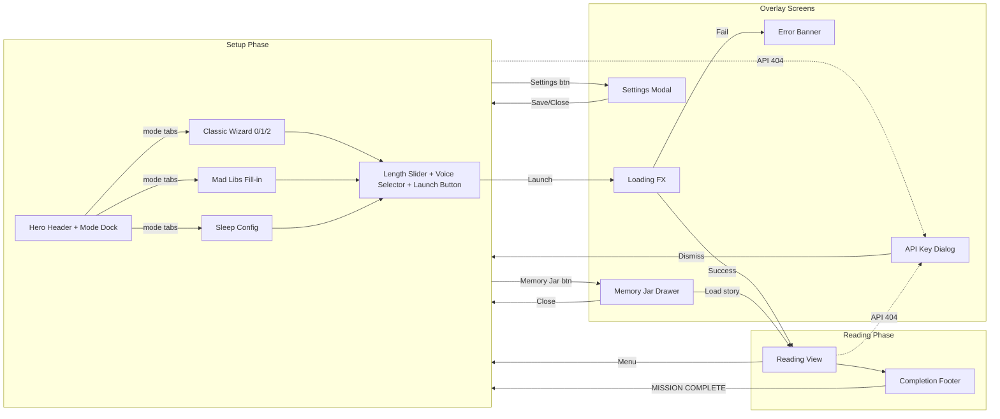

**Navigation Rules:**
1. There is no browser-based routing -- the app is a single-page application with phase-based rendering.
2. `phase = 'setup'` renders the Setup component; `phase = 'reading'` renders the ReadingView.
3. Overlays (Memory Jar, Settings, API Key Dialog, Loading FX) render on top of the current phase.
4. The only way to leave Reading View is via `reset()` (Menu button or MISSION COMPLETE).
5. The only way to enter Reading View is via `generateStory()` success or `loadStoryFromHistory()`.
6. Mode switching within Setup is instantaneous -- it merely re-renders the mode-specific form.

---

## 8. Timing & Pacing

### 8.1 Expected Generation Times

| Operation | Expected Duration | User Feedback |
|-----------|------------------|---------------|
| Story generation (`streamStory`) | 5-15 seconds | Full-screen LoadingFX with progress bar (non-linear 0-99%) |
| Avatar generation (`generateAvatar`) | 3-8 seconds | Spinner inside avatar circle + "Painting..." text |
| Scene illustration (`generateSceneIllustration`) | 3-8 seconds | `isSceneLoading` flag set (handled in ReadingView) |
| Narration TTS fetch (cold, no cache) | 2-5 seconds | Hourglass icon + pulse animation on play button + `isNarrationLoading = true` |
| Narration TTS fetch (IndexedDB cache hit) | <100ms | Near-instant playback start |
| Narration TTS fetch (memory cache hit) | <10ms | Instant playback start |

### 8.2 Animation Durations

| Animation | Duration | Easing | Context |
|-----------|----------|--------|---------|
| Mode dock pill slide | 600ms | Spring (bounce: 0.2) | Switching between Classic/MadLibs/Sleep |
| Sleep sub-mode pill | 600ms | Spring (bounce: 0.2) | Dream Pick / Parent's Path toggle |
| LoadingFX status message flip | 2000ms cycle | Wait mode (out then in) | Loading overlay text rotation |
| LoadingFX word particles | 1500ms lifetime | Scale 0 -> 1.5 -> 1, float up | "ZAP!" "POW!" words (classic/madlibs only) |
| LoadingFX progress bar | Continuous (spring: stiffness 20, damping 10) | Spring | Non-linear fill from 0% to ~99% |
| Loading FX icon pulse | 3000ms loop | easeInOut | Central icon scale 0.9->1.1->0.9 |
| Loading FX cosmic particles (classic) | 0.5-2s per particle | Linear | Upward warp-speed motion |
| Loading FX star particles (sleep) | 3-6s per particle | easeInOut | Gentle drift + fade |
| Loading FX chaos particles (madlibs) | 0.5-2s per particle | Linear | Random jitter + rotation |
| Memory Jar drawer slide | Spring (damping: 25, stiffness: 200) | Spring | Slide from right edge |
| Memory Jar backdrop fade | Default (300ms) | Linear | Opacity 0->1 |
| Settings modal scale-in | Default (300ms) | Spring | Scale 0.9->1, opacity 0->1 |
| Settings success overlay | Default | Slide from bottom | "Preferences Saved" green bar |
| Settings auto-close after save | 1200ms delay | N/A | Modal closes after success feedback |
| Reading view fade-in | Default | Opacity 0->1 | Entire reading view on mount |
| Story part scroll-into-view | Default | `behavior: 'smooth'` | Sleep mode auto-scroll to current part |
| Story part reveal | Default (whileInView) | Opacity 0->1, Y 40->0 | Parts animate in when scrolled into viewport |
| SyncedText word highlight | 100ms | Default transition | Color change + scale 1.05 on active word |
| SyncedText sentence highlight | 500ms | Default transition | Background color change on active sentence |
| Error banner expand | Default | Height 0->auto, opacity 0->1 | Error appears in setup panel |
| Completion view scale-in | Default | Scale 0.9->1, opacity 0->1 | CompletionView (standalone, currently unused inline) |
| Avatar circle hover | 300ms | CSS transition | Scale 105% on group hover |
| Sleep theme icon bob | 6000ms loop | easeInOut | Rotate +/-5deg, scale 1->1.05, Y 0->-10 |
| Sleep star twinkle | 2-4s per star | easeInOut | Opacity 0.1->0.8->0.1 |
| Header parallax | Continuous on scroll | `useTransform` | Y: 0->100, opacity: 1->0, scale: 1->0.95 over 300px scroll |
| Ambient sound fade-in | 4000ms | Linear ramp | Volume 0->0.08 |
| Ambient sound fade-out | 2000ms | Exponential ramp | Volume current->0.0001 |

### 8.3 Auto-Advance Timing (Sleep Mode)

| Event | Delay | Next Action |
|-------|-------|-------------|
| Current part narration ends (`onEnded` fires) | 500ms (`setTimeout`) | `currentPartIndex` increments |
| `currentPartIndex` changes (useEffect fires) | 100ms (`setTimeout`) | `playNarration()` called if not already playing |
| Narration preload (next part) | Immediate (fire-and-forget) | Next part audio fetched in background during current playback |

**Total gap between parts in sleep mode:** ~600ms (500ms explicit delay + ~100ms auto-play trigger), plus any network latency if audio is not pre-cached.

### 8.4 Narration Pacing at Different Speeds

| Speed | Playback Rate | Effect on Duration | Use Case |
|-------|--------------|-------------------|----------|
| 0.8x | `playbackRate = 0.8` | 25% longer | Slower reading for young children, sleep mode |
| 1.0x | `playbackRate = 1.0` | Normal | Default narration speed |
| 1.2x | `playbackRate = 1.2` | ~17% shorter | Faster reading for returning stories |

**Estimated total narration times by story length and speed:**

| Length | Description | Parts Count | Normal (1.0x) | Slow (0.8x) | Fast (1.2x) |
|--------|-------------|-------------|---------------|-------------|-------------|
| Short | ~3 min story | ~3-4 parts | ~3 min | ~3:45 | ~2:30 |
| Medium | ~8 min story | ~5-6 parts | ~8 min | ~10 min | ~6:40 |
| Long | ~15 min story | ~8-10 parts | ~15 min | ~18:45 | ~12:30 |
| Eternal | ~25 min story | ~12-15 parts | ~25 min | ~31:15 | ~20:50 |

### 8.5 Sound Effect Durations

| Sound | Duration | Type | Frequency Range |
|-------|----------|------|-----------------|
| `playChoice()` | 100ms | Sine oscillator | 440Hz -> 880Hz (exponential ramp) |
| `playPageTurn()` | 300ms | Triangle oscillator | 150Hz -> 300Hz |
| `playSparkle()` | ~700ms total (4 notes) | Sine oscillator cascade | C5(523), E5(659), G5(784), C6(1047) at 100ms intervals |
| `playDelete()` | 200ms | Sawtooth oscillator | 150Hz -> 50Hz (descending) |

### 8.6 Ambient Sound Characteristics

| Theme | Noise Type | Filter | Special Layers | Stereo |
|-------|-----------|--------|---------------|--------|
| Cosmic Hum | Brown noise | Lowpass 80Hz + LFO mod (0.05Hz) | 2 detuned sine drones at 55Hz/55.5Hz | Slow pan LFO (0.1Hz) |
| Gentle Rain | Pink noise | Lowpass 1200Hz | White noise patter (bandpass 2500Hz, Q=0.5) with volume LFO (0.3Hz) | Pan LFO (0.2Hz) on patter |
| Forest Night | Pink noise | Lowpass 400Hz + wind swell LFO (0.15Hz) | Pink noise leaves (highpass 2500Hz) with volume LFO (0.08Hz) | Pan LFO (0.05Hz) on leaves |
| Midnight Ocean | Brown noise | Lowpass 350Hz | Pink noise spray (highpass 2000Hz); master wave cycle LFO (0.1Hz) modulates both layers | Pan LFO (0.05Hz) on both |
| Night Crickets | Pink noise | Lowpass 600Hz | Sine chirp at 4500Hz, amplitude-modulated by square wave (25Hz) + rhythm LFO (0.4Hz) | Mono |
| Ethereal Spark | White noise | Bandpass 2000Hz (Q=20) | Sweeping center frequency via LFO (0.15Hz, +/- 1000Hz) | Mono |

---

## Appendix: Data Model Quick Reference

### StoryState (Input Configuration)

```typescript
{
  heroName: string;           // Required for classic/sleep
  heroPower: string;          // Optional
  setting: string;            // Required for classic
  sidekick: string;           // Optional
  problem: string;            // Optional
  heroAvatarUrl?: string;     // Base64 or URL
  mode: 'classic' | 'madlibs' | 'sleep';
  madlibs: { adjective, place, food, sillyWord, animal };  // All required for madlibs
  sleepConfig: { subMode, texture, sound, scent, theme, ambientTheme };
  narratorVoice: 'Puck' | 'Charon' | 'Kore' | 'Fenrir' | 'Aoede' | 'Zephyr' | 'Leda';
  storyLength: 'short' | 'medium' | 'long' | 'eternal';
}
```

### StoryFull (Generated Output)

```typescript
{
  title: string;
  parts: Array<{ text: string; choices?: string[]; partIndex: number }>;
  vocabWord: { word: string; definition: string };
  joke: string;
  lesson: string;
  tomorrowHook: string;
  rewardBadge: { emoji: string; title: string; description: string };
}
```

### Persistence (IndexedDB: BedtimeChroniclesDB v4)

| Store | Key | Contents |
|-------|-----|----------|
| `stories` | `id` (UUID) | `CachedStory` { id, timestamp, story, avatar, scenes, feedback } |
| `audio` | `v1:{voice}:{text_snippet}_{length}` | `ArrayBuffer` (raw PCM 16-bit 24kHz mono) |
| `preferences` | `user_settings` | `UserPreferences` object |
