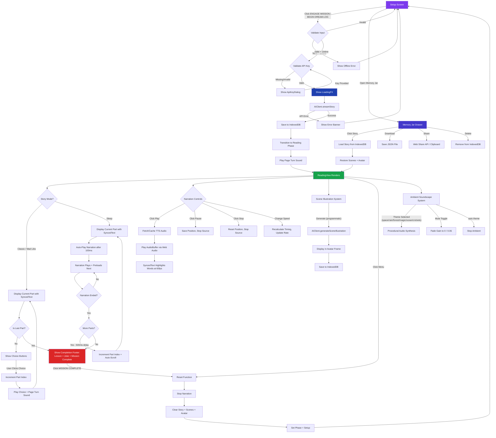

# UX Documentation: Reading / Story Experience

> Complete documentation of the reading flow in Infinity Heroes: Bedtime Chronicles, covering every aspect of the story consumption experience from launch through completion.

---

## Table of Contents

1. [Story Loading](#1-story-loading)
2. [Story Display](#2-story-display)
3. [Part Navigation](#3-part-navigation)
4. [Choice System](#4-choice-system)
5. [Sleep Mode Reading](#5-sleep-mode-reading)
6. [Mad Libs Reading](#6-mad-libs-reading)
7. [Narration Playback](#7-narration-playback)
8. [SyncedText](#8-syncedtext)
9. [Scene Illustrations](#9-scene-illustrations)
10. [Ambient Soundscapes](#10-ambient-soundscapes)
11. [Story Completion](#11-story-completion)
12. [Save / Share](#12-save--share)
13. [Return to Setup](#13-return-to-setup)
14. [Offline Reading](#14-offline-reading)
15. [Accessibility in Reading](#15-accessibility-in-reading)
16. [User Flow Diagram](#16-user-flow-diagram)

---

## 1. Story Loading

**Source files:** `Setup.tsx`, `LoadingFX.tsx`, `hooks/useStoryEngine.ts`

### Trigger

The user clicks the primary action button at the bottom of the setup panel. The button label varies by mode:

| Mode | Button Label |
|------|-------------|
| Classic | `ENGAGE MISSION` |
| Mad Libs | `ENGAGE MISSION` |
| Sleep | `BEGIN DREAM-LOG` |

The button is disabled (gray, `cursor-not-allowed`) when:
- Required fields are empty (hero name + setting for classic; all 5 mad lib words for mad libs; hero name for sleep)
- A generation is already in progress (`isLoading`)
- The device is offline (`!isOnline`)

### Generation Flow

1. `generateStory()` in `useStoryEngine` validates the API key (prompts the `ApiKeyDialog` if missing).
2. Sets `isLoading = true`, clears any prior error.
3. Calls `AIClient.streamStory(input)` which sends a POST to `/api/generate-story` with system instruction, user prompt, and a JSON response schema. The AI returns structured `StoryFull` JSON.
4. The returned story is immediately saved to IndexedDB via `storageManager.saveStory()`.
5. History list is refreshed.
6. State transitions: `phase` changes from `'setup'` to `'reading'`, `currentPartIndex` resets to `0`.
7. `soundManager.playPageTurn()` fires a triangle-wave sweep (150 Hz to 300 Hz over 0.3 seconds) as an audible transition cue.

### Loading Animation (`LoadingFX`)

While `isLoading` is true, a full-screen (when standalone) or absolutely-positioned (when embedded in the setup card) loading overlay renders with:

**Mode-specific theming:**

| Mode | Title | Icon | Background | Bar Colors |
|------|-------|------|-----------|------------|
| Classic | `LAUNCHING {HERONAME}...` | lightning bolt | Blue radial gradient | Blue-cyan gradient |
| Sleep | `DREAMING WITH {HERONAME}...` | crescent moon | Indigo-to-black ellipse gradient | Indigo-purple gradient |
| Mad Libs | `GENERATING CHAOS...` | zany face | Orange-red radial gradient | Orange-yellow-red gradient |

**Visual elements:**
- **Background particles**: Animated dots (60 for classic, 100 for sleep, 50 for mad libs). Sleep particles drift gently with a glow effect; classic particles stream upward in a warp-speed pattern; mad libs particles jitter chaotically with rotation.
- **Floating word particles**: Comic-book onomatopoeia words (`ZAP!`, `POW!`, `KABOOM!`, etc.) appear every 300ms, animate in with scale/opacity/upward-drift, and fade out. These are suppressed in sleep mode to maintain calm.
- **Central icon**: Pulsing with scale animation (0.9 to 1.1) over 3 seconds, surrounded by spinning dashed rings and a blurred glow aura. Mad libs mode adds a wobble rotation.
- **Status message flipper**: Rotating through 6 mode-specific progress messages every 2 seconds with vertical slide transitions.
- **Progress bar**: Non-linear simulated progress (fast early, slowing after 85%) rendered in a striped bar with a shimmer overlay animation. Shows percentage counter alongside `Processing...` label.

**Loading step messages by mode:**

| Classic | Sleep | Mad Libs |
|---------|-------|----------|
| Initializing Imagination Engines... | Dimming the Lights... | Mixing Chaos Potions... |
| Querying the Multiverse Archives... | Fluffing the Clouds... | Scrambling the Dictionary... |
| Drafting the Heroic Plotlines... | Gathering Starlight... | Injecting Silly Serums... |
| Rendering Scenic Wonderlands... | Quieting the World... | Confusing the Narrator... |
| Polishing the Dialogue Synthesizer... | Weaving Soft Dreams... | Maximizing Wackiness... |
| Finalizing Destiny Parameters... | Preparing for Slumber... | Launching Logic out the Window... |

### Error Handling

If generation fails, the loading overlay exits and an error banner appears in the setup card: red background, warning icon, `Transmission Interrupted!` header with the error message in monospace, and a `Dismiss` button. The user remains on the setup phase.

Retry logic: `AIClient.streamStory` retries up to 3 times with exponential backoff (1s, 2s, 4s), skipping retries for 4xx errors (except 429 rate limiting).

---

## 2. Story Display

**Source files:** `components/ReadingView.tsx`

### Layout

The reading view is a full-viewport (`h-[100dvh]`) flex column with:
- **Header controls**: Absolutely positioned at top, transparent background with `pointer-events-none` container (individual buttons have `pointer-events-auto`).
- **Content scroller**: Flex-1 scrollable area containing the story article.
- **Persistent control hub**: Fixed bottom navigation bar for playback controls.

The entire view animates in with a `motion.main` opacity fade from 0 to 1.

### Typography and Background

**Classic / Mad Libs mode:**
- Background: `bg-[#fcf8ef]` (warm cream/parchment)
- Text color: `text-gray-800`
- Font family: `font-serif` for body text, `font-comic` for UI elements
- Title: `text-3xl md:text-5xl lg:text-6xl`, uppercase, black, tight tracking

**Sleep mode:**
- Background: `bg-indigo-950` (deep night blue)
- Text color: `text-indigo-100/90` (soft light with 90% opacity)
- Same font families but with reduced-opacity avatar image

### Font Size

Two sizes controlled by the `fontSize` prop (`'normal'` or `'large'`):

| Size | Classes |
|------|---------|
| Normal | `text-base md:text-xl lg:text-2xl` |
| Large | `text-xl md:text-3xl lg:text-4xl` |

Toggle button in the top-right header shows `A` (normal) or `A+` (large). Button styling: `bg-black/40` with `backdrop-blur-lg`, circular, white border.

### Content Structure

The article container is `max-w-prose mx-auto` with `space-y-12 md:space-y-16` between sections and `pb-48` bottom padding (to allow scrolling past the control bar).

**Story header:**
1. Hero avatar image in a `w-28 h-28 md:w-40 md:h-40` container with `border-[6px] border-black`, `rounded-3xl md:rounded-[2.5rem]`, slight rotation (`rotate-1`), and `shadow-2xl`. Uses `layoutId="avatar"` for shared layout animation from setup.
2. Story title rendered as `<h1>` in comic font, uppercase, black, with drop shadow.
3. Red divider bar (`h-1.5 w-16 bg-red-600 mt-6 rounded-full opacity-50`).

**Story parts:**
Each part is a `motion.section` that:
- Enters with `initial={{ opacity: 0, y: 40 }}` and animates to `{{ opacity: 1, y: 0 }}` when scrolled into view (`whileInView`).
- Viewport trigger margin: `-10% 0% -10% 0%` (triggers slightly before entering viewport).
- `once: true` means the animation only plays the first time.
- Future parts (index > currentPartIndex) are dimmed: `opacity-10 grayscale blur-[2px] pointer-events-none`.
- Current and past parts: `opacity-100`.
- Transition between states: `transition-all duration-1000` (1 second crossfade).

---

## 3. Part Navigation

**Source files:** `hooks/useStoryEngine.ts`, `components/ReadingView.tsx`

### Navigation Model

Part navigation is strictly forward-only and driven by two mechanisms:

1. **Choice selection** (Classic mode): When the user clicks a choice button, `handleChoice(choice)` increments `currentPartIndex` by 1 (if not on the last part). A page-turn sound effect plays. If narration was active, it is stopped and restarted after a 1200ms delay.

2. **Auto-advance** (Sleep mode): When narration finishes playing a part (`narrationManager.onEnded`), a 500ms delay triggers `currentPartIndex` increment. The next part then auto-plays narration after a 100ms trigger delay.

### Progress Indicator

The bottom control bar displays:
- **Text label**: `Journey Segment {current + 1} / {total}` in tiny uppercase monospace.
- **Progress bar**: A `w-20 md:w-32 h-2` bar with `bg-black/10` track and `bg-blue-500` fill. Width is animated with a spring transition (`stiffness: 50`) to `{storyProgress}%` where `storyProgress = ((currentPartIndex + 1) / story.parts.length) * 100`.

### Scroll Behavior

In sleep mode, an `useEffect` watches `currentPartIndex` and calls `scrollIntoView({ behavior: 'smooth', block: 'center' })` on the element with `data-part={currentPartIndex}`. This ensures the currently-narrated part stays centered as auto-advance progresses.

---

## 4. Choice System

**Source files:** `components/ReadingView.tsx`, `hooks/useStoryEngine.ts`, `types.ts`

### When Choices Appear

Choices render only when ALL of the following are true:
- The part index `i` equals `currentPartIndex` (only the active part shows choices).
- `part.choices` exists and has a length > 0.
- The mode is NOT sleep (`!isSleepMode`).

### Choice UI

Choices are rendered in a `<nav>` element with `aria-label="Story Decisions"`:
- Layout: `grid grid-cols-1 md:grid-cols-2 gap-4`
- Margin: `mt-12` above the grid
- Each choice is a `<button>` styled as:
  - Background: `bg-blue-500`
  - Text: `text-white`, left-aligned
  - Border: `border-4 border-black`
  - Shadow: `shadow-[6px_6px_0px_black]` (comic-book 3D effect)
  - Rounded: `rounded-2xl`
  - Font: `font-comic uppercase tracking-wide`
  - Size: `text-sm md:text-lg`
  - Padding: `p-4`
  - Hover: `hover:scale-[1.03]`
  - Active press: `active:scale-[0.97]`
  - Transition: `transition-all`

### On Choice Click

1. `soundManager.playChoice()` fires a sine-wave chirp (440 Hz to 880 Hz in 0.1 seconds).
2. Narration is stopped via `stopNarration()`.
3. `currentPartIndex` increments by 1 (if not already on the last part).
4. `soundManager.playPageTurn()` fires a triangle-wave sweep.
5. If narration was actively playing, it restarts for the new part after a 1200ms delay.

### Data Structure

Each `StoryPart` has an optional `choices?: string[]` array. The AI generates 3 meaningful choices for each part except the final one. In sleep mode, the AI is instructed to always return empty choice arrays.

---

## 5. Sleep Mode Reading

**Source files:** `hooks/useStoryEngine.ts`, `components/ReadingView.tsx`, `AIClient.ts`

### Visual Differences

| Aspect | Classic/Mad Libs | Sleep |
|--------|-----------------|-------|
| Content background | `bg-[#fcf8ef]` (cream) | `bg-indigo-950` (deep blue) |
| Text color | `text-gray-800` | `text-indigo-100/90` |
| Control bar | `bg-white text-black` | `bg-indigo-900 text-white` |
| Avatar opacity | Full | `opacity-80` |
| Choices | Shown | Hidden (never rendered) |

### Auto-Advance Behavior

Sleep mode implements a fully hands-free reading experience:

1. **On entering reading phase**: A `useEffect` watches `currentPartIndex` and, when in sleep mode, triggers `playNarration()` after a 100ms delay (only if not already playing). This starts narration automatically.

2. **Narration preloading**: When `playNarration()` is called, it fetches and plays the current part, then fires a non-blocking preload of the next part's narration (with `autoPlay = false`). This reduces dead time between parts.

3. **On narration end**: The `narrationManager.onEnded` callback checks if in sleep mode. If there are more parts, it waits 500ms then increments `currentPartIndex`. This triggers the auto-play effect again, creating a seamless chain.

4. **Auto-scroll**: The `scrollRef` container watches `currentPartIndex` and smoothly scrolls the current part into center view.

### Story Generation Differences

Sleep stories are generated with fundamentally different parameters:
- **Length**: Base of 15 parts (scaled by length multiplier: 0.7x short, 1x medium, 1.5x long, 2x eternal), targeting 4000-6000 base words.
- **Pacing**: "Hypnotically slow" with extensive descriptions.
- **Tone**: Dreamy, lyrical, slow, repetitive. Focus on warmth, softness, safety.
- **Content rules**: Zero conflict, no monsters, no scares, no tension.
- **Interactivity**: The `choices` array is explicitly required to be empty for all parts.

### Last Part Narration

On the final part of any mode, the narration text is enriched: `"{part text}. Today's lesson is: {lesson}. Here is a joke: {joke}. {tomorrowHook}"`. This ensures completion content is read aloud.

---

## 6. Mad Libs Reading

**Source files:** `components/ReadingView.tsx`, `AIClient.ts`

### Story Generation

Mad libs mode sends the 5 user-provided words to the AI:
- `adjective`
- `place`
- `food`
- `sillyWord`
- `animal`

The AI system instruction is: "You are a Mad Libs Generator and Comedian. Your goal is to create a hilarious, chaotic, and nonsensical story using provided keywords." The AI is told to maximize usage of the provided words in funny contexts.

### Display in Reading View

Mad libs stories render identically to classic stories in the `ReadingView`. The same cream background, serif font, and choice system apply. The AI naturally weaves the user's words into the narrative, and these words appear inline as regular story text.

There is no special highlighting or emphasis applied to mad lib words in the `ReadingView` or `SyncedText` components. The humor comes from the AI's integration of the words into absurd contexts, not from visual treatment.

### Behavioral Parity with Classic

- Choices appear at the end of each part (3 choices per part, except final).
- Manual navigation via choice clicks.
- Same narration, playback, and scene illustration systems.

---

## 7. Narration Playback

**Source files:** `NarrationManager.ts`, `hooks/useNarrationSync.ts`, `components/ReadingView.tsx`

### Architecture

Narration is managed by a singleton `NarrationManager` class that handles:
- Web Audio API context (24 kHz sample rate, mono channel)
- TTS fetching from a server-side API proxy (`/api/generate-narration`)
- Raw PCM 16-bit audio decoding (Gemini TTS output format)
- Multi-layer caching (in-memory Map + IndexedDB persistence)
- Playback state machine (stopped / playing / paused)

### Controls

The bottom control bar provides three playback-related areas:

**1. Play/Pause Button (center):**
- Large circular button (`text-3xl md:text-5xl`)
- Surrounded by an SVG circular progress indicator (ring that fills as audio progresses)
- States:
  - Loading: `hourglass` icon with `animate-pulse opacity-50`, button disabled
  - Playing: `pause` icon
  - Paused/Stopped: `play` icon
- Hover: `scale-110`, Active: `scale-90`

**2. Stop Button (right of play):**
- `stop` icon, `text-2xl md:text-3xl`
- Default: `opacity-30`, Hover: `opacity-100 text-red-500`
- Completely stops narration and resets position

**3. Progress Ring:**
- SVG circle with `strokeDasharray="260"` and `strokeDashoffset` calculated from `progressPercent = (narrationTime / narrationDuration) * 100`
- Renders as a circular arc that fills clockwise around the play button
- Opacity: 20%, 4px stroke width

### Voice Display

Below the speed controls: the selected voice name displayed as `{voiceName} Spirit` in `font-comic` uppercase tracking.

### Speed Controls

Three speed buttons in a row: `0.8x`, `1.0x`, `1.2x`
- Styling: `text-[8px] md:text-[10px] font-black border-2 border-current px-2 py-0.5 rounded-full`
- Active button: `bg-current text-white scale-110`
- Inactive: `opacity-30 hover:opacity-60`
- ARIA: `role="group" aria-label="Playback speed"`, each button has `aria-pressed`

### Playback Flow

1. User clicks play (or auto-play in sleep mode).
2. `playNarration()` in `useStoryEngine` checks `narrationManager.state`:
   - If paused: resumes via `narrationManager.play()`
   - If playing: pauses via `narrationManager.pause()`
   - If stopped: proceeds to fetch
3. Sets `isNarrating = true` and `isNarrationLoading = true`.
4. `narrationManager.fetchNarration(text, voiceName, autoPlay=true)`:
   - Checks in-memory cache (Map keyed by `v1:{voice}:{text snippet}_{text length}`)
   - Checks IndexedDB cache
   - Falls back to API fetch, then caches result in both layers
5. Once loaded, `play()` creates an `AudioBufferSourceNode`, connects through a `GainNode`, and starts from offset 0 (or paused offset).
6. `isNarrationLoading` is set to false.
7. Preload of next part fires in background (non-blocking).

### Pause/Resume

- **Pause**: Records current playback position as `pausedAt = (currentTime - startTime) * playbackRate`, then stops the source.
- **Resume**: Creates a new source, starts from the saved offset, adjusts `startTime` accordingly.

### Rate Change During Playback

When playback rate changes mid-narration, the manager recalculates `startTime` to maintain continuity: `startTime = now - (currentAudioTime / newRate)`, then sets `source.playbackRate.value`.

---

## 8. SyncedText

**Source files:** `components/SyncedText.tsx`, `hooks/useNarrationSync.ts`

### Purpose

The `SyncedText` component provides karaoke-style text highlighting synchronized with narration audio playback. It visually tracks which sentence and word is currently being spoken.

### Synchronization Mechanism

`useNarrationSync` polls the `NarrationManager` singleton via `requestAnimationFrame` loop when `isNarrating` is true, extracting `getCurrentTime()` and `getDuration()` at 60fps. When narration stops, `narrationTime` resets to 0.

### Text Splitting Algorithm

1. **Sentence splitting**: Text is split using regex `/[^.!?]+[.!?]+[\])'"]*|[^.!?]+$/g` which captures sentences ending with `.`, `!`, or `?` (including trailing quotes/brackets).
2. **Word splitting**: Each sentence is further split by whitespace using `/(\s+)/` (preserving whitespace tokens).

### Timing Calculation (Heuristic)

Timing is based on **character position proportional to total duration** (a linear heuristic, not word-level alignment):

- Each sentence's start/end time: `(charOffset / totalChars) * duration`
- Each word's start/end time: same formula using absolute character offset

This is an approximation. It works well for consistent speech rates but may drift for varied pacing.

### Visual Treatment

**When narration is inactive** (`!isActive || duration <= 0`):
- Plain `
` with `leading-relaxed font-serif text-gray-800`

**When narration is active:**

| State | Visual Treatment |
|-------|-----------------|
| Active sentence | `bg-yellow-100/30 rounded px-1 -mx-1` (subtle yellow highlight) |
| Active word | Color: `#2563eb` (bright blue), `font-bold`, `scale: 1.05`, `textShadow: 0px 0px 8px rgba(37,99,235,0.2)` |
| Other words in active sentence | Color: `#1e3a8a` (dark blue) |
| Words in inactive sentences | Color: `#1f2937` (gray), `opacity: 0.7` |

All color/scale transitions use `framer-motion` `animate` with `duration: 0.1` for snappy feedback. Each word is an `inline-block` `motion.span` with `whitespace-pre` to preserve spacing.

### Performance

The component is wrapped in `React.memo` to prevent unnecessary re-renders. Since it receives `currentTime` as a prop updated at 60fps, memo prevents re-renders when text/active state have not changed.

---

## 9. Scene Illustrations

**Source files:** `hooks/useStoryEngine.ts`, `components/ReadingView.tsx`, `AIClient.ts`

### Display

The scene illustration appears at the top of the reading view in the story header area. It uses the same container as the hero avatar:
- `w-28 h-28 md:w-40 md:h-40` with `border-[6px] border-black`
- `rounded-3xl md:rounded-[2.5rem]`
- `shadow-2xl`, slight rotation, `overflow-hidden`
- `layoutId="avatar"` for smooth shared-element transition from setup

The `src` is: `scenes[currentPartIndex] || input.heroAvatarUrl`. This means:
- If a scene has been generated for the current part, it displays that scene.
- Otherwise, it falls back to the hero avatar image.

### Generation Trigger

Scene illustration generation is exposed via two callbacks:
- `onGenerateScene()`: Generates a scene for the current part index.
- `onGenerateSceneIndex(index)`: Generates a scene for a specific part index.

These are passed to `ReadingView` as props (`onGenerateScene`, `onGenerateSceneIndex`). However, in the current `ReadingView` implementation, there is no visible UI button to trigger scene generation -- the props are available but not wired to any button in the reading view. Scene generation must be triggered programmatically or could be added as a future UI element.

### Generation Process

1. Validates: story exists, has a `currentStoryId`, not already loading, device is online, API key is valid.
2. Sets `isSceneLoading = true`.
3. Calls `AIClient.generateSceneIllustration(context, heroDescription)` which sends the part's text (first 400 characters) and hero description to `/api/generate-scene`.
4. The API returns a base64-encoded image that is stored as a data URI.
5. The scene is saved to both React state and persisted to IndexedDB via `storageManager.saveStoryScene(storyId, partIndex, imageUrl)`.
6. The `isSceneLoading` prop is available but not currently used in the reading view UI for loading indicators.

### Persistence

Generated scenes are stored in the `CachedStory.scenes` record (keyed by part index) in IndexedDB. When a story is loaded from history, its scenes are restored to state.

---

## 10. Ambient Soundscapes

**Source files:** `SoundManager.ts`, `types.ts`

### Overview

The `SoundManager` class provides procedurally generated ambient soundscapes using the Web Audio API. All sounds are synthesized in real-time -- no audio files are loaded.

### The 6 Soundscape Types

| Theme | Key | Noise Base | Audio Signature |
|-------|-----|-----------|-----------------|
| **Cosmic Hum** | `space` | Brown noise (lowpass 80 Hz) | Deep rumble + detuned sine drones at 55 Hz and 55.5 Hz creating a beating effect. LFO modulates filter frequency. Stereo panning rotates slowly. |
| **Gentle Rain** | `rain` | Pink noise (lowpass 1200 Hz) | Base rain layer + secondary white noise through bandpass at 2500 Hz for patter. LFO modulates patter volume (0.3 Hz). Stereo panning on patter layer. |
| **Forest Night** | `forest` | Pink noise (lowpass 400 Hz) | Wind base with swelling LFO (0.15 Hz). Secondary pink noise highpassed at 2500 Hz for rustling leaves with its own slower modulation (0.08 Hz). Wide stereo panning. |
| **Ethereal** | `magic` | White noise (bandpass 2000 Hz, Q=20) | Narrow resonant filter sweep driven by LFO (0.15 Hz) with 1000 Hz modulation depth. Creates a shimmering, otherworldly tone. |
| **Midnight Ocean** | `ocean` | Brown noise (lowpass 350 Hz) | Deep wave layer with volume cycling (LFO 0.1 Hz, +/- 0.3 gain). Synchronized spray layer (pink noise highpassed at 2000 Hz) that crests with the waves. Slow stereo roll. |
| **Summer Night** | `crickets` | Pink noise (lowpass 600 Hz) | Quiet nighttime base + procedural cricket chirps: 4500 Hz sine oscillator amplitude-modulated by a 25 Hz square wave (chirp rate) and a 0.4 Hz sine (rhythm). |

### Sound Design Details

- **Noise generation**: Three noise types synthesized mathematically:
  - *White*: Pure random samples
  - *Pink*: Voss-McCartney algorithm with 7 octave bands
  - *Brown*: Integrated white noise (random walk) scaled by 3.5x
- **Fade in**: All soundscapes ramp gain from 0 to 0.08 over 4 seconds (`linearRampToValueAtTime`).
- **Fade out**: 2-second exponential ramp to 0.0001, sources stopped after 2.1 seconds.
- **Stereo**: Uses `StereoPannerNode` where available, with LFO-driven pan values for spatial movement.
- **Master gain**: 0.06 when unmuted (set via `setMuted()`), 0 when muted.

### Controls

- **Mute toggle**: The header mute button (`isMuted`) sets `soundManager.setMuted(muted)` which fades the ambient gain to 0 (0.5s ramp) or restores to 0.06.
- **Mode `'auto'`**: When `ambientTheme` is `'auto'`, `playAmbient()` calls `stopAmbient()` and returns, effectively disabling ambient sound.

### Sound Effects (Non-Ambient)

In addition to soundscapes, `SoundManager` provides UI feedback sounds:

| Effect | Trigger | Sound |
|--------|---------|-------|
| `playChoice()` | Button clicks, choice selection | Sine 440-880 Hz, 0.1s, gain 0.3 fade |
| `playPageTurn()` | Part transitions | Triangle 150-300 Hz, 0.3s, gain 0.1 fade |
| `playSparkle()` | Avatar generation success | Ascending arpeggio (C5-E5-G5-C6), staggered 0.1s each |
| `playDelete()` | Story deletion | Sawtooth 150-50 Hz descending, 0.2s |

---

## 11. Story Completion

**Source files:** `components/ReadingView.tsx`, `components/CompletionView.tsx`, `types.ts`

### Inline Completion (ReadingView)

When `currentPartIndex === story.parts.length - 1` (the final part is active), a completion footer renders at the bottom of the article:

**Layout:**
- Top border: `border-t-4 border-dashed border-black/10`
- Spacing: `pt-24 space-y-12 text-center`

**Elements:**

1. **The Wise Hero's Lesson**
   - Container: `bg-black/5 p-6 md:p-10 rounded-3xl border-2 border-black/10`
   - Title: `font-comic text-xl md:text-3xl uppercase tracking-widest text-red-600`
   - Content: `text-xl md:text-2xl leading-relaxed italic` in quotes

2. **A Chuckle for the Road**
   - Container: `bg-yellow-100/50 p-6 md:p-8 rounded-3xl border-2 border-yellow-200`
   - Title: `font-comic text-lg md:text-xl uppercase text-yellow-800 tracking-wide`
   - Content: `text-lg md:text-xl font-comic text-slate-700`

3. **MISSION COMPLETE Button**
   - Full-width button: `bg-red-600 text-white py-5 md:py-6 text-2xl md:text-4xl`
   - Shadow: `shadow-[10px_10px_0px_black]`
   - Font: `uppercase font-comic tracking-widest`
   - Action: Calls `onReset()` to return to setup + `soundManager.playChoice()`

### CompletionView Component (Standalone Overlay)

A separate `CompletionView` component exists as a full-screen modal overlay but is **not currently rendered** in the main `App.tsx` flow. It provides a more detailed completion experience:

- **Full-screen overlay**: `fixed inset-0 z-[200] bg-slate-950`
- **Card**: `max-w-md`, white background, `border-[6px] border-black`, `shadow-[12px_12px_0px_black]`
- **Reward badge**: Large emoji (6xl), blue title (4xl), description in serif
- **Vocab word**: Yellow dashed-border card with the word, definition
- **BACK TO BASE button**: Full-width red comic button

### Completion Data (from AI)

The `StoryFull` type includes these completion fields:

| Field | Type | Description |
|-------|------|-------------|
| `lesson` | `string` | Moral/wisdom of the story |
| `joke` | `string` | A lighthearted joke |
| `tomorrowHook` | `string` | Teaser for the next adventure |
| `vocabWord.word` | `string` | New vocabulary word |
| `vocabWord.definition` | `string` | Definition of the word |
| `rewardBadge.emoji` | `string` | Badge emoji icon |
| `rewardBadge.title` | `string` | Badge title |
| `rewardBadge.description` | `string` | Badge description |

---

## 12. Save / Share

**Source files:** `components/setup/MemoryJar.tsx`, `lib/StorageManager.ts`, `hooks/useStoryEngine.ts`

### Automatic Saving

Every story is automatically saved to IndexedDB immediately after generation (before the reading phase transition). The saved record includes:
- Unique UUID (`crypto.randomUUID()`)
- Timestamp
- Full `StoryFull` JSON
- Hero avatar (base64 data URI)
- Scenes record (populated as scenes are generated)
- Feedback (populated if user submits)

### Memory Jar (History Browser)

The Memory Jar is a slide-in drawer (from right) accessible from the setup screen via the jar icon button.

**Drawer layout:**
- Full width on mobile, `w-96` on desktop
- `bg-slate-900` with `border-l-[6px] border-black`
- Header with close button
- Scrollable list of story cards
- Footer: "Drift into dreams..."

**Story card features:**
- Avatar thumbnail (14x14px) or book emoji fallback
- Story title in blue comic font
- Creation date, part count
- "Offline Ready" badge indicator
- Three action buttons:

**1. Save (Download):**
- Downloads the `StoryFull` JSON as a `.json` file
- Filename: sanitized story title (lowercase, non-alphanumeric replaced with underscores)
- Uses `Blob` + object URL + programmatic anchor click

**2. Share:**
- Uses `navigator.share()` Web Share API if available
- Share payload: `{ title: storyTitle, text: "I just created a story called '{title}' with Infinity Heroes!" }`
- Fallback: copies the share text to clipboard with `navigator.clipboard.writeText()`

**3. Delete:**
- Removes from IndexedDB via `storageManager.deleteStory(id)`
- Plays `soundManager.playDelete()` sound effect
- Refreshes history list

### Loading from History

Clicking a story card in Memory Jar:
1. Sets the story data to state
2. Restores the avatar URL and saved scenes
3. Transitions to reading phase
4. Resets `currentPartIndex` to 0
5. Plays page-turn sound
6. Closes the Memory Jar drawer

---

## 13. Return to Setup

**Source files:** `hooks/useStoryEngine.ts`, `components/ReadingView.tsx`

### Menu Button

A `Menu` button is positioned in the top-left of the reading view header:
- Styling: `bg-black/40 hover:bg-black/60 px-3 md:px-5 py-2 rounded-full border border-white/20 backdrop-blur-lg`
- Text: `text-white font-comic text-[10px] md:text-xs uppercase tracking-widest`
- ARIA: `aria-label="Back to home"`

### MISSION COMPLETE Button

At the end of the story, the "MISSION COMPLETE" button also triggers reset.

### Reset Process

Both buttons call `onReset()` which triggers the `reset()` function in `useStoryEngine`:

1. `stopNarration()`: Stops any active narration, clears the audio source.
2. `setPhase('setup')`: Returns to the setup screen.
3. `setStory(null)`: Clears the current story from state.
4. `setCurrentPartIndex(0)`: Resets part position.
5. `setScenes({})`: Clears generated scene illustrations.
6. `setInput(prev => ({ ...prev, heroAvatarUrl: '' }))`: Clears the avatar URL (other input fields are preserved for convenience).
7. `setError(null)`: Clears any error state.

### No Confirmation Dialog

There is no confirmation prompt before exiting. The user clicks Menu and immediately returns to setup. However, this is safe because:
- Stories are auto-saved to IndexedDB on generation.
- The user can reload any story from the Memory Jar.
- Scene illustrations generated during the session are also persisted.

---

## 14. Offline Reading

**Source files:** `lib/StorageManager.ts`, `NarrationManager.ts`, `hooks/useStoryEngine.ts`

### Offline Detection

The app monitors `navigator.onLine` and listens to `window.addEventListener('online'/'offline')` events. The `isOnline` state is reactive.

### Offline Banner

When offline, a fixed-top banner appears:
- `bg-amber-500 text-black py-2 text-center text-sm font-bold z-[500]`
- Message: "OFFLINE MODE: Reading from Memory Jar only."
- Slides down with `motion` animation

### What Works Offline

| Feature | Offline Support | Details |
|---------|----------------|---------|
| Reading saved stories | Yes | Full story JSON stored in IndexedDB |
| Viewing saved scenes | Yes | Scene images stored as base64 data URIs in IndexedDB |
| Viewing saved avatars | Yes | Avatar stored as base64 data URI in the cached story record |
| Narration of cached audio | Yes | TTS audio buffers stored in IndexedDB `audio` store, keyed by `v1:{voice}:{text}_{length}` |
| Generating new stories | No | Requires API call |
| Generating scenes | No | Requires API call |
| Generating avatars | No | Requires API call |
| Generating new narration | No | Requires API call (but previously-played narration is cached) |

### Storage Architecture

IndexedDB database `BedtimeChroniclesDB` (version 4) with three object stores:

| Store | Key | Contents |
|-------|-----|----------|
| `stories` | `id` (UUID) | `CachedStory` objects: story JSON, avatar, scenes, feedback, timestamp |
| `audio` | composite string | Raw `ArrayBuffer` of PCM audio data |
| `preferences` | `'user_settings'` | `UserPreferences` object |

### Audio Caching Strategy

The `NarrationManager` implements a two-tier cache:
1. **In-memory** (`Map<string, AudioBuffer>`): Fastest lookup, cleared on page refresh.
2. **IndexedDB**: Persistent across sessions. On cache hit, the raw bytes are decoded into an `AudioBuffer` and promoted to the in-memory cache.

Cache key format: `v1:{voiceName}:{first 30 chars of text}_{text length}` -- this ensures uniqueness while keeping keys manageable.

---

## 15. Accessibility in Reading

**Source files:** `components/ReadingView.tsx`, `components/SettingsModal.tsx`, `App.tsx`

### Semantic Structure

- `<main>` with `role="main"` and `aria-label="Reading story: {title}"`
- Story content in `<article>` with `<header>` for title
- Choices in `<nav>` with `aria-label="Story Decisions"`
- Playback controls in `<nav>` with `aria-label="Playback Controls"`
- Speed buttons in a `role="group"` with `aria-label="Playback speed"` and individual `aria-pressed` attributes

### ARIA Labels

| Element | ARIA Label |
|---------|-----------|
| Menu button | "Back to home" |
| Font size toggle | "Adjust font size" |
| Mute button | Dynamic: "Unmute" or "Mute" |
| Play button | Dynamic: "Pause" or "Play" |
| Stop button | "Stop Playback" |

### Font Size Support

Two font sizes available:
- **Normal**: `text-base` (16px) on mobile, `text-xl` (20px) on medium, `text-2xl` (24px) on large screens
- **Large**: `text-xl` (20px) on mobile, `text-3xl` (30px) on medium, `text-4xl` (36px) on large screens

Toggled via:
1. The reading view header button (A / A+ toggle)
2. The Settings Modal > Accessibility tab > Reading Size selector (visual cards with "Aa" previews)

### Reduced Motion

When `userPreferences.reducedMotion` is `true`:
- `document.documentElement.style.scrollBehavior` is set to `'auto'` (instant scroll instead of smooth)
- The setting is toggled via a switch in Settings Modal > Accessibility tab
- Note: Framer Motion animations in `ReadingView` are not individually gated by this preference, though the scroll behavior change applies globally.

### Color Contrast

- Classic mode: `text-gray-800` on `bg-[#fcf8ef]` provides strong contrast (dark on light warm background)
- Sleep mode: `text-indigo-100/90` on `bg-indigo-950` provides light-on-dark contrast appropriate for nighttime reading
- All interactive controls use `bg-black/40` with `border-white/20` over dark backgrounds, with hover states that increase opacity

### Focus Indicators

All buttons include `outline-none ring-blue-500 focus:ring-2` for visible keyboard focus indicators using a blue ring. The Memory Jar story cards use `focus-within:ring-4 focus-within:ring-blue-500/50`.

### Selection

The root app container includes `selection:bg-yellow-200` allowing users to select text with a visible yellow highlight.

---

## 16. User Flow Diagram

---

## Appendix: Key File Reference

| File | Purpose |
|------|---------|
| `App.tsx` | Root component; manages phase transitions between setup and reading |
| `components/ReadingView.tsx` | Main reading UI: story display, controls, header, completion |
| `components/SyncedText.tsx` | Word-level text highlighting synced with narration |
| `components/CompletionView.tsx` | Standalone completion overlay (currently unused in main flow) |
| `hooks/useStoryEngine.ts` | Core state machine: generation, navigation, playback orchestration |
| `hooks/useNarrationSync.ts` | Bridges NarrationManager AudioContext state to React state at 60fps |
| `NarrationManager.ts` | TTS audio fetching, decoding, caching, and playback |
| `SoundManager.ts` | Procedural UI sound effects and ambient soundscapes |
| `AIClient.ts` | API communication for story, avatar, and scene generation |
| `lib/StorageManager.ts` | IndexedDB persistence for stories, audio cache, preferences |
| `components/setup/MemoryJar.tsx` | History browser with save/share/delete actions |
| `components/SettingsModal.tsx` | User preferences for voice, font size, reduced motion |
| `components/setup/VoiceSelector.tsx` | Narrator voice picker (7 voices) |
| `LoadingFX.tsx` | Mode-aware loading animation with progress simulation |
| `Book.tsx` / `Panel.tsx` | Legacy comic-book page-flip rendering (not used in ReadingView) |
| `types.ts` | TypeScript interfaces for StoryFull, StoryPart, StoryState, etc. |
