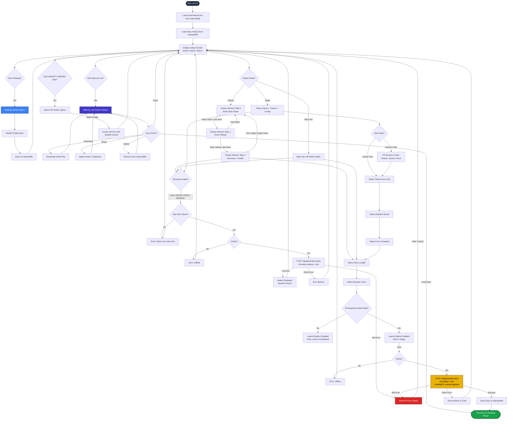

# UX Setup Flow Documentation

## Infinity Heroes: Bedtime Chronicles

Complete UX specification for the Setup phase of the application. This document covers every interactive element, state transition, animation, and user path from app launch through story generation.

---

## Table of Contents

1. [Entry Point](#1-entry-point)
2. [Mode Selection](#2-mode-selection)
3. [Classic Mode Setup](#3-classic-mode-setup)
4. [Mad Libs Mode Setup](#4-mad-libs-mode-setup)
5. [Sleep Mode Setup](#5-sleep-mode-setup)
6. [Hero Avatar](#6-hero-avatar)
7. [Voice Selection](#7-voice-selection)
8. [Story Length](#8-story-length)
9. [Memory Jar](#9-memory-jar)
10. [Settings Modal](#10-settings-modal)
11. [API Key Dialog](#11-api-key-dialog)
12. [Header](#12-header)
13. ["Begin Adventure" Button](#13-begin-adventure-button)
14. [State Persistence](#14-state-persistence)
15. [Screen-by-Screen Wireframe Descriptions](#15-screen-by-screen-wireframe-descriptions)
16. [User Flow Diagram](#16-user-flow-diagram)

---

## 1. Entry Point

### Initial App Load

When the user opens the application, the `App` component renders. The app phase begins as `'setup'`, which causes the `Setup` component to be lazy-loaded inside a `<Suspense>` boundary with a `<LoadingFX />` fallback spinner.

### Initial State (from `useStoryEngine`)

The `StoryState` object is initialized with the following defaults:

| Field            | Initial Value                          |
|------------------|----------------------------------------|
| `heroName`       | `''` (empty string)                    |
| `heroPower`      | `''` (empty string)                    |
| `setting`        | `''` (empty string)                    |
| `sidekick`       | `''` (empty string)                    |
| `problem`        | `''` (empty string)                    |
| `heroAvatarUrl`  | `''` (empty string)                    |
| `mode`           | `'classic'`                            |
| `madlibs`        | All five fields empty                  |
| `sleepConfig`    | `subMode: 'automatic'`, empty sensory fields, theme from saved preferences (default `'Cloud Kingdom'`), `ambientTheme: 'auto'` |
| `narratorVoice`  | From saved preferences (default `'Kore'`) |
| `storyLength`    | From saved preferences (default `'medium'`) |

On mount, the engine:
1. Loads saved `UserPreferences` from IndexedDB (via `StorageManager`).
2. Overrides `narratorVoice`, `storyLength`, and `sleepConfig.theme` with saved values.
3. Loads story history (`CachedStory[]`) from IndexedDB.
4. Registers online/offline event listeners.

### What the User Sees

A full-viewport dark page (`bg-slate-950`) containing:
- **Top-right corner**: Two floating circular buttons (Memory Jar and Settings).
- **Hero Header**: Large "INFINITY HEROES" title with mode tabs floating at the bottom edge.
- **Main content card**: A white, heavy-bordered panel containing the mode-specific setup form, story length slider, voice selector, and the launch button.
- **No error banner** (hidden by default via `AnimatePresence`).
- **No loading overlay** (hidden until story generation begins).
- **Offline banner** (only visible if `navigator.onLine === false`): amber banner fixed to top reading "OFFLINE MODE: Reading from Memory Jar only."

---

## 2. Mode Selection

### Location

The mode selector is part of the `HeroHeader` component. It renders as a floating "dock" bar positioned at the absolute bottom of the header, translated 50% downward so it visually bridges the header and the content card below.

### The Three Modes

| Mode     | Label      | Icon | Color Class    | Tagline              |
|----------|------------|------|----------------|----------------------|
| Classic  | `Classic`  | `⚔️`  | `bg-blue-600`  | "Choose Your Destiny" |
| Mad Libs | `Mad Libs` | `🤪`  | `bg-red-500`   | "Unleash The Chaos"  |
| Sleep    | `Sleepy`   | `🌙`  | `bg-indigo-600` | "Drift Into Dreams"  |

### Visual Design

- **Container**: `bg-slate-900/90` with `backdrop-blur-xl`, rounded corners (`rounded-2xl`), a thin white border (`border-white/10`), and a heavy drop shadow.
- **Each tab button**: Full-flex, centered column layout with a large emoji icon (2xl-3xl) above a tiny uppercase label (`text-[10px]`, `font-bold`, `tracking-wider`).
- **Active tab indicator**: A `motion.div` with `layoutId="activeTab"` provides a spring-animated colored pill that slides behind the active button. The pill uses the mode's color class with `shadow-lg`.
- **Inactive tabs**: `text-slate-400`.
- **Active tab text**: `text-white`.

### Animation Behavior

- Switching modes triggers `framer-motion` layout animation on the `activeTab` pill (spring physics: `bounce: 0.2`, `duration: 0.6`).
- The tagline below the title cross-fades (`AnimatePresence mode="wait"`) with slide-up/slide-down transitions.
- The header background gradient transitions over 1000ms (`transition-colors duration-1000`):
  - Classic: `from-blue-900 via-slate-900 to-black`
  - Mad Libs: `from-red-900 via-orange-950 to-black`
  - Sleep: `from-[#020617] via-[#0f172a] to-black`
- In Sleep mode, a star field of 60 twinkling dots fades in (`opacity: [0.1, 0.8, 0.1]` on infinite loop).

### Interaction

- Clicking a tab calls `onModeChange(mode.id)` and `soundManager.playChoice()`.
- The mode change propagates to `StoryState.mode`, which causes `ModeSetup` to switch-render the corresponding setup sub-component.
- The main content card also transitions: Sleep mode applies `bg-indigo-950 text-indigo-50`, otherwise `bg-white text-black` with a 1000ms color transition.

---

## 3. Classic Mode Setup

### Component: `ClassicSetup`

Classic mode uses a multi-step wizard pattern managed by local state `wizardStep` (values: `0`, `1`, `2`).

### Step 0: Hero Name

- **Wizard prompt** (via `GeminiWizardStep`): "Who is our hero today?"
- **UI**: A robot avatar icon (`🤖`, gradient blue-to-purple, circular, bordered) appears top-left in a speech-bubble layout. The prompt text sits inside a comic speech bubble (`border-4 border-black rounded-3xl rounded-tl-none`).
- **Input field**: Single `<input>` element.
  - `autoFocus`: Yes
  - `placeholder`: "Hero's name..."
  - `className`: Full-width, center-aligned, `text-3xl md:text-5xl`, `font-comic`, bottom-border only (`border-b-4 border-blue-500`), transparent background.
  - `aria-label`: "Hero Name"
  - **Validation**: No inline validation; readiness is checked globally.
  - **Character limit**: None enforced in the UI.
- **Navigation**: "Next" button (blue, `bg-blue-500`, rounded pill, `shadow-[4px_4px_0px_black]`). Back button is disabled (`isFirst=true`).

### Step 1: Story Setting

- **Wizard prompt**: "Where does the adventure begin?"
- **Input field**: Same styling as Step 0.
  - `placeholder`: "Place name..."
  - `className`: Bottom-border is `border-purple-500` instead of blue.
  - `aria-label`: "Story Setting"
- **Navigation**: Both Back (goes to Step 0) and Next (goes to Step 2) are enabled.

### Step 2: Mission Parameters (Summary + Avatar)

- **Title**: "Mission Parameters" in `font-comic text-2xl md:text-3xl uppercase text-blue-600`.
- **Hero Avatar Display**: The `HeroAvatarDisplay` component (see [Section 6](#6-hero-avatar)).
- **Summary card**: A dashed-border container (`bg-slate-50 border-4 border-dashed border-slate-300 rounded-2xl`) displaying:
  - "The Hero: {heroName}" (blue underline)
  - "The World: {setting}" (purple underline)
- **Edit link**: "Adjust Origin Story" -- a dotted-underline text button that returns to Step 0.

### Fields Not Used in Classic Wizard

The following `StoryState` fields exist but are **not exposed** in the current Classic setup wizard UI:
- `heroPower` (not editable in wizard; sent as-is, defaults to empty)
- `sidekick` (not editable; defaults to empty)
- `problem` (not editable; defaults to empty)

These values are still sent to the AI with fallback descriptions (e.g., "boundless imagination", "a mystery to solve").

---

## 4. Mad Libs Mode Setup

### Component: `MadlibsSetup`

Mad Libs mode presents an inline narrative sentence with embedded input fields. There is no wizard -- all fields are visible simultaneously.

### Layout

- **Container**: `font-serif text-lg md:text-2xl leading-relaxed text-center`, max-width `max-w-2xl`, centered, with a zoom-in entrance animation (`animate-in zoom-in duration-500`).
- **Hero Avatar Display** is rendered at the top (see [Section 6](#6-hero-avatar)).

### The Narrative Template

The displayed sentence reads:

> "Once, a **[Adjective]** explorer found a **[Place]**. They carried a **[Food]** when a **[Animal]** yelled **[Silly Word]**!"

Each bracketed term is a `MadLibField` inline input component.

### MadLibField Component

Each field is an inline `<input>` with a suggestion dropdown:

| Field       | Label        | Placeholder   | Suggestions                               |
|-------------|--------------|---------------|--------------------------------------------|
| `adjective` | "Adjective"  | "Adjective"   | "brave", "tiny", "glowing", "invisible"    |
| `place`     | "Place"      | "Place"       | "Cave", "Cloud City", "Candy Lab"          |
| `food`      | "Food"       | "Food"        | "Pizza", "Marshmallow", "Taco"             |
| `animal`    | "Animal"     | "Animal"      | "Hamster", "Dragon", "Penguin"             |
| `sillyWord` | "Silly Word" | "Silly Word"  | "Bazinga!", "Sploot!", "Zoinks!"           |

#### Input Styling

- Width: `w-28 md:w-36`
- Text: `text-center font-bold text-xl text-blue-900`
- Border: `border-b-4 border-dashed rounded-md`
- Dynamic border color:
  - **Focused**: `border-blue-500 bg-blue-50`
  - **Filled (not focused)**: `border-blue-400 bg-blue-50/50`
  - **Empty (not focused)**: `border-red-400 bg-red-50/50 animate-pulse` (pulsing red to indicate required)

#### Suggestion Dropdown

- Appears on focus with `AnimatePresence` animation (fade + slide up from below).
- Yellow header bar: "Ideas for {label}" (`bg-yellow-300`, `text-[10px]`, uppercase).
- List of clickable suggestion buttons. Clicking one fills the field, closes the dropdown, and plays `soundManager.playSparkle()`.
- Dropdown has a 200ms blur delay to allow click registration on suggestions.

#### Validation Tooltip

- When the field is empty and not focused, a hover tooltip appears: "Required" (`text-[8px] uppercase font-bold text-red-500`).
- Opacity transitions from 0 to 1 on group hover.

---

## 5. Sleep Mode Setup

### Component: `SleepSetup`

Sleep mode has the most complex setup UI, featuring a hero name input, sub-mode toggle, a two-column layout with sensory inputs or theme preview (left) and theme grid (right), plus an ambient sound selector.

### Hero Name Input

- Label: "The Sleepy Hero" (`font-serif italic text-indigo-300 text-sm md:text-base`).
- Input: Full-width, centered, `text-4xl md:text-6xl font-serif text-white`, transparent background, bottom border `border-indigo-500/20`.
- Focus effect: An animated gradient underline scales in from center (`scale-x-0` to `scale-x-100`).
- Placeholder: "Hero's name..." (`placeholder-indigo-900`).
- A floating sparkle emoji (`✨`) animates with pulsing opacity and scale above the input.

### Sub-Mode Toggle

Two toggle buttons in a pill-shaped container (`bg-indigo-950/80 rounded-full`):

| Sub-Mode         | Label              | Icon |
|------------------|--------------------|------|
| `child-friendly` | "Dream Pick"       | `🌟`  |
| `parent-madlib`  | "Parent's Path"    | `✍️`  |

- Active button: `bg-indigo-50 text-indigo-950` with a spring-animated pill (`layoutId="submode-pill"`).
- Inactive button: `text-indigo-400`.

### Left Column Content (Mode-Dependent)

#### When Sub-Mode = `parent-madlib`: Sensory Weaving

Three `SensoryInputCard` components are displayed:

| Card           | Icon | Label            | Description                         | Placeholder             | Suggestions                                                              |
|----------------|------|------------------|-------------------------------------|-------------------------|--------------------------------------------------------------------------|
| Texture        | `☁️`  | "World Texture"  | "How does the air or ground feel?"  | "Soft and pillowy..."   | "Soft velvet cloud", "Warm toasted bread", "Giant marshmallow", "Fresh fallen snow" |
| Sound          | `🐚`  | "Gentle Echoes"  | "What soft sounds drift by?"        | "A distant hum..."      | "Whispering leaves", "Distant ocean hum", "A tiny silver bell", "Soft crackling fire" |
| Scent          | `🍪`  | "Dream Aromas"   | "What sweet scent fills the nose?"  | "Warm honey..."         | "Warm apple pie", "Fresh lavender", "Rain on warm stones", "Sweet honey flowers" |

##### SensoryInputCard Design

- Container: `bg-indigo-950/30 border-2 border-indigo-400/10 rounded-3xl` with hover glow.
- Icon block: `w-14 h-14 bg-indigo-500/20 rounded-2xl`.
- Label: Uppercase, `text-[10px] md:text-xs font-black tracking-[0.2em] text-indigo-200`.
- Description: Italic, `text-[11px] text-indigo-300/60`.
- Input: `bg-indigo-900/40 border-2 border-indigo-800/60 rounded-2xl py-3.5 px-5 text-indigo-50 text-lg font-serif`.
- Clear button: Appears when value is non-empty (animated with `AnimatePresence`). Small `✕` icon.
- Suggestion chips: Pill-shaped buttons below the input. Active chip gets `bg-indigo-500 border-indigo-400 text-white` with glow; inactive chips are `bg-indigo-950/40 border-indigo-700/30 text-indigo-300/50`.

#### When Sub-Mode = `child-friendly`: Theme Preview

A large preview card displaying the currently selected theme:
- Container: `bg-indigo-900/30 rounded-[4rem] border-2 border-indigo-400/20` with radial gradient overlay and dot pattern background.
- Animated theme icon: `text-8xl md:text-9xl`, floating animation (`rotate`, `scale`, `y` transforms on 6-second loop).
- Theme name: `font-comic text-2xl md:text-3xl text-white uppercase tracking-widest`.
- Theme description: Italic serif text in `text-indigo-200/50`.
- Visual connector arrow on desktop (`→` in `text-indigo-500/30`).
- If no theme selected: Shows `🧸` with "Adventure Pick" and prompt text.

### Right Column: Dreamscape Selection

A 2-column grid of 5 theme buttons:

| Theme ID           | Label              | Icon | Gradient                       | Description                             |
|--------------------|--------------------|------|--------------------------------|-----------------------------------------|
| `Cloud Kingdom`    | Cloud Kingdom      | `☁️`  | `from-blue-600/40 to-blue-900/60`   | "Floating among soft, marshmallow clouds." |
| `Starry Space`     | Starry Space       | `🚀`  | `from-indigo-600/40 to-indigo-900/60` | "Drifting past friendly, glowing stars." |
| `Magic Forest`     | Magic Forest       | `🍄`  | `from-green-600/40 to-green-900/60`  | "Whispering trees and glowing flowers." |
| `Deep Ocean`       | Deep Ocean         | `🐙`  | `from-cyan-600/40 to-cyan-900/60`    | "Gentle waves and glowing sea friends." |
| `Moonlight Meadow` | Moonlight Meadow   | `🌙`  | `from-purple-600/40 to-purple-900/60` | "Soft grass and a sleepy silver moon." |

#### Theme Button Design

- Size: `h-32 md:h-40`, `rounded-3xl`, `border-[3px]`.
- Selected: `border-indigo-300 bg-indigo-900/50 shadow-[0_0_25px_rgba(99,102,241,0.4)]`, icon scaled to 110%, gradient overlay animates in with `layoutId="selection-glow"`, checkmark icon appears top-right.
- Unselected: `border-indigo-500/10 bg-indigo-950/30`, icon at 60% opacity and grayscale; hover removes grayscale and scales icon.
- Interaction: `whileHover={{ scale: 1.05 }}`, `whileTap={{ scale: 0.95 }}`, plays `soundManager.playChoice()`.
- ARIA: `aria-pressed` and `aria-label` set properly.

#### Active Description Display

Below the grid, a pill-shaped display (`bg-indigo-950/80 rounded-[2rem]`) shows the selected theme's description in italic serif, or "Select Your World" placeholder if none selected. Content cross-fades with blur transition.

### Ambient Sound Selector

Below a divider (`border-t border-indigo-500/10`), labeled "Gentle Ambient Sounds":

| ID         | Label          | Icon |
|------------|----------------|------|
| `auto`     | Silence        | `🔇`  |
| `rain`     | Gentle Rain    | `🌧️`  |
| `forest`   | Forest Night   | `🌲`  |
| `ocean`    | Midnight Ocean | `🌊`  |
| `crickets` | Night Crickets | `🦗`  |
| `space`    | Cosmic Hum     | `🛰️`  |
| `magic`    | Ethereal Spark | `✨`  |

- "Silence" (`auto`) has a unique wider style (`px-8`).
- Active sound: `bg-indigo-600 text-white border-indigo-400 shadow-[0_10px_30px_rgba(99,102,241,0.4)] scale-105`, icon scaled and rotated.
- Inactive: `bg-indigo-950/40 border-indigo-400/10 text-indigo-400`.
- Selecting an ambient theme triggers `soundManager.playAmbient(theme)` via a `useEffect` hook. Selecting `auto` stops ambient sound.
- Ambient sound stops on unmount.

---

## 6. Hero Avatar

### Component: `HeroAvatarDisplay`

The hero avatar appears in all three modes, always positioned near the top of the mode-specific content area.

### Container

- Size: `w-32 h-32 md:w-40 md:h-40`, centered (`mx-auto`), `mb-6`.
- Shape: Circular (`rounded-full`), heavy border (`border-[6px]`).
- Classic/Mad Libs border: `border-black shadow-[8px_8px_0px_rgba(0,0,0,0.2)]`.
- Sleep border: `border-indigo-400/50 shadow-[0_0_20px_rgba(99,102,241,0.3)]`.
- Hover: Scales to 105% (`group-hover:scale-105`).

### Three Display States

#### 1. Loading State (`isAvatarLoading === true`)

- White/light background (`bg-slate-50`).
- Spinning blue ring: `w-10 h-10 border-4 border-blue-500 border-t-transparent rounded-full animate-spin`.
- Label: "Painting..." (`text-[10px] font-comic uppercase tracking-widest animate-pulse text-slate-500`).

#### 2. Avatar Displayed (`heroAvatarUrl` is truthy)

- Full-bleed `` with `object-cover`.
- Overlay button appears on hover: "REPAINT" badge (`bg-yellow-400 text-black`, tilted `-rotate-3`), with `bg-black/40 backdrop-blur-[2px]` overlay.

#### 3. Default / Empty State (`heroAvatarUrl` is falsy)

The `DefaultAvatar` component renders:
- Mode-specific emoji: Classic `🦸`, Mad Libs `🤪`, Sleep `😴`.
- Background: Classic/Mad Libs: `bg-slate-100 text-slate-400` with grayscale opacity. Sleep: `bg-indigo-900/40 text-indigo-300` with slight blur.
- Dot pattern overlay at 10% opacity.
- Label badge at bottom: "No Image" (`text-[9px] uppercase font-bold`).
- Overlay button is always visible (not just on hover): "CREATE HERO" badge (`bg-green-500 text-white animate-pulse`).
- Bouncing badge in top-right corner: `🎨` (Classic/Mad Libs, red background) or `✨` (Sleep, indigo background), `animate-bounce`.

### Generate Avatar Flow

1. User clicks "CREATE HERO" or "REPAINT".
2. `onGenerateAvatar()` is called.
3. Validation: Must have a hero name (or animal name in Mad Libs mode). If missing, sets error "Please name your hero first!".
4. Must be online. If offline, error "You are offline."
5. API key validation runs (always passes with server-side keys).
6. `isAvatarLoading` becomes `true` -> spinner displayed.
7. `AIClient.generateAvatar(name, power)` calls `/api/generate-avatar` with a prompt describing the hero.
8. On success: base64 data URI is set as `heroAvatarUrl`, `soundManager.playSparkle()` fires.
9. On failure: Error message displayed in the red error banner.
10. `isAvatarLoading` becomes `false`.

### Image Upload Alternative

Clicking the "INFINITY HEROES" logo text in the header triggers a hidden file input (`accept="image/*"`). The selected image is read as a base64 data URL and set as `heroAvatarUrl` with `soundManager.playSparkle()`.

---

## 7. Voice Selection

### Component: `VoiceSelector`

Appears below the story length slider in all modes, separated by a top border.

### The 7 Voices

| ID       | Icon | Label             |
|----------|------|-------------------|
| `Kore`   | `🌸`  | Soothing          |
| `Aoede`  | `🐦`  | Melodic           |
| `Zephyr` | `🍃`  | Gentle (Soft)     |
| `Leda`   | `✨`  | Ethereal (Soft)   |
| `Puck`   | `🦊`  | Playful           |
| `Charon` | `🐻`  | Deep              |
| `Fenrir` | `🐺`  | Bold              |

### Layout

- Header label: "Select Narrator Voice" (`font-comic text-[10px] md:text-xs uppercase tracking-widest`).
  - Classic: `text-slate-400`.
  - Sleep: `text-indigo-400`.
- Flex-wrap row of buttons, `role="radiogroup"`, `aria-label="Narrator Voices"`.

### Button Design

- Size: `w-24 md:w-32`, `p-3 md:p-4`, `rounded-3xl`, `border-2`.
- Each button is a column: large icon (`text-3xl md:text-4xl`), label (`text-[10px] md:text-xs font-black uppercase`), and voice ID (`text-[8px] md:text-[9px] font-mono uppercase tracking-widest`).
- **Selected (Classic)**: `border-black bg-blue-50 text-black shadow-[6px_6px_0px_black] scale-105`.
- **Selected (Sleep)**: `border-indigo-400 bg-indigo-900/40 text-white shadow-[0_0_20px_rgba(129,140,248,0.2)]`.
- **Unselected**: `border-transparent opacity-40`, hover to full opacity with `bg-white/5`.
- ARIA: `role="radio"`, `aria-checked` reflects selection.
- Interaction: Clicking plays `soundManager.playChoice()` and updates `narratorVoice`.

### Storage

The selected voice is stored in `StoryState.narratorVoice` (session) and persisted in `UserPreferences.narratorVoice` (IndexedDB) when saved via Settings.

---

## 8. Story Length

### Component: `LengthSlider`

Positioned between the mode-specific content and the voice selector, separated by a top border.

### The 4 Length Options

| Value    | Icon | Label   | Color Class     | Approx. Duration |
|----------|------|---------|-----------------|------------------|
| `short`  | `⚡`  | Short   | `bg-yellow-400` | ~3 mins          |
| `medium` | `📖`  | Medium  | `bg-blue-400`   | ~8 mins          |
| `long`   | `📜`  | Long    | `bg-purple-400` | ~15 mins         |
| `eternal`| `♾️`  | Eternal | `bg-red-500`    | ~25 mins         |

### Visual Design

- Container: `max-w-xl mx-auto`, with label "Story Duration" (`font-comic text-[10px] md:text-xs uppercase tracking-widest`).
- **Track**: A horizontal bar (`h-3 md:h-4 bg-slate-200/50 rounded-full border-2 border-slate-300/50`).
- **Active progress**: A colored bar that fills from left to the position of the selected step, using the active step's color class.
- **Step nodes**: Four circular buttons (`w-12 h-12 md:w-16 md:h-16 rounded-full border-4`) distributed evenly along the track.
  - Active steps (at or before selected): Colored with the step's own color, `shadow-md`, elevated (`-translate-y-1`).
  - Inactive steps: `bg-white border-slate-300 text-slate-300 grayscale`.
  - Sleep mode inactive: `bg-indigo-950 border-indigo-800 text-indigo-800`.
  - Selected step: `scale-110`.
- **Duration label**: Appears below the selected node as an animated badge showing the approximate time (e.g., "~8 mins").
- Interaction: Clicking plays `soundManager.playChoice()`.
- ARIA: `role="group"`, `aria-label="Select Story Length"`, each button has `aria-pressed` and `aria-label`.

### Effect on Story Generation

In Classic/Mad Libs mode:
- Short: ~400 words, 3-4 parts
- Medium: ~1200 words, 5-7 parts
- Long: ~2500 words, 8-10 parts
- Eternal: ~4500 words, 15-18 parts

In Sleep mode, a multiplier is applied:
- Short: 0.7x (10-11 parts, 2800-4200 words)
- Medium: 1.0x (15 parts, 4000-6000 words)
- Long: 1.5x (22 parts, 6000-9000 words)
- Eternal: 2.0x (30 parts, 8000-12000 words)

---

## 9. Memory Jar

### Component: `MemoryJar`

A slide-in drawer for viewing and managing previously generated stories.

### Trigger

- A floating button in the top-right utility bar: `🏺` emoji, `w-12 h-12 bg-indigo-900 rounded-full border-4 border-black shadow-[4px_4px_0px_black]`.
- Hover: `scale-110`.
- Active: `scale-95`.
- `aria-label`: "Open Memory Jar".
- `title`: "Saved Stories".
- Click plays `soundManager.playChoice()`.

### Drawer Design

- **Backdrop**: `fixed inset-0 bg-black/80 z-[200]`. Clicking backdrop closes the drawer.
- **Drawer panel**: Fixed, slides in from right (`initial={{ x: '100%' }}`), spring animation (`damping: 25, stiffness: 200`).
  - Full height, `w-full md:w-96`.
  - `bg-slate-900 border-l-[6px] border-black`.
  - `role="dialog"`, `aria-modal="true"`, `aria-label="Memory Jar - Saved Stories"`.

### Drawer Contents

#### Header
- "Memory Jar" title with `🏺` icon, `font-comic text-2xl text-white`.
- Close button: `✕` in a circular dark button.

#### Story List (Empty State)
- Centered fog emoji `🌫️` at `text-6xl`.
- Text: "Your jar is currently empty..." (italic, `text-lg`, 30% opacity).

#### Story List (With Stories)
Each story is an `<article>` card:

- **Clickable area**: Shows avatar thumbnail (or `📘` fallback), story title (`font-comic text-base text-blue-300 uppercase`), date (`font-mono text-[10px]`), part count, and an "Offline Ready" badge.
- Clicking loads the story (`onLoadHistory`), closes the drawer, and plays `soundManager.playPageTurn()`.

- **Action Bar** (bottom of each card, three equal buttons):
  - `💾 Save`: Downloads story as JSON file. Filename is the story title sanitized to lowercase with underscores.
  - `🔗 Share`: Uses `navigator.share()` API if available, otherwise copies text to clipboard and shows alert.
  - `🗑️` (Delete): Calls `onDeleteHistory(id)` and `soundManager.playDelete()`.

#### Footer
- Text: "Drift into dreams..." (`text-[10px] text-slate-500 uppercase tracking-widest`).

---

## 10. Settings Modal

### Component: `SettingsModal`

A full-screen overlay modal for managing persistent user preferences.

### Trigger

- Settings button in the top-right utility bar: `⚙️` emoji, `w-12 h-12 bg-white rounded-full border-4 border-black shadow-[4px_4px_0px_black]`.
- Hover: `scale-110`, `rotate-90`.
- Active: `scale-95`.

### Modal Design

- Backdrop: `fixed inset-0 bg-black/80 backdrop-blur-md z-[1000]`.
- Panel: `max-w-2xl bg-white rounded-3xl border-[6px] border-black shadow-[16px_16px_0px_rgba(0,0,0,0.5)]`, `max-h-[90vh]`.
- Entrance animation: Scale from 0.9, fade in.

### Header
- Icon: `🔧` in blue circle.
- Title: "Mission Control" (`font-comic text-2xl md:text-3xl uppercase`).
- Close button: `&times;` character.

### Three Category Tabs (Sidebar)

| Tab            | Icon | Label           |
|----------------|------|-----------------|
| `general`      | `⚙️`  | General         |
| `voice`        | `🗣️`  | Voice & Audio   |
| `accessibility`| `👁️`  | Accessibility   |

Sidebar is horizontal on mobile (scrollable), vertical column on desktop (`md:w-48`).

### Tab: General

1. **Default Mission Length**: 2x2 grid of buttons for `short`, `medium`, `long`, `eternal`. Active: `bg-yellow-400 border-black shadow-[4px_4px_0px_black]`.
2. **Preferred Dreamscape**: A `<select>` dropdown with the 5 sleep themes (Cloud Kingdom, Starry Space, Magic Forest, Deep Ocean, Moonlight Meadow).

### Tab: Voice & Audio

1. **System Sound**: Toggle showing "MUTED" (red) or "ACTIVE" (green). Controls `soundManager.setMuted()`.
2. **Default Narrator**: 2x3 grid (md:3 cols) of voice buttons matching the 7 voices from `VoiceSelector`. Active: `bg-blue-50 border-blue-500 scale-105`.

### Tab: Accessibility

1. **Reading Size**: Two large buttons -- "Normal" (`text-2xl Aa`) and "Large" (`text-4xl Aa`). Active: `border-black shadow-[4px_4px_0px_black]`.
2. **Reduced Motion**: Toggle switch (`w-14 h-8 rounded-full`). When enabled, sets `document.documentElement.style.scrollBehavior = 'auto'`.

### Footer

- "Reset Defaults" text button (left): Resets local state to `DEFAULT_PREFERENCES`, plays `soundManager.playDelete()`.
- "Save As Default" button (right): `bg-green-500 text-white`. On click:
  1. Saves to IndexedDB.
  2. Plays `soundManager.playSparkle()`.
  3. Shows success overlay ("Preferences Saved" with `💾` icon, green background slides up).
  4. Auto-closes modal after 1200ms.

---

## 11. API Key Dialog

### Component: `ApiKeyDialog`

### When It Appears

The dialog is shown (`showApiKeyDialog === true`) when an API call returns a 404 status, which indicates the server-side API route is not properly configured or billing is not enabled.

### Current Behavior

Since the app uses **server-side API keys** (managed via Vercel environment variables), the `validateApiKey()` hook always returns `true`. The dialog only appears as a fallback for billing/configuration errors.

### Design

- Backdrop: `fixed inset-0 bg-black/80 backdrop-blur-sm z-[400]`.
- Panel: `max-w-lg bg-white border-[6px] border-black shadow-[16px_16px_0px_rgba(0,0,0,1)]`, slight rotation (`rotate-1`).
- Floating badge: `🔑` on a bouncing yellow circle, positioned top-left offset.
- Title: "Secret Identity Required!" in `font-comic text-5xl text-red-600 uppercase`.
- Body text explains the need for a paid API key.
- Mission Briefing box: Dashed border, links to Gemini billing docs.
- Action button: "Unlock The Multiverse" (`bg-blue-500 text-white text-2xl`). Closes the dialog.
- Footer: "ERROR_CODE: PAYWALL_VILLAIN_DETECTED" in monospace.

---

## 12. Header

### Component: `HeroHeader`

### Title

Two-line display:
- Line 1: "INFINITY" in `font-comic text-6xl md:text-8xl lg:text-9xl text-white`.
- Line 2: "HEROES" in the same size, with mode-dependent color:
  - Classic: `text-blue-400`
  - Mad Libs: `text-yellow-400`
  - Sleep: `text-indigo-400`
- Both lines have `drop-shadow-[0_4px_0_rgba(0,0,0,0.6)]` for a 3D embossed effect.
- Text color transition: 500ms.

### Parallax

On scroll, the header content:
- Translates upward (0 to 100px over 300px scroll).
- Fades out (opacity 1 to 0).
- Scales down slightly (1 to 0.95).

### Background Texture

A halftone/stardust texture overlay at 20% opacity, using `mix-blend-overlay`.

### Image Upload

Clicking the title text (when `onImageUpload` is provided) triggers a hidden `<input type="file" accept="image/*">`. This allows the user to upload a custom avatar image without using the AI generator.

### Mode Dock

Described in [Section 2](#2-mode-selection). Positioned at the absolute bottom of the header, translated 50% down. The header has `overflow-visible` and `isolate` to allow the dock to visually overflow.

### Spacing

The header has `mb-20` (5rem margin-bottom) to account for the floating mode dock that extends below it.

---

## 13. "Begin Adventure" Button

### Location

At the very bottom of the main content card, below the voice selector. Full-width (`w-full`), large padding (`py-5 md:py-6`), large text (`text-2xl md:text-4xl`), `rounded-2xl`.

### Button Text (Dynamic)

| Mode    | Loading State     | Ready State       |
|---------|-------------------|-------------------|
| Classic | "INITIATING..."   | "ENGAGE MISSION"  |
| Mad Libs| "INITIATING..."   | "ENGAGE MISSION"  |
| Sleep   | "INITIATING..."   | "BEGIN DREAM-LOG" |

### Readiness Validation (`checkIsReady`)

The button is enabled only when:

| Mode     | Required Fields                                                    |
|----------|--------------------------------------------------------------------|
| Classic  | `heroName` must be non-empty AND `setting` must be non-empty       |
| Mad Libs | ALL five mad lib fields (`adjective`, `place`, `food`, `sillyWord`, `animal`) must be non-empty |
| Sleep    | `heroName` must be non-empty                                       |

### Disabled Conditions

The button is disabled (`!isReady || isLoading || !isOnline`) when:
1. Required fields are not filled.
2. Story generation is already in progress.
3. The user is offline.

### Visual States

- **Ready (Classic/Mad Libs)**: `bg-red-600 text-white shadow-[10px_10px_0px_black]`. On click: `translate-y-1` (press effect).
- **Ready (Sleep)**: `bg-indigo-600 text-white border-white shadow-[0_10px_40px_rgba(99,102,241,0.5)]`.
- **Disabled**: `bg-slate-200 text-slate-400 cursor-not-allowed shadow-none border-slate-300`.

### Loading State

When clicked (and valid):
1. `isLoading` becomes `true`.
2. Button text changes to "INITIATING...".
3. An embedded `<LoadingFX>` overlay appears inside the content card (above all fields) via `AnimatePresence`.
4. The `LoadingFX` component receives the current `mode` and `heroName` for contextual loading messages.
5. On success: Phase transitions to `'reading'`, Setup unmounts, ReadingView mounts.
6. On failure: Error banner animates in at the top of the content card.

### Error Banner

- `bg-red-500 text-white border-4 border-black rounded-xl shadow-[4px_4px_0px_black]`.
- Icon: `⚠️`.
- Title: "Transmission Interrupted!" in `font-comic text-xl uppercase`.
- Message: The specific error string in `font-mono text-sm`.
- Dismiss button: `bg-black/20` pill.
- Animates in/out with height and opacity transitions.

---

## 14. State Persistence

### What Is Persisted (IndexedDB via `StorageManager`)

The application uses IndexedDB (`BedtimeChroniclesDB`, version 4) with three object stores:

#### `preferences` Store

Saves `UserPreferences` under the key `'user_settings'`:

| Preference      | Type                                      | Default     | Persisted? |
|-----------------|-------------------------------------------|-------------|------------|
| `narratorVoice` | `'Puck' \| 'Charon' \| 'Kore' \| 'Fenrir' \| 'Aoede' \| 'Zephyr' \| 'Leda'` | `'Kore'` | Yes |
| `storyLength`   | `'short' \| 'medium' \| 'long' \| 'eternal'` | `'medium'` | Yes |
| `sleepTheme`    | `string`                                  | `'Cloud Kingdom'` | Yes |
| `fontSize`      | `'normal' \| 'large'`                     | `'normal'`  | Yes |
| `isMuted`       | `boolean`                                 | `false`     | Yes |
| `reducedMotion` | `boolean`                                 | `false`     | Yes |

Preferences are loaded on app mount and applied to both `StoryState` defaults and global managers (`soundManager`).

#### `stories` Store

Each `CachedStory` record contains:
- `id`: UUID string (keyPath)
- `timestamp`: Unix timestamp
- `story`: Full `StoryFull` object
- `avatar`: Optional base64 avatar image
- `scenes`: Optional map of part index to base64 scene images
- `feedback`: Optional rating + text + timestamp

Stories are saved automatically after generation and sorted newest-first on retrieval.

#### `audio` Store

Caches narration audio buffers keyed by text hash + voice ID.

### What Is NOT Persisted Between Sessions

- `heroName`, `heroPower`, `setting`, `sidekick`, `problem` (cleared on each session)
- `heroAvatarUrl` (cleared on reset; persisted only within story records)
- `mode` (always starts as `'classic'`)
- `madlibs` fields (always start empty)
- `sleepConfig` sensory fields (always start empty)
- `sleepConfig.subMode` (always starts as `'automatic'`)
- `sleepConfig.ambientTheme` (always starts as `'auto'`)

---

## 15. Screen-by-Screen Wireframe Descriptions

### Screen 1: Initial Load (Classic Mode, Default State)

```
+------------------------------------------------------------------+
|  [OFFLINE BANNER - only if offline]                               |
+------------------------------------------------------------------+
|                                            [🏺 Memory] [⚙️ Settings]
|                                                                    |
|         +-------------------------------------------------+       |
|         |          BACKGROUND: Blue-to-black gradient      |       |
|         |          Stardust texture overlay                 |       |
|         |                                                   |       |
|         |              I N F I N I T Y                      |       |
|         |              H E R O E S (blue)                   |       |
|         |                                                   |       |
|         |          --- Choose Your Destiny ---              |       |
|         |                                                   |       |
|         |    +------[⚔️ Classic]--[🤪 Mad Libs]--[🌙 Sleepy]------+
|         |    |     ^^^ACTIVE^^^                             |       |
|         +----+---------------------------------------------+       |
|                                                                    |
|    +--------------------------------------------------------------+|
|    | WHITE CARD (border-[6px] border-black, heavy shadow)         ||
|    |                                                              ||
|    |  [🤖 Robot Avatar]  "Who is our hero today?"                ||
|    |                     (speech bubble)                          ||
|    |                                                              ||
|    |         +-------------------------------------+              ||
|    |         |    Hero's name...                    |  (input)    ||
|    |         +-------------------------------------+              ||
|    |                                                              ||
|    |  [⬅ disabled]                        [Next ➡ blue button]   ||
|    |                                                              ||
|    |  ──────────── Story Duration ────────────                    ||
|    |  [⚡]----[📖]----[📜]----[♾️]                                 ||
|    |          ^^ACTIVE (blue, ~8 mins)^^                          ||
|    |                                                              ||
|    |  ──────────── Select Narrator Voice ────────────             ||
|    |  [🌸 Soothing] [🐦 Melodic] [🍃 Gentle] [✨ Ethereal]      ||
|    |  [🦊 Playful]  [🐻 Deep]    [🐺 Bold]                      ||
|    |   ^^ACTIVE (Kore)^^                                          ||
|    |                                                              ||
|    |  +----------------------------------------------------------+||
|    |  |         ENGAGE MISSION (disabled, grey)                  |||
|    |  +----------------------------------------------------------+||
|    +--------------------------------------------------------------+|
+--------------------------------------------------------------------+
```

### Screen 2: Classic Mode, Step 1 (Setting)

Same as Screen 1 but:
- Wizard prompt changes to "Where does the adventure begin?"
- Input placeholder is "Place name..." with purple bottom border.
- Back button (⬅) is now enabled.
- If hero name was entered, the "ENGAGE MISSION" button may still be disabled until setting is also filled.

### Screen 3: Classic Mode, Step 2 (Summary)

```
|    | "Mission Parameters" (blue, uppercase)                       |
|    |                                                              |
|    |          +--------+                                          |
|    |          | [AVATAR|  (circular, 128-160px)                   |
|    |          | AREA ] |  Default: 🦸 or generated image          |
|    |          +--------+  [CREATE HERO] or [REPAINT]              |
|    |              🎨 (bouncing badge, if no avatar)               |
|    |                                                              |
|    |  +---  ---  ---  ---  ---  ---  ---  ---  ---  ---  ---+     |
|    |  | The Hero: Luna (blue underline)                      |     |
|    |  | The World: Crystal Cave (purple underline)           |     |
|    |  +---  ---  ---  ---  ---  ---  ---  ---  ---  ---  ---+     |
|    |                                                              |
|    |          "Adjust Origin Story" (dotted underline link)       |
```

### Screen 4: Mad Libs Mode

```
|    | WHITE CARD                                                   |
|    |                                                              |
|    |          +--------+                                          |
|    |          | [AVATAR|  🤪 default or generated                 |
|    |          +--------+                                          |
|    |                                                              |
|    |  Once, a [_brave__] explorer found a [_Cave___].             |
|    |  They carried a [_Pizza__] when a [_Dragon_]                 |
|    |  yelled [_Zoinks!_]!                                         |
|    |                                                              |
|    |  (Each [___] is an inline input with dashed border.          |
|    |   Empty fields pulse red. Focused fields show                |
|    |   suggestion dropdowns.)                                     |
|    |                                                              |
|    |  ──────── Story Duration / Voice / Launch Button ────────    |
```

### Screen 5: Sleep Mode

```
|    | DARK INDIGO CARD (bg-indigo-950)                             |
|    |                                                              |
|    |           ✨ (floating, pulsing)                             |
|    |          +--------+                                          |
|    |          | [AVATAR|  😴 default, indigo glow                 |
|    |          +--------+                                          |
|    |       THE SLEEPY HERO (italic indigo label)                  |
|    |       [_________Hero's name..._________]                     |
|    |       (gradient underline on focus)                          |
|    |                                                              |
|    |     [🌟 Dream Pick]  [✍️ Parent's Path]                     |
|    |      ^^^ACTIVE^^^                                            |
|    |                                                              |
|    | +--LEFT COLUMN---+  +--RIGHT COLUMN--+                      |
|    | |                |  | DREAMSCAPE      |                      |
|    | | Large theme    |  | [☁️ Cloud    ] [🚀 Starry  ]         |
|    | | preview with   |  | [🍄 Magic   ] [🐙 Deep    ]         |
|    | | floating icon  |  | [🌙 Moonlight]              |         |
|    | | and desc.      |  |                |                      |
|    | |        →       |  | "Floating among soft..."     |         |
|    | +----------------+  +----------------+                      |
|    |                                                              |
|    |  ──── Gentle Ambient Sounds ────                             |
|    |  [🔇 Silence] [🌧️ Rain] [🌲 Forest] [🌊 Ocean]             |
|    |  [🦗 Crickets] [🛰️ Cosmic] [✨ Ethereal]                    |
|    |                                                              |
|    |  ──────── Story Duration / Voice ────────                    |
|    |  (Sleep-themed: indigo colors, glow effects)                 |
|    |                                                              |
|    |  +----------------------------------------------------------+|
|    |  |       BEGIN DREAM-LOG (indigo, glowing)                  ||
|    |  +----------------------------------------------------------+|
```

### Screen 6: Memory Jar Drawer Open

```
+--------------------------------------------------------------------+
|  [Main content dimmed behind bg-black/80 backdrop]                  |
|                                                                      |
|                                   +-------------------------------+ |
|                                   | 🏺 Memory Jar           [✕]  | |
|                                   |-------------------------------| |
|                                   | +---------------------------+ | |
|                                   | | [📘] The Brave Knight     | | |
|                                   | |       12/25/2025 • 5 Parts| | |
|                                   | |       📶🚫 Offline Ready  | | |
|                                   | |---------------------------| | |
|                                   | | [💾 Save] [🔗 Share] [🗑️]| | |
|                                   | +---------------------------+ | |
|                                   |                               | |
|                                   | +---------------------------+ | |
|                                   | | [img] Luna's Dream        | | |
|                                   | |       01/10/2026 • 15 Parts| |
|                                   | |---------------------------| | |
|                                   | | [💾 Save] [🔗 Share] [🗑️]| | |
|                                   | +---------------------------+ | |
|                                   |                               | |
|                                   |   Drift into dreams...        | |
|                                   +-------------------------------+ |
+--------------------------------------------------------------------+
```

### Screen 7: Settings Modal

```
+--------------------------------------------------------------------+
|  [Everything dimmed + blurred behind modal]                         |
|                                                                      |
|    +----------------------------------------------------------+     |
|    | [🔧] Mission Control                              [✕]    |     |
|    |----------------------------------------------------------|     |
|    | [⚙️ General ]  | Default Mission Length              |     |     |
|    | [🗣️ Voice   ]  | [short] [MEDIUM] [long] [eternal]  |     |     |
|    | [👁️ Access.  ]  |                                    |     |     |
|    |                 | Preferred Dreamscape                |     |     |
|    |                 | [☁️ Cloud Kingdom      ▼]           |     |     |
|    |                 |                                    |     |     |
|    |----------------------------------------------------------|     |
|    | Reset Defaults              [Save As Default (green)]     |     |
|    +----------------------------------------------------------+     |
+--------------------------------------------------------------------+
```

---

## 16. User Flow Diagram



---

## Appendix: Type Reference

### `AppMode`
```typescript
type AppMode = 'classic' | 'madlibs' | 'sleep';
```

### `StoryLength`
```typescript
type StoryLength = 'short' | 'medium' | 'long' | 'eternal';
```

### `StoryState`
```typescript
interface StoryState {
    heroName: string;
    heroPower: string;
    setting: string;
    sidekick: string;
    problem: string;
    heroAvatarUrl?: string;
    mode: AppMode;
    madlibs: MadLibState;
    sleepConfig: SleepConfig;
    narratorVoice: 'Puck' | 'Charon' | 'Kore' | 'Fenrir' | 'Aoede' | 'Zephyr' | 'Leda';
    storyLength: StoryLength;
}
```

### `MadLibState`
```typescript
interface MadLibState {
    adjective: string;
    place: string;
    food: string;
    sillyWord: string;
    animal: string;
}
```

### `SleepConfig`
```typescript
interface SleepConfig {
    subMode: 'automatic' | 'parent-madlib' | 'child-friendly';
    texture: string;
    sound: string;
    scent: string;
    theme: string;
    ambientTheme: 'space' | 'rain' | 'forest' | 'magic' | 'ocean' | 'crickets' | 'auto';
}
```

### `UserPreferences`
```typescript
interface UserPreferences {
    narratorVoice: StoryState['narratorVoice'];
    storyLength: StoryLength;
    sleepTheme: string;
    fontSize: 'normal' | 'large';
    isMuted: boolean;
    reducedMotion: boolean;
}
```

---

## Appendix: File Reference

| File | Purpose |
|------|---------|
| `Setup.tsx` | Main setup layout: utility bar, header, content card, error banner, loading overlay, launch button, Memory Jar integration |
| `components/setup/ModeSetup.tsx` | Switch-router rendering ClassicSetup, MadlibsSetup, or SleepSetup based on mode |
| `components/setup/ClassicSetup.tsx` | 3-step wizard for Classic mode (hero name, setting, summary) |
| `components/setup/MadlibsSetup.tsx` | Inline narrative with 5 MadLibField inputs |
| `components/setup/SleepSetup.tsx` | Sleep mode: hero name, sub-mode toggle, sensory inputs, theme grid, ambient sounds |
| `components/setup/VoiceSelector.tsx` | 7-voice radio group for narrator selection |
| `components/setup/MemoryJar.tsx` | Slide-in drawer for saved story management (load, download, share, delete) |
| `components/setup/SetupShared.tsx` | Shared components: DefaultAvatar, HeroAvatarDisplay, MadLibField, GeminiWizardStep, LengthSlider, SensoryInputCard |
| `HeroHeader.tsx` | App title, mode tabs dock, parallax effects, star field, image upload |
| `components/SettingsModal.tsx` | Persistent preferences modal (3 tabs: General, Voice & Audio, Accessibility) |
| `ApiKeyDialog.tsx` | Billing/API key error dialog |
| `types.ts` | All TypeScript interfaces and type definitions |
| `hooks/useStoryEngine.ts` | Central state management hook for setup, generation, history, preferences |
| `useApiKey.ts` | API key validation hook (currently always passes; server-side keys) |
| `AIClient.ts` | API client for story generation, avatar generation, scene illustration |
| `lib/StorageManager.ts` | IndexedDB wrapper for stories, audio cache, and user preferences |
